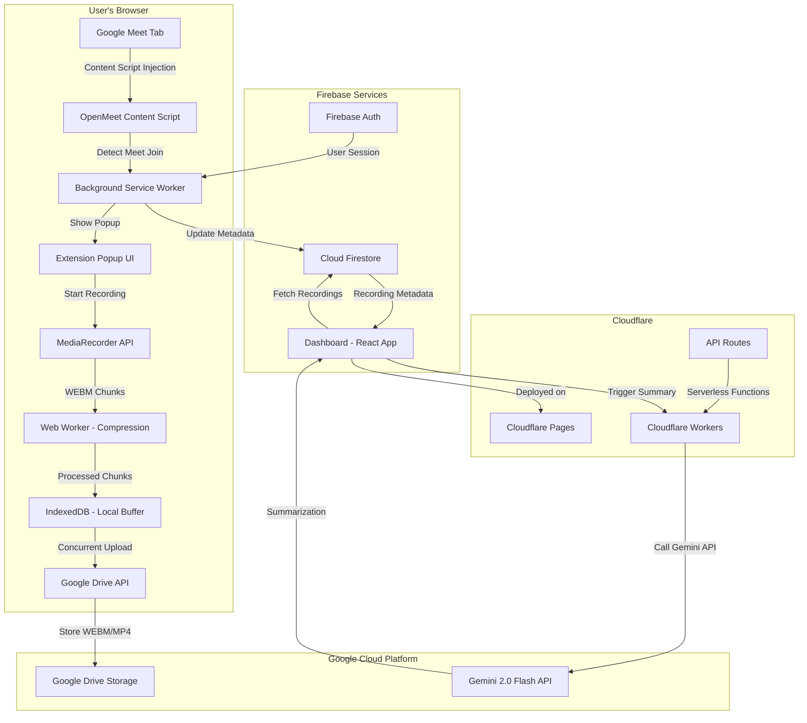

# OpenMeet Recorder - Implementation Plan

> **Status:** Draft - Awaiting Review  
> **Created:** 2025-12-29  
> **Hackathon:** TechSprint - Leveraging the Power of AI  
> **Deadline:** December 29, 2025 (36 hours remaining)  
> **Project Repository:** https://github.com/PRATS-gits/openmeet-chromium

---

## Table of Contents
1. [Project Overview](#project-overview)
2. [Goals & Success Criteria](#goals--success-criteria)
3. [Technical Architecture](#technical-architecture)
4. [Technology Stack](#technology-stack)
5. [Project Structure](#project-structure)
6. [Chrome Extension Implementation](#chrome-extension-implementation)
7. [Dashboard Application Implementation](#dashboard-application-implementation)
8. [Firebase & GCP Configuration](#firebase--gcp-configuration)
9. [Development Roadmap](#development-roadmap)
10. [Testing & Verification Strategy](#testing--verification-strategy)
11. [Deployment Strategy](#deployment-strategy)
12. [Risk Mitigation](#risk-mitigation)

---

## 1. Project Overview

### 1.1 Product Description
**OpenMeet Recorder** is a Chrome extension that enables users to record Google Meet sessions with smart features like automatic mic synchronization, chunked concurrent uploads to Google Drive, and AI-powered multilingual meeting summarization. The extension provides a seamless recording experience with a dedicated web dashboard for managing recordings.

### 1.2 Target Users
- **Primary:** Google Meet users who need to record meetings for documentation, training, or review purposes
- **Secondary:** Teams conducting remote meetings who need searchable, summarizable meeting archives

### 1.3 Core Value Proposition
- **Zero-friction recording:** Auto-detects Google Meet and prompts recording with minimal clicks
- **Smart storage:** Direct integration with Google Drive (no third-party storage concerns)
- **Multilingual support:** AI summarization works with Hindi, Hinglish, Marathi, and mixed-language meetings
- **Freemium model:** Full functionality available for hackathon; monetization ready for future

### 1.4 Browser Compatibility
- Google Chrome (primary target)
- Microsoft Edge (Chromium-based)
- Brave Browser (Chromium-based)

---

## 2. Goals & Success Criteria

### 2.1 Hackathon Goals (Must-Have for Submission)
| Goal | Success Criteria | Priority |
|------|------------------|----------|
| **MVP Recording** | User can record Tab/Window/Desktop from Google Meet | 🔴 Critical |
| **Google Sign-In** | Firebase authentication working with Google OAuth | 🔴 Critical |
| **Drive Upload** | Recording automatically saves to Google Drive | 🔴 Critical |
| **Control Bar** | Pause/Resume/Stop controls functional | 🔴 Critical |
| **Dashboard Listing** | Recordings displayed in web dashboard with metadata | 🔴 Critical |
| **Basic Actions** | User can download/delete recordings from dashboard | 🔴 Critical |
| **Demo Video** | Comprehensive demo with voiceover showcasing all features | 🔴 Critical |

### 2.2 Full Feature Goals (Nice-to-Have)
| Goal | Success Criteria | Priority |
|------|------------------|----------|
| **Mic Sync** | Extension detects Google Meet mic state and syncs | 🟡 High |
| **Auto-Popup** | Extension shows recording prompt when joining Google Meet | 🟡 High |
| **Chunked Upload** | Concurrent resumable upload with progress tracking | 🟡 High |
| **Quality Selection** | User can choose 720p or 1080p recording quality | 🟢 Medium |
| **Folder Picker** | Google Drive folder selection for organized storage | 🟢 Medium |
| **AI Summary** | On-demand meeting summarization in English | 🟢 Medium |
| **Advanced Dashboard** | Folders, sorting, filtering, search functionality | 🟢 Medium |

### 2.3 Technical Goals
- ✅ Zero server costs (local processing, serverless functions only)
- ✅ Privacy-first (data stays on user's device until explicit upload)
- ✅ Scalable architecture (ready for freemium → premium transition)
- ✅ Production-ready code quality (proper error handling, logging)

---

## 3. Technical Architecture

### 3.1 System Architecture Diagram



### 3.2 Data Flow Architecture

#### 3.2.1 Recording Flow
```
1. User joins Google Meet
   ↓
2. Content script detects meet.google.com URL pattern
   ↓
3. Background service worker shows native notification "Record this meeting?"
   ↓
4. User clicks "Start Recording" → Extension popup opens
   ↓
5. User selects source (Tab/Window/Desktop) via Chrome's native picker
   ↓
6. MediaRecorder starts capturing stream in WEBM format (VP9 codec)
   ↓
7. Every 10 seconds: ondataavailable → chunk saved to IndexedDB
   ↓
8. Web Worker compresses chunk (if needed) and uploads to Drive
   ↓
9. Upload progress tracked in IndexedDB + UI control bar updates
   ↓
10. User clicks "Stop" → Final chunk uploaded + Metadata saved to Firestore
```

#### 3.2.2 Authentication Flow
```
Extension:
1. User clicks "Sign In with Google" in popup
   ↓
2. Background service worker opens Firebase Auth redirect URL
   ↓
3. User authenticates with Google (OAuth consent screen)
   ↓
4. Firebase returns ID token + refresh token
   ↓
5. Tokens stored in chrome.storage.sync (encrypted by Chrome)
   ↓
6. Extension requests Drive API scopes (drive.file - restricted access)

Dashboard:
1. User visits openmeet.panotech.uk/dashboard
   ↓
2. Firebase Auth checks for existing session
   ↓
3. If not authenticated → Redirect to Firebase Auth UI
   ↓
4. After authentication → Fetch user's recordings from Firestore
   ↓
5. Real-time updates via Firestore onSnapshot listeners
```

#### 3.2.3 AI Summarization Flow
```
1. User clicks "Generate Summary" button on recording card
   ↓
2. Dashboard sends request to Cloudflare Worker endpoint
   ↓
3. Worker fetches WEBM file from Google Drive using user's token
   ↓
4. Worker extracts audio track using FFmpeg.wasm (or sends to Cloud Run)
   ↓
5. Audio sent to Gemini 2.0 Flash API with prompt:
   "Summarize this meeting in English. Extract key points, action items, decisions."
   ↓
6. Gemini returns structured summary
   ↓
7. Summary saved to Firestore (linked to recording document)
   ↓
8. Dashboard updates UI with summary display
```

### 3.3 Security Architecture

#### 3.3.1 Authentication & Authorization
- **Firebase Auth** handles all user authentication
- **OAuth 2.0** for Google Sign-In (required for Drive API access)
- **Token Management:**
  - Extension: Tokens stored in `chrome.storage.sync` (encrypted at rest by Chrome)
  - Dashboard: Tokens managed by Firebase Auth SDK (HTTP-only cookies)
- **Drive API Scopes:**
  - `https://www.googleapis.com/auth/drive.file` (restricted - only files created by app)
  - **NOT** using `drive.readonly` or `drive` (full access)

#### 3.3.2 Data Privacy
- **Local-first processing:** All recording happens in browser memory
- **No cloud storage of raw video:** Videos go directly from browser → Google Drive (user's storage)
- **Metadata only in Firestore:** File name, Drive file ID, duration, timestamp (no video content)
- **User owns data:** Can delete recordings anytime (cascade deletes from Drive + Firestore)

#### 3.3.3 API Key Security
- **Extension:** No API keys hardcoded (uses Firebase Auth tokens)
- **Dashboard:** Cloudflare Workers environment variables for Gemini API keys
- **Firestore Rules:** User can only read/write their own recordings
  ```javascript
  match /recordings/{recordingId} {
    allow read, write: if request.auth != null && request.auth.uid == resource.data.userId;
  }
  ```

### 3.4 Scalability Considerations

#### 3.4.1 Current Architecture (Hackathon MVP)
- **Storage:** User's Google Drive (15GB free tier per user)
- **Compute:** Client-side (user's browser) + Cloudflare Workers (free tier: 100k requests/day)
- **Database:** Firestore (free tier: 50k reads, 20k writes per day)
- **AI:** Vertex AI / Gemini API (pay-per-use, ~$0.10 per 1M tokens)

#### 3.4.2 Future Scaling (Post-Hackathon)
- **Freemium Limits:**
  - Free: 10 recordings/month, 30 min max duration, 720p only
  - Premium: Unlimited recordings, unlimited duration, 1080p/4K, priority summarization
- **Infrastructure Upgrades:**
  - Cloud Storage for thumbnail caching
  - Redis for rate limiting
  - Pub/Sub for async summarization queue
  - CDN for dashboard static assets

---

## 4. Technology Stack

### 4.1 Chrome Extension Stack

| Layer | Technology | Version | Purpose |
|-------|-----------|---------|---------|
| **Manifest** | Manifest V3 | Latest | Chrome extension architecture |
| **Language** | TypeScript | 5.3+ | Type safety, better DX |
| **Build Tool** | Vite | 5.0+ | Fast bundling, HMR for development |
| **UI Framework** | React | 18.2+ | Popup and options page UI |
| **Styling** | TailwindCSS | 3.4+ | Utility-first CSS |
| **State Management** | Zustand | 4.5+ | Lightweight state for popup |
| **Storage** | IndexedDB (Dexie.js) | 3.2+ | Local chunk buffering |
| **API Client** | Google API Client | Latest | Drive API, Auth API |
| **Video Processing** | MediaRecorder API | Native | Browser-native recording |
| **Worker** | Web Workers | Native | Background compression |

### 4.2 Dashboard Stack

| Layer | Technology | Version | Purpose |
|-------|-----------|---------|---------|
| **Framework** | React | 18.2+ | Component-based UI |
| **Build Tool** | Vite | 5.0+ | Fast builds, optimized production |
| **Language** | TypeScript | 5.3+ | Type safety |
| **Styling** | TailwindCSS | 3.4+ | Utility-first CSS |
| **Component Library** | ShadcnUI | Latest | Pre-built accessible components |
| **Icons** | Lucide React | Latest | Modern icon library |
| **Routing** | React Router | 6.21+ | Client-side routing |
| **State Management** | Zustand | 4.5+ | Global state (user, recordings) |
| **Database** | Cloud Firestore | Latest | Real-time database |
| **Authentication** | Firebase Auth | Latest | User authentication |
| **API Client** | Google API Client | Latest | Drive API for file operations |
| **Date Handling** | date-fns | 3.0+ | Date formatting, parsing |

### 4.3 Backend / Serverless Stack

| Service | Provider | Purpose |
|---------|----------|---------|
| **Authentication** | Firebase Auth | Google Sign-In, session management |
| **Database** | Cloud Firestore | Recording metadata, user profiles |
| **Storage** | Google Drive API | User's video files (WEBM/MP4) |
| **AI Model** | Gemini 2.0 Flash (Vertex AI) | Meeting summarization |
| **Serverless Functions** | Cloudflare Workers | API proxy, summarization triggers |
| **Hosting** | Cloudflare Pages | Dashboard static site hosting |
| **Domain** | Cloudflare DNS | openmeet.panotech.uk routing |

### 4.4 Development Tools

| Tool | Purpose |
|------|---------|
| **Git** | Version control (GitHub) |
| **pnpm** | Fast package manager |
| **ESLint** | Code linting |
| **Prettier** | Code formatting |
| **TypeScript** | Type checking |
| **Chrome DevTools** | Extension debugging |
| **Firebase Emulator Suite** | Local development/testing |
| **Wrangler** | Cloudflare Workers CLI |

---

## 5. Project Structure

### 5.1 Root Directory Structure

```
openmeet-chromium/
├── .git/                      # Git repository
├── .github/                   # GitHub workflows (CI/CD)
│   └── workflows/
│       └── ci.yml             # Automated testing & linting
├── extension/                 # Chrome extension source code
│   ├── src/
│   ├── public/
│   ├── dist/                  # Build output (gitignored)
│   ├── package.json
│   ├── tsconfig.json
│   ├── vite.config.ts
│   └── README.md
├── dashboard/                 # React dashboard application
│   ├── src/
│   ├── public/
│   ├── dist/                  # Build output (gitignored)
│   ├── package.json
│   ├── tsconfig.json
│   ├── vite.config.ts
│   ├── tailwind.config.js
│   └── README.md
├── firebase/                  # Firebase configuration
│   ├── firestore.rules        # Firestore security rules
│   ├── firestore.indexes.json # Firestore indexes
│   └── .firebaserc            # Firebase project config
├── plans/                     # Project planning documents
│   ├── DESCRIPTION.md         # General description (existing)
│   └── IMPLEMENTATION_PLAN.md # This file
├── docs/                      # Documentation
│   ├── DEVELOPMENT.md         # Development guide
│   ├── DEPLOYMENT.md          # Deployment instructions
│   └── API.md                 # API documentation
├── .gitignore                 # Git ignore rules
├── LICENSE                    # MIT License (existing)
├── README.md                  # Project README
└── package.json               # Root package.json (workspace config)
```

### 5.2 Chrome Extension Structure (Detailed)

```
extension/
├── src/
│   ├── manifest.json          # Extension manifest (MV3)
│   ├── background/            # Service worker
│   │   ├── index.ts           # Background service worker entry
│   │   ├── auth.ts            # Firebase Auth handling
│   │   ├── recorder.ts        # Recording state management
│   │   ├── uploader.ts        # Drive API upload logic
│   │   └── notifications.ts   # Chrome notifications API
│   ├── content/               # Content scripts
│   │   ├── index.ts           # Main content script
│   │   ├── meet-detector.ts   # Detect Google Meet join
│   │   ├── mic-sync.ts        # Mic synchronization logic
│   │   └── control-bar.tsx    # Recording control bar UI
│   ├── popup/                 # Extension popup
│   │   ├── index.tsx          # Popup entry point
│   │   ├── App.tsx            # Main popup component
│   │   ├── index.html         # Popup HTML
│   │   ├── components/
│   │   │   ├── AuthButton.tsx      # Sign-in button
│   │   │   ├── RecordingStatus.tsx # Recording status display
│   │   │   ├── QualitySelector.tsx # 720p/1080p selector
│   │   │   └── DriveSettings.tsx   # Drive folder picker
│   │   └── styles/
│   │       └── popup.css      # Popup styles
│   ├── options/               # Options/Settings page
│   │   ├── index.tsx          # Options page entry
│   │   ├── App.tsx            # Options page component
│   │   └── index.html         # Options HTML
│   ├── lib/                   # Shared utilities
│   │   ├── firebase.ts        # Firebase SDK initialization
│   │   ├── storage.ts         # Chrome storage helpers
│   │   ├── drive-api.ts       # Google Drive API client
│   │   ├── indexeddb.ts       # IndexedDB wrapper (Dexie)
│   │   └── constants.ts       # App constants
│   ├── types/                 # TypeScript types
│   │   ├── index.ts           # Shared type definitions
│   │   ├── recording.ts       # Recording types
│   │   └── chrome.d.ts        # Chrome API type extensions
│   ├── workers/               # Web Workers
│   │   ├── compression.worker.ts  # Video compression
│   │   └── upload.worker.ts       # Concurrent upload
│   └── assets/                # Static assets
│       ├── icons/
│       │   ├── icon16.png     # Extension icons (sizes)
│       │   ├── icon32.png
│       │   ├── icon48.png
│       │   └── icon128.png
│       └── images/
│           └── logo.png
├── public/                    # Public static files
│   └── _locales/              # Internationalization
│       └── en/
│           └── messages.json
├── dist/                      # Build output (gitignored)
├── package.json
├── tsconfig.json
├── vite.config.ts             # Vite config for extension
└── README.md
```

### 5.3 Dashboard Structure (Detailed)

```
dashboard/
├── src/
│   ├── main.tsx               # App entry point
│   ├── App.tsx                # Root component
│   ├── index.css              # Global styles (Tailwind)
│   ├── vite-env.d.ts          # Vite type definitions
│   ├── pages/                 # Route pages
│   │   ├── Dashboard.tsx      # Main dashboard (recordings list)
│   │   ├── Login.tsx          # Login/Auth page
│   │   ├── Recording.tsx      # Single recording detail view
│   │   └── NotFound.tsx       # 404 page
│   ├── components/            # Reusable components
│   │   ├── ui/                # ShadcnUI components
│   │   │   ├── button.tsx
│   │   │   ├── card.tsx
│   │   │   ├── dialog.tsx
│   │   │   ├── dropdown-menu.tsx
│   │   │   ├── input.tsx
│   │   │   ├── select.tsx
│   │   │   └── ...            # Other ShadcnUI components
│   │   ├── layout/
│   │   │   ├── Header.tsx     # Dashboard header
│   │   │   ├── Sidebar.tsx    # Dashboard sidebar (like Awesome SS)
│   │   │   └── Layout.tsx     # Main layout wrapper
│   │   ├── recordings/
│   │   │   ├── RecordingCard.tsx    # Recording card (grid view)
│   │   │   ├── RecordingList.tsx    # Recordings container
│   │   │   ├── RecordingFilters.tsx # Sort/filter controls
│   │   │   ├── RecordingSearch.tsx  # Search bar
│   │   │   └── RecordingActions.tsx # Action buttons (delete, download)
│   │   ├── folders/
│   │   │   ├── FolderTree.tsx       # Folder navigation
│   │   │   └── FolderCard.tsx       # Folder display
│   │   └── ai/
│   │       ├── SummaryPanel.tsx     # AI summary display
│   │       └── SummaryButton.tsx    # Generate summary button
│   ├── lib/                   # Utilities
│   │   ├── firebase.ts        # Firebase initialization
│   │   ├── firestore.ts       # Firestore queries
│   │   ├── drive.ts           # Drive API client
│   │   ├── api.ts             # Cloudflare Workers API client
│   │   └── utils.ts           # Helper functions (cn, formatters)
│   ├── hooks/                 # Custom React hooks
│   │   ├── useAuth.ts         # Authentication hook
│   │   ├── useRecordings.ts   # Fetch user recordings
│   │   ├── useDrive.ts        # Drive operations
│   │   └── useRealtime.ts     # Firestore real-time updates
│   ├── stores/                # Zustand stores
│   │   ├── authStore.ts       # User auth state
│   │   ├── recordingsStore.ts # Recordings state
│   │   └── uiStore.ts         # UI state (filters, search)
│   ├── types/                 # TypeScript types
│   │   ├── index.ts           # Shared types
│   │   ├── recording.ts       # Recording types
│   │   └── firestore.ts       # Firestore document types
│   └── config/                # Configuration
│       ├── firebase.config.ts # Firebase config
│       └── constants.ts       # App constants
├── public/                    # Public assets
│   ├── favicon.ico
│   ├── logo.svg
│   └── _redirects            # Cloudflare Pages redirects
├── functions/                 # Cloudflare Workers (serverless)
│   ├── api/
│   │   └── summarize.ts      # AI summarization endpoint
│   └── wrangler.toml         # Wrangler config
├── dist/                      # Build output (gitignored)
├── package.json
├── tsconfig.json
├── vite.config.ts             # Vite config
├── tailwind.config.js         # Tailwind config
├── components.json            # ShadcnUI config
├── postcss.config.js          # PostCSS config
└── README.md
```

### 5.4 Firebase Structure

```
firebase/
├── firestore.rules            # Firestore security rules
├── firestore.indexes.json     # Firestore composite indexes
└── .firebaserc                # Firebase project aliases
```

**Firestore Data Model:**
```
/users/{userId}
  ├── email: string
  ├── displayName: string
  ├── photoURL: string
  ├── createdAt: timestamp
  └── driveConnected: boolean

/recordings/{recordingId}
  ├── userId: string (indexed)
  ├── title: string
  ├── driveFileId: string
  ├── driveFileUrl: string
  ├── duration: number (seconds)
  ├── fileSize: number (bytes)
  ├── quality: "720p" | "1080p"
  ├── format: "webm" | "mp4"
  ├── thumbnailUrl: string (optional)
  ├── meetingUrl: string
  ├── folderId: string (optional, indexed) ← NEW: Reference to folders collection
  ├── createdAt: timestamp (indexed)
  ├── updatedAt: timestamp
  └── summary: object (optional)
      ├── text: string
      ├── keyPoints: string[]
      ├── actionItems: string[]
      ├── generatedAt: timestamp
      └── model: string (e.g., "gemini-2.0-flash")

/folders/{folderId} ← NEW: Folders collection for organization
  ├── userId: string (indexed)
  ├── name: string
  ├── color: string (optional, hex color for UI)
  ├── createdAt: timestamp
  └── updatedAt: timestamp
```

### 5.5 .gitignore Configuration

```gitignore
# Dependencies
node_modules/
.pnpm-store/
.yarn/

# Build outputs
dist/
build/
.cache/
*.tsbuildinfo

# Environment variables
.env
.env.local
.env.production
.env.development
*.local

# IDE / Editors
.vscode/
.idea/
*.swp
*.swo
*~
.DS_Store

# Extension specific
extension/dist/
extension/.crx
extension/.pem
extension/.zip

# Dashboard specific
dashboard/dist/
dashboard/.output/

# Firebase
.firebase/
firebase-debug.log
firestore-debug.log
ui-debug.log

# Cloudflare
.wrangler/
wrangler.toml.backup

# Logs
logs/
*.log
npm-debug.log*
yarn-debug.log*
yarn-error.log*
pnpm-debug.log*

# Testing
coverage/
.nyc_output/
*.test.js.snap

# Temporary files
tmp/
temp/
*.tmp

# OS Files
Thumbs.db
.DS_Store
desktop.ini
```

### 5.6 Package Manager Configuration

**Root `package.json` (Workspace):**
```json
{
  "name": "openmeet-chromium",
  "version": "1.0.0",
  "private": true,
  "description": "Chrome extension for recording Google Meet with AI summarization",
  "repository": {
    "type": "git",
    "url": "https://github.com/PRATS-gits/openmeet-chromium"
  },
  "author": "Pratham (pratham.eduace@gmail.com)",
  "license": "MIT",
  "workspaces": [
    "extension",
    "dashboard"
  ],
  "scripts": {
    "dev:extension": "pnpm --filter extension dev",
    "dev:dashboard": "pnpm --filter dashboard dev",
    "build:extension": "pnpm --filter extension build",
    "build:dashboard": "pnpm --filter dashboard build",
    "build:all": "pnpm build:extension && pnpm build:dashboard",
    "lint": "pnpm --filter extension lint && pnpm --filter dashboard lint",
    "type-check": "pnpm --filter extension type-check && pnpm --filter dashboard type-check"
  },
  "devDependencies": {
    "@types/node": "^20.10.0",
    "prettier": "^3.1.1"
  },
  "engines": {
    "node": ">=18.0.0",
    "pnpm": ">=8.0.0"
  }
}
```

### 5.7 Development Workflow

#### 5.7.1 Initial Setup
```bash
# Clone repository
git clone https://github.com/PRATS-gits/openmeet-chromium.git
cd openmeet-chromium

# Install pnpm (if not installed)
npm install -g pnpm

# Install all dependencies (workspace)
pnpm install

# Set up environment variables
cp extension/.env.example extension/.env
cp dashboard/.env.example dashboard/.env

# Configure Firebase (interactive)
firebase login
firebase use --add  # Select "OpenMeet" project
```

#### 5.7.2 Development Commands
```bash
# Run extension in development mode (with HMR)
pnpm dev:extension
# Output: extension/dist/ (load unpacked in chrome://extensions)

# Run dashboard in development mode
pnpm dev:dashboard
# Output: http://localhost:5173

# Build for production
pnpm build:all

# Lint & type-check
pnpm lint
pnpm type-check
```

#### 5.7.3 Git Workflow
```bash
# Create feature branch
git checkout -b feature/recording-control-bar

# Make changes, commit
git add .
git commit -m "feat: add recording control bar with pause/resume"

# Push to remote
git push origin feature/recording-control-bar

# Create Pull Request on GitHub (to branch-pratham)
# After review, merge to branch-pratham
# Then create PR from branch-pratham → main
```

---


## 6. Chrome Extension Implementation

### 6.1 Manifest.json Configuration (MV3)

```json
{
  "manifest_version": 3,
  "name": "OpenMeet Recorder",
  "version": "1.0.0",
  "description": "Record Google Meet sessions with AI-powered summarization",
  "icons": {
    "16": "assets/icons/icon16.png",
    "32": "assets/icons/icon32.png",
    "48": "assets/icons/icon48.png",
    "128": "assets/icons/icon128.png"
  },
  "permissions": [
    "storage",
    "tabs",
    "notifications",
    "identity",
    "scripting"
  ],
  "host_permissions": [
    "https://meet.google.com/*",
    "https://www.googleapis.com/*",
    "https://*.firebaseapp.com/*"
  ],
  "background": {
    "service_worker": "background/index.js",
    "type": "module"
  },
  "content_scripts": [
    {
      "matches": ["https://meet.google.com/*"],
      "js": ["content/index.js"],
      "css": ["content/control-bar.css"],
      "run_at": "document_idle"
    }
  ],
  "action": {
    "default_popup": "popup/index.html",
    "default_icon": {
      "16": "assets/icons/icon16.png",
      "32": "assets/icons/icon32.png"
    },
    "default_title": "OpenMeet Recorder"
  },
  "options_page": "options/index.html",
  "web_accessible_resources": [
    {
      "resources": ["assets/*", "workers/*"],
      "matches": ["https://meet.google.com/*"]
    }
  ],
  "oauth2": {
    "client_id": "YOUR_CLIENT_ID.apps.googleusercontent.com",
    "scopes": [
      "https://www.googleapis.com/auth/drive.file",
      "https://www.googleapis.com/auth/userinfo.email",
      "https://www.googleapis.com/auth/userinfo.profile"
    ]
  }
}
```

### 6.2 Background Service Worker Architecture

**Purpose:** Coordinate recording state, handle authentication, manage uploads, and communicate between components.

**Key Responsibilities:**
1. Manage global recording state (idle, recording, paused, uploading)
2. Handle Firebase authentication and token refresh
3. Listen for Google Meet tab detection from content scripts
4. Trigger notifications to start recording
5. Coordinate chunk uploads to Google Drive
6. Update Firestore metadata after recording completion

**Implementation (`background/index.ts`):**

```typescript
import { initializeApp } from 'firebase/app';
import { getAuth, signInWithCredential, GoogleAuthProvider } from 'firebase/auth';
import { getFirestore, collection, addDoc, updateDoc } from 'firebase/firestore';
import { RecordingState, UploadChunk } from '../types';

// Global state
let currentRecording: RecordingState | null = null;
let uploadQueue: UploadChunk[] = [];

// Initialize Firebase
const firebaseConfig = { /* from environment */ };
const app = initializeApp(firebaseConfig);
const auth = getAuth(app);
const db = getFirestore(app);

// Listen for messages from content scripts
chrome.runtime.onMessage.addListener((message, sender, sendResponse) => {
  switch (message.type) {
    case 'MEET_DETECTED':
      handleMeetDetected(sender.tab?.id);
      break;
    case 'START_RECORDING':
      handleStartRecording(message.payload);
      break;
    case 'PAUSE_RECORDING':
      handlePauseRecording();
      break;
    case 'STOP_RECORDING':
      handleStopRecording();
      break;
    case 'UPLOAD_CHUNK':
      handleChunkUpload(message.payload);
      break;
  }
  return true; // Keep message channel open for async response
});

// Detect Google Meet join
async function handleMeetDetected(tabId: number) {
  const user = await getCurrentUser();
  if (!user) {
    // Show notification to sign in
    chrome.notifications.create({
      type: 'basic',
      iconUrl: 'assets/icons/icon128.png',
      title: 'OpenMeet Recorder',
      message: 'Sign in to start recording Google Meet',
      buttons: [{ title: 'Sign In' }]
    });
    return;
  }
  
  // Show recording prompt
  chrome.notifications.create({
    type: 'basic',
    iconUrl: 'assets/icons/icon128.png',
    title: 'Record this meeting?',
    message: 'Click to start recording',
    buttons: [{ title: 'Start Recording' }]
  });
}

// Start recording
async function handleStartRecording(config: { tabId: number; quality: '720p' | '1080p' }) {
  currentRecording = {
    id: generateId(),
    tabId: config.tabId,
    quality: config.quality,
    status: 'recording',
    startTime: Date.now(),
    chunks: []
  };
  
  // Create Firestore document for this recording
  const docRef = await addDoc(collection(db, 'recordings'), {
    userId: auth.currentUser!.uid,
    title: `Meeting - ${new Date().toLocaleDateString()}`,
    quality: config.quality,
    status: 'recording',
    createdAt: new Date(),
    meetingUrl: '' // Will be updated from content script
  });
  
  currentRecording.firestoreId = docRef.id;
  
  // Notify content script to show control bar
  chrome.tabs.sendMessage(config.tabId, {
    type: 'RECORDING_STARTED',
    payload: { recordingId: currentRecording.id }
  });
}

// Handle chunk upload
async function handleChunkUpload(chunk: UploadChunk) {
  uploadQueue.push(chunk);
  processUploadQueue();
}

// Process upload queue with concurrency
async function processUploadQueue() {
  const MAX_CONCURRENT = 3; // Upload 3 chunks concurrently
  const activeUploads: Promise<void>[] = [];
  
  while (uploadQueue.length > 0 && activeUploads.length < MAX_CONCURRENT) {
    const chunk = uploadQueue.shift()!;
    const uploadPromise = uploadChunkToDrive(chunk);
    activeUploads.push(uploadPromise);
  }
  
  await Promise.all(activeUploads);
}

// Upload single chunk to Google Drive
async function uploadChunkToDrive(chunk: UploadChunk): Promise<void> {
  const accessToken = await getAccessToken();
  
  const metadata = {
    name: `chunk_${chunk.index}.webm`,
    mimeType: 'video/webm',
    parents: [currentRecording!.driveFolderId || 'root']
  };
  
  const form = new FormData();
  form.append('metadata', new Blob([JSON.stringify(metadata)], { type: 'application/json' }));
  form.append('file', chunk.blob);
  
  const response = await fetch('https://www.googleapis.com/upload/drive/v3/files?uploadType=multipart', {
    method: 'POST',
    headers: { 'Authorization': `Bearer ${accessToken}` },
    body: form
  });
  
  if (!response.ok) throw new Error('Upload failed');
  
  const result = await response.json();
  chunk.driveFileId = result.id;
  
  // Update progress
  currentRecording!.chunks.push(chunk);
  updateRecordingProgress();
}
```

### 6.3 Content Script Implementation

**Purpose:** Detect Google Meet page load, inject control bar UI, sync microphone state.

**Implementation (`content/index.ts`):**

```typescript
import { createRoot } from 'react-dom/client';
import ControlBar from './control-bar';

// Detect if on Google Meet
function isGoogleMeet(): boolean {
  return window.location.hostname === 'meet.google.com' 
    && window.location.pathname.length > 1;
}

// Wait for Meet to fully load
function waitForMeetLoad(): Promise<void> {
  return new Promise((resolve) => {
    const observer = new MutationObserver((mutations) => {
      // Check if meet controls are present
      const meetControls = document.querySelector('[data-meeting-title]');
      if (meetControls) {
        observer.disconnect();
        resolve();
      }
    });
    
    observer.observe(document.body, { childList: true, subtree: true });
  });
}

// Initialize
async function init() {
  if (!isGoogleMeet()) return;
  
  await waitForMeetLoad();
  
  // Notify background that we're on a Google Meet
  chrome.runtime.sendMessage({
    type: 'MEET_DETECTED',
    payload: { url: window.location.href }
  });
  
  // Listen for recording start
  chrome.runtime.onMessage.addListener((message) => {
    if (message.type === 'RECORDING_STARTED') {
      injectControlBar();
      startMicSync();
    }
  });
}

// Inject control bar
function injectControlBar() {
  const container = document.createElement('div');
  container.id = 'openmeet-control-bar';
  container.style.cssText = `
    position: fixed;
    bottom: 20px;
    left: 20px;
    z-index: 9999;
  `;
  document.body.appendChild(container);
  
  const root = createRoot(container);
  root.render(<ControlBar />);
}

// Sync microphone state
function startMicSync() {
  const micButton = document.querySelector('[data-is-muted]');
  if (!micButton) return;
  
  const observer = new MutationObserver((mutations) => {
    const isMuted = micButton.getAttribute('data-is-muted') === 'true';
    
    chrome.runtime.sendMessage({
      type: 'MIC_STATE_CHANGED',
      payload: { muted: isMuted }
    });
  });
  
  observer.observe(micButton, { attributes: true, attributeFilter: ['data-is-muted'] });
}

init();
```

### 6.3.5 Popup Component with Recording Options

**Purpose:** Provide user interface for configuring recording settings before starting a recording.

**Component (`popup/Popup.tsx`):**

```tsx
import React, { useState, useEffect } from 'react';
import { Monitor, Box, Settings } from 'lucide-react';

export default function Popup() {
  const [recordingSource, setRecordingSource] = useState<'tab' | 'window' | 'desktop'>('tab');
  const [tabSound, setTabSound] = useState(true);
  const [micEnabled, setMicEnabled] = useState(false);
  const [showAnnotationTools, setShowAnnotationTools] = useState(false);
  const [quality, setQuality] = useState<'720p' | '1080p'>('720p');
  const [isSignedIn, setIsSignedIn] = useState(false);

  useEffect(() => {
    // Check authentication status
    chrome.storage.sync.get(['googleAccessToken'], (result) => {
      setIsSignedIn(!!result.googleAccessToken);
    });

    // Load saved preferences
    chrome.storage.sync.get(['recordingPreferences'], (result) => {
      if (result.recordingPreferences) {
        const prefs = result.recordingPreferences;
        setRecordingSource(prefs.source || 'tab');
        setTabSound(prefs.tabSound !== undefined ? prefs.tabSound : true);
        setMicEnabled(prefs.micEnabled || false);
        setShowAnnotationTools(prefs.showAnnotationTools || false);
        setQuality(prefs.quality || '720p');
      }
    });
  }, []);

  const handleStartRecording = async () => {
    // Save preferences
    const preferences = {
      source: recordingSource,
      tabSound,
      micEnabled,
      showAnnotationTools,
      quality
    };

    await chrome.storage.sync.set({ recordingPreferences: preferences });

    // Send message to background to start recording
    chrome.runtime.sendMessage({
      type: 'START_RECORDING',
      payload: preferences
    });

    // Close popup
    window.close();
  };

  const handleSignIn = () => {
    chrome.runtime.sendMessage({ type: 'SIGN_IN_REQUESTED' });
  };

  if (!isSignedIn) {
    return (
      <div className="popup-container">
        <div className="header">
          <h2>OpenMeet Recorder</h2>
        </div>
        <div className="sign-in-prompt">
          <p>Sign in with Google to start recording</p>
          <button onClick={handleSignIn} className="btn-primary">
            Sign in with Google
          </button>
        </div>
      </div>
    );
  }

  return (
    <div className="popup-container">
      <div className="header">
        <h2>Record</h2>
      </div>

      {/* Recording Source Selector */}
      <div className="source-selector">
        <button
          className={`source-option ${recordingSource === 'desktop' ? 'selected' : ''}`}
          onClick={() => setRecordingSource('desktop')}
        >
          <Monitor size={32} />
          <span>Desktop</span>
        </button>
        
        <button
          className={`source-option ${recordingSource === 'tab' ? 'selected' : ''}`}
          onClick={() => setRecordingSource('tab')}
        >
          <Box size={32} />
          <span>This Tab</span>
        </button>
        
        <button
          className={`source-option ${recordingSource === 'window' ? 'selected' : ''}`}
          onClick={() => setRecordingSource('window')}
        >
          <Monitor size={32} />
          <span>Canvas Only</span>
        </button>
      </div>

      {/* Settings */}
      <div className="settings-section">
        <div className="setting-item">
          <label>
            <input 
              type="checkbox" 
              checked={tabSound} 
              onChange={(e) => setTabSound(e.target.checked)}
            />
            <span>Tab Sound</span>
          </label>
        </div>

        <div className="setting-item">
          <label>
            <input 
              type="checkbox" 
              checked={showAnnotationTools} 
              onChange={(e) => setShowAnnotationTools(e.target.checked)}
            />
            <span>Control bar & Annotation tools</span>
          </label>
        </div>

        {/* Help Text */}
        <div className="info-note">
          <span>ℹ️</span>
          <p>
            The Mic is {micEnabled ? 'on' : 'off'} & Tab Sound is {tabSound ? 'on' : 'off'} to prevent echoes 
            during recording. Turn on the Mic if you need to record your voice.
          </p>
        </div>
      </div>

      {/* Quality & Format */}
      <div className="quality-section">
        <div className="quality-selector">
          <label>Quality:</label>
          <select value={quality} onChange={(e) => setQuality(e.target.value as '720p' | '1080p')}>
            <option value="720p">720p</option>
            <option value="1080p">1080p</option>
          </select>
        </div>

        <div className="format-info">
          <span>Format: WebM (VP9)</span>
          <span>Storage: Google Drive</span>
        </div>
      </div>

      {/* Start Recording Button */}
      <button onClick={handleStartRecording} className="btn-start-recording">
        Start Recording
      </button>
    </div>
  );
}
```

**Styling (`popup/popup.css`):**

```css
.popup-container {
  width: 400px;
  font-family: -apple-system, BlinkMacSystemFont, 'Segoe UI', Roboto, sans-serif;
  color: #333;
}

.header {
  padding: 16px 20px;
  border-bottom: 1px solid #e5e7eb;
}

.header h2 {
  margin: 0;
  font-size: 18px;
  font-weight: 600;
}

/* Sign In Prompt */
.sign-in-prompt {
  padding: 40px 20px;
  text-align: center;
}

.sign-in-prompt p {
  margin-bottom: 20px;
  color: #6b7280;
}

/* Recording Source Selector */
.source-selector {
  display: grid;
  grid-template-columns: repeat(3, 1fr);
  gap: 12px;
  padding: 20px;
}

.source-option {
  display: flex;
  flex-direction: column;
  align-items: center;
  gap: 8px;
  padding: 16px;
  background: #f9fafb;
  border: 2px solid transparent;
  border-radius: 8px;
  cursor: pointer;
  transition: all 0.2s;
}

.source-option:hover {
  background: #f3f4f6;
}

.source-option.selected {
  background: #dbeafe;
  border-color: #3b82f6;
}

.source-option span {
  font-size: 13px;
  font-weight: 500;
}

/* Settings Section */
.settings-section {
  padding: 0 20px 16px;
  border-bottom: 1px solid #e5e7eb;
}

.setting-item {
  padding: 12px 0;
}

.setting-item label {
  display: flex;
  align-items: center;
  gap: 10px;
  cursor: pointer;
}

.setting-item input[type="checkbox"] {
  width: 18px;
  height: 18px;
  cursor: pointer;
}

.setting-item span {
  font-size: 14px;
}

/* Info Note */
.info-note {
  display: flex;
  gap: 10px;
  padding: 12px;
  background: #eff6ff;
  border-radius: 6px;
  margin-top: 12px;
}

.info-note span {
  font-size: 16px;
}

.info-note p {
  margin: 0;
  font-size: 12px;
  color: #1e40af;
  line-height: 1.5;
}

/* Quality Section */
.quality-section {
  padding: 16px 20px;
  display: flex;
  justify-content: space-between;
  align-items: center;
}

.quality-selector {
  display: flex;
  align-items: center;
  gap: 8px;
}

.quality-selector label {
  font-size: 14px;
  font-weight: 500;
}

.quality-selector select {
  padding: 6px 12px;
  border: 1px solid #d1d5db;
  border-radius: 4px;
  font-size: 14px;
  cursor: pointer;
}

.format-info {
  display: flex;
  flex-direction: column;
  align-items: flex-end;
  gap: 4px;
}

.format-info span {
  font-size: 12px;
  color: #6b7280;
}

/* Buttons */
.btn-primary,
.btn-start-recording {
  width: 100%;
  padding: 12px;
  background: #3b82f6;
  color: white;
  border: none;
  border-radius: 6px;
  font-size: 15px;
  font-weight: 600;
  cursor: pointer;
  transition: background 0.2s;
}

.btn-primary:hover,
.btn-start-recording:hover {
  background: #2563eb;
}

.btn-start-recording {
  margin: 0 20px 20px;
  width: calc(100% - 40px);
}
```

### 6.4 Recording Control Bar UI

**Component (`content/control-bar.tsx`):**

```tsx
import React, { useState, useEffect } from 'react';
import { Pause, Play, Square, Mic, MicOff, Pen, Highlighter, Type, ArrowRight, ChevronLeft, ChevronRight } from 'lucide-react';

export default function ControlBar() {
  const [isRecording, setIsRecording] = useState(true);
  const [isPaused, setIsPaused] = useState(false);
  const [micEnabled, setMicEnabled] = useState(true);
  const [duration, setDuration] = useState(0);
  const [showAnnotationTools, setShowAnnotationTools] = useState(false);
  const [activeTool, setActiveTool] = useState<'pen' | 'highlighter' | 'text' | 'arrow' | null>(null);

  useEffect(() => {
    const timer = setInterval(() => {
      if (isRecording && !isPaused) {
        setDuration(prev => prev + 1);
      }
    }, 1000);
    
    return () => clearInterval(timer);
  }, [isRecording, isPaused]);

  const formatDuration = (seconds: number) => {
    const h = Math.floor(seconds / 3600);
    const m = Math.floor((seconds % 3600) / 60);
    const s = seconds % 60;
    return `${h.toString().padStart(2, '0')}:${m.toString().padStart(2, '0')}:${s.toString().padStart(2, '0')}`;
  };

  const handlePauseResume = () => {
    if (isPaused) {
      chrome.runtime.sendMessage({ type: 'RESUME_RECORDING' });
    } else {
      chrome.runtime.sendMessage({ type: 'PAUSE_RECORDING' });
    }
    setIsPaused(!isPaused);
  };

  const handleStop = () => {
    if (confirm('Stop recording? This will save the recording to your Google Drive.')) {
      chrome.runtime.sendMessage({ type: 'STOP_RECORDING' });
      setIsRecording(false);
    }
  };

  const handleMicToggle = () => {
    chrome.runtime.sendMessage({ 
      type: 'TOGGLE_MIC',
      payload: { enabled: !micEnabled }
    });
    setMicEnabled(!micEnabled);
  };

  const handleToolSelect = (tool: 'pen' | 'highlighter' | 'text' | 'arrow') => {
    setActiveTool(activeTool === tool ? null : tool);
    chrome.runtime.sendMessage({
      type: 'ANNOTATION_TOOL_SELECTED',
      payload: { tool: activeTool === tool ? null : tool }
    });
  };

  return (
    <div className="control-bar">
      <div className="recording-indicator">
        <div className="pulse" />
        <span>REC</span>
      </div>
      
      <div className="duration">{formatDuration(duration)}</div>
      
      <button onClick={handleMicToggle} title={micEnabled ? 'Mute mic' : 'Unmute mic'}>
        {micEnabled ? <Mic size={20} /> : <MicOff size={20} />}
      </button>
      
      <button onClick={handlePauseResume} title={isPaused ? 'Resume' : 'Pause'}>
        {isPaused ? <Play size={20} /> : <Pause size={20} />}
      </button>
      
      <button onClick={handleStop} title="Stop recording" className="stop-btn">
        <Square size={20} />
      </button>

      {/* Annotation Tools Section */}
      {showAnnotationTools && (
        <div className="annotation-tools">
          <button 
            onClick={() => handleToolSelect('pen')}
            className={activeTool === 'pen' ? 'active' : ''}
            title="Pen"
          >
            <Pen size={18} />
          </button>
          
          <button 
            onClick={() => handleToolSelect('highlighter')}
            className={activeTool === 'highlighter' ? 'active' : ''}
            title="Highlighter"
          >
            <Highlighter size={18} />
          </button>
          
          <button 
            onClick={() => handleToolSelect('text')}
            className={activeTool === 'text' ? 'active' : ''}
            title="Add Text"
          >
            <Type size={18} />
          </button>
          
          <button 
            onClick={() => handleToolSelect('arrow')}
            className={activeTool === 'arrow' ? 'active' : ''}
            title="Arrow"
          >
            <ArrowRight size={18} />
          </button>
        </div>
      )}

      {/* Collapse/Expand Button */}
      <button 
        onClick={() => setShowAnnotationTools(!showAnnotationTools)}
        title={showAnnotationTools ? 'Hide annotation tools' : 'Show annotation tools'}
        className="toggle-tools-btn"
      >
        {showAnnotationTools ? <ChevronLeft size={18} /> : <ChevronRight size={18} />}
      </button>
    </div>
  );
}
```

**Styling (`content/control-bar.css`):**

```css
.control-bar {
  position: fixed;
  bottom: 20px;
  left: 20px;
  display: flex;
  align-items: center;
  gap: 8px;
  padding: 12px 16px;
  background: rgba(0, 0, 0, 0.85);
  border-radius: 8px;
  backdrop-filter: blur(10px);
  box-shadow: 0 4px 12px rgba(0, 0, 0, 0.3);
  z-index: 99999;
  font-family: -apple-system, BlinkMacSystemFont, 'Segoe UI', Roboto, sans-serif;
}

.recording-indicator {
  display: flex;
  align-items: center;
  gap: 6px;
  margin-right: 4px;
}

.pulse {
  width: 8px;
  height: 8px;
  background: #ff4444;
  border-radius: 50%;
  animation: pulse 1.5s ease-in-out infinite;
}

@keyframes pulse {
  0%, 100% { opacity: 1; transform: scale(1); }
  50% { opacity: 0.6; transform: scale(1.2); }
}

.recording-indicator span {
  color: #ff4444;
  font-weight: 600;
  font-size: 14px;
}

.duration {
  color: #fff;
  font-family: 'Courier New', monospace;
  font-size: 14px;
  font-weight: 500;
  margin-right: 4px;
}

.control-bar button {
  background: rgba(255, 255, 255, 0.1);
  border: none;
  border-radius: 4px;
  color: #fff;
  padding: 8px;
  cursor: pointer;
  display: flex;
  align-items: center;
  justify-content: center;
  transition: all 0.2s;
}

.control-bar button:hover {
  background: rgba(255, 255, 255, 0.2);
  transform: scale(1.05);
}

.control-bar button:active {
  transform: scale(0.95);
}

.stop-btn {
  background: rgba(255, 68, 68, 0.2);
}

.stop-btn:hover {
  background: rgba(255, 68, 68, 0.3);
}

.annotation-tools {
  display: flex;
  gap: 4px;
  padding-left: 8px;
  margin-left: 8px;
  border-left: 1px solid rgba(255, 255, 255, 0.2);
}

.annotation-tools button.active {
  background: rgba(59, 130, 246, 0.4);
  border: 1px solid rgba(59, 130, 246, 0.6);
}

.toggle-tools-btn {
  margin-left: 4px;
  opacity: 0.7;
}

.toggle-tools-btn:hover {
  opacity: 1;
}
```


### 6.5 MediaRecorder Implementation

**Core Recording Logic (`background/recorder.ts`):**

```typescript
export class ScreenRecorder {
  private mediaRecorder: MediaRecorder | null = null;
  private recordedChunks: Blob[] = [];
  private stream: MediaStream | null = null;
  
  async startRecording(quality: '720p' | '1080p' = '720p'): Promise<void> {
    // Request screen capture
    const stream = await navigator.mediaDevices.getDisplayMedia({
      video: {
        width: quality === '1080p' ? 1920 : 1280,
        height: quality === '1080p' ? 1080 : 720,
        frameRate: 30
      },
      audio: true // Capture system audio + mic
    });
    
    this.stream = stream;
    
    // Create MediaRecorder with VP9 codec (better compression)
    const options = {
      mimeType: 'video/webm;codecs=vp9,opus',
      videoBitsPerSecond: quality === '1080p' ? 5000000 : 2500000 // 5Mbps vs 2.5Mbps
    };
    
    this.mediaRecorder = new MediaRecorder(stream, options);
    
    // Chunk every 10 seconds
    this.mediaRecorder.ondataavailable = (event) => {
      if (event.data.size > 0) {
        this.handleChunk(event.data);
      }
    };
    
    this.mediaRecorder.onstop = () => {
      this.finalize();
    };
    
    // Start recording with 10s timeslice
    this.mediaRecorder.start(10000);
  }
  
  private async handleChunk(blob: Blob) {
    this.recordedChunks.push(blob);
    
    // Queue for upload
    chrome.runtime.sendMessage({
      type: 'UPLOAD_CHUNK',
      payload: {
        index: this.recordedChunks.length - 1,
        blob: blob,
        timestamp: Date.now()
      }
    });
  }
  
  pause() {
    this.mediaRecorder?.pause();
  }
  
  resume() {
    this.mediaRecorder?.resume();
  }
  
  async stop(): Promise<void> {
    this.mediaRecorder?.stop();
    this.stream?.getTracks().forEach(track => track.stop());
  }
  
  private async finalize() {
    // Merge all chunks into final file
    const finalBlob = new Blob(this.recordedChunks, { type: 'video/webm' });
    
    // Upload final merged file to Drive
    chrome.runtime.sendMessage({
      type: 'FINALIZE_RECORDING',
      payload: {
        blob: finalBlob,
        duration: this.recordedChunks.length * 10 // Rough estimate
      }
    });
  }
}
```

### 6.6 Firebase Authentication Integration

**Implementation (`background/auth.ts`):**

```typescript
import { getAuth, signInWithCredential, GoogleAuthProvider } from 'firebase/auth';

export async function signInWithGoogle(): Promise<void> {
  // Use Chrome Identity API for OAuth
  const redirectURL = chrome.identity.getRedirectURL();
  const authURL = `https://accounts.google.com/o/oauth2/auth?` +
    `client_id=${CLIENT_ID}` +
    `&response_type=token` +
    `&redirect_uri=${encodeURIComponent(redirectURL)}` +
    `&scope=${encodeURIComponent('email profile https://www.googleapis.com/auth/drive.file')}`;
  
  return new Promise((resolve, reject) => {
    chrome.identity.launchWebAuthFlow({
      url: authURL,
      interactive: true
    }, async (responseUrl) => {
      if (chrome.runtime.lastError) {
        reject(chrome.runtime.lastError);
        return;
      }
      
      // Extract access token from URL
      const urlParams = new URLSearchParams(responseUrl.split('#')[1]);
      const accessToken = urlParams.get('access_token');
      
      if (!accessToken) {
        reject(new Error('No access token'));
        return;
      }
      
      // Sign in to Firebase with credential
      const credential = GoogleAuthProvider.credential(null, accessToken);
      const auth = getAuth();
      await signInWithCredential(auth, credential);
      
      // Store token for Drive API
      await chrome.storage.sync.set({ googleAccessToken: accessToken });
      
      resolve();
    });
  });
}

export async function getAccessToken(): Promise<string> {
  const { googleAccessToken } = await chrome.storage.sync.get('googleAccessToken');
  
  if (!googleAccessToken) {
    throw new Error('Not authenticated');
  }
  
  return googleAccessToken;
}

export async function getCurrentUser() {
  const auth = getAuth();
  return auth.currentUser;
}
```

---


## 7. Dashboard Application Implementation

### 7.1 Application Setup & Routing

**Main Entry Point (`src/main.tsx`):**

```tsx
import React from 'react';
import ReactDOM from 'react-dom/client';
import { BrowserRouter } from 'react-router-dom';
import App from './App';
import './index.css';

ReactDOM.createRoot(document.getElementById('root')!).render(
  <React.StrictMode>
    <BrowserRouter>
      <App />
    </BrowserRouter>
  </React.StrictMode>
);
```

**Root Component with Routes (`src/App.tsx`):**

```tsx
import { Routes, Route, Navigate } from 'react-router-dom';
import { useAuth } from './hooks/useAuth';
import Layout from './components/layout/Layout';
import Dashboard from './pages/Dashboard';
import Login from './pages/Login';
import Recording from './pages/Recording';
import NotFound from './pages/NotFound';

export default function App() {
  const { user, loading } = useAuth();

  if (loading) {
    return <div className="loading-screen">Loading...</div>;
  }

  return (
    <Routes>
      <Route path="/login" element={!user ? <Login /> : <Navigate to="/dashboard" />} />
      
      <Route element={<Layout />}>
        <Route path="/dashboard" element={user ? <Dashboard /> : <Navigate to="/login" />} />
        <Route path="/recording/:id" element={user ? <Recording /> : <Navigate to="/login" />} />
      </Route>
      
      <Route path="/" element={<Navigate to="/dashboard" />} />
      <Route path="*" element={<NotFound />} />
    </Routes>
  );
}
```

### 7.2 Authentication Hook

**Custom Hook (`src/hooks/useAuth.ts`):**

```tsx
import { useState, useEffect } from 'react';
import { getAuth, onAuthStateChanged, signInWithPopup, GoogleAuthProvider, signOut } from 'firebase/auth';
import { doc, getDoc, setDoc } from 'firebase/firestore';
import { db } from '../lib/firebase';

export function useAuth() {
  const [user, setUser] = useState(null);
  const [loading, setLoading] = useState(true);
  const auth = getAuth();

  useEffect(() => {
    const unsubscribe = onAuthStateChanged(auth, async (firebaseUser) => {
      if (firebaseUser) {
        // Check if user exists in Firestore, create if not
        const userRef = doc(db, 'users', firebaseUser.uid);
        const userSnap = await getDoc(userRef);
        
        if (!userSnap.exists()) {
          await setDoc(userRef, {
            email: firebaseUser.email,
            displayName: firebaseUser.displayName,
            photoURL: firebaseUser.photoURL,
            createdAt: new Date(),
            driveConnected: false
          });
        }
        
        setUser(firebaseUser);
      } else {
        setUser(null);
      }
      setLoading(false);
    });

    return unsubscribe;
  }, []);

  const signInWithGoogle = async () => {
    const provider = new GoogleAuthProvider();
    provider.addScope('https://www.googleapis.com/auth/drive.file');
    await signInWithPopup(auth, provider);
  };

  const logout = async () => {
    await signOut(auth);
  };

  return { user, loading, signInWithGoogle, logout };
}
```

### 7.3 Recordings Hook with Real-time Sync

**Custom Hook (`src/hooks/useRecordings.ts`):**

```tsx
import { useState, useEffect } from 'react';
import { collection, query, where, orderBy, onSnapshot } from 'firebase/firestore';
import { db } from '../lib/firebase';
import { useAuth } from './useAuth';
import type { Recording } from '../types/recording';

export function useRecordings() {
  const { user } = useAuth();
  const [recordings, setRecordings] = useState<Recording[]>([]);
  const [loading, setLoading] = useState(true);

  useEffect(() => {
    if (!user) {
      setRecordings([]);
      setLoading(false);
      return;
    }

    // Real-time Firestore listener
    const q = query(
      collection(db, 'recordings'),
      where('userId', '==', user.uid),
      orderBy('createdAt', 'desc')
    );

    const unsubscribe = onSnapshot(q, (snapshot) => {
      const docs = snapshot.docs.map(doc => ({
        id: doc.id,
        ...doc.data()
      })) as Recording[];
      
      setRecordings(docs);
      setLoading(false);
    });

    return unsubscribe;
  }, [user]);

  return { recordings, loading };
}
```

### 7.4 Dashboard Page Component

**Main Dashboard (`src/pages/Dashboard.tsx`):**

```tsx
import { useState } from 'react';
import { useRecordings } from '../hooks/useRecordings';
import RecordingList from '../components/recordings/RecordingList';
import RecordingFilters from '../components/recordings/RecordingFilters';
import RecordingSearch from '../components/recordings/RecordingSearch';
import { Button } from '../components/ui/button';
import { PlusCircle, FolderPlus } from 'lucide-react';

export default function Dashboard() {
  const { recordings, loading } = useRecordings();
  const [searchQuery, setSearchQuery] = useState('');
  const [sortBy, setSortBy] = useState<'dateCreated' | 'dateModified' | 'name'>('dateCreated');
  const [filterBy, setFilterBy] = useState<'all' | 'videos' | 'images'>('all');

  // Filter and sort recordings
  const filteredRecordings = recordings
    .filter(rec => rec.title.toLowerCase().includes(searchQuery.toLowerCase()))
    .sort((a, b) => {
      if (sortBy === 'dateCreated') return b.createdAt.toMillis() - a.createdAt.toMillis();
      if (sortBy === 'dateModified') return b.updatedAt.toMillis() - a.updatedAt.toMillis();
      return a.title.localeCompare(b.title);
    });

  if (loading) {
    return <div className="loading">Loading recordings...</div>;
  }

  return (
    <div className="dashboard-container">
      <div className="dashboard-header">
        <div className="header-top">
          <h1 className="text-3xl font-bold">My Items</h1>
          <div className="header-actions">
            <Button variant="outline" size="sm">
              <FolderPlus className="mr-2 h-4 w-4" />
              New Folder
            </Button>
            <Button size="sm">
              <PlusCircle className="mr-2 h-4 w-4" />
              New Recording
            </Button>
          </div>
        </div>
        
        <div className="header-controls">
          <RecordingSearch value={searchQuery} onChange={setSearchQuery} />
          <RecordingFilters 
            sortBy={sortBy} 
            onSortChange={setSortBy}
            filterBy={filterBy}
            onFilterChange={setFilterBy}
          />
        </div>
      </div>

      {filteredRecordings.length === 0 ? (
        <div className="empty-state">
          
          <h2>No recordings yet</h2>
          <p>Start recording Google Meet sessions with the OpenMeet extension</p>
        </div>
      ) : (
        <RecordingList recordings={filteredRecordings} />
      )}
    </div>
  );
}
```

### 7.5 Recording Card Component

**Recording Card (`src/components/recordings/RecordingCard.tsx`):**

```tsx
import { useState } from 'react';
import { useNavigate } from 'react-router-dom';
import { formatDistanceToNow } from 'date-fns';
import { MoreVertical, Download, Trash2, Share2, Sparkles } from 'lucide-react';
import { Card, CardContent } from '../ui/card';
import { Button } from '../ui/button';
import { 
  DropdownMenu, 
  DropdownMenuContent, 
  DropdownMenuItem, 
  DropdownMenuTrigger 
} from '../ui/dropdown-menu';
import { useDrive } from '../../hooks/useDrive';
import SummaryPanel from '../ai/SummaryPanel';
import type { Recording } from '../../types/recording';

interface RecordingCardProps {
  recording: Recording;
}

export default function RecordingCard({ recording }: RecordingCardProps) {
  const navigate = useNavigate();
  const { downloadFile, deleteFile } = useDrive();
  const [showSummary, setShowSummary] = useState(false);

  const handleCardClick = () => {
    // Navigate to recording detail view
    navigate(`/recording/${recording.id}`);
  };

  const handleDownload = async (e: React.MouseEvent) => {
    e.stopPropagation(); // Prevent card click
    await downloadFile(recording.driveFileId, recording.title);
  };

  const handleDelete = async (e: React.MouseEvent) => {
    e.stopPropagation(); // Prevent card click
    if (confirm(`Delete "${recording.title}"?`)) {
      await deleteFile(recording.driveFileId, recording.id);
    }
  };

  const handleSummaryClick = (e: React.MouseEvent) => {
    e.stopPropagation(); // Prevent card click
    setShowSummary(true);
  };

  return (
    <Card className="recording-card cursor-pointer hover:shadow-lg transition-shadow" onClick={handleCardClick}>
      <CardContent className="p-4">
        <div className="card-thumbnail">
          {recording.thumbnailUrl ? (
            
          ) : (
            <div className="thumbnail-placeholder">
              <video className="w-full h-full object-cover" />
            </div>
          )}
          <div className="duration-badge">{formatDuration(recording.duration)}</div>
        </div>

        <div className="card-info">
          <h3 className="font-semibold truncate">{recording.title}</h3>
          <div className="metadata">
            <span className="text-sm text-muted-foreground">
              {formatDistanceToNow(recording.createdAt.toDate(), { addSuffix: true })}
            </span>
            <span className="text-sm text-muted-foreground">
              {recording.quality} • {formatFileSize(recording.fileSize)}
            </span>
          </div>
        </div>

        <div className="card-actions" onClick={(e) => e.stopPropagation()}>
          {!recording.summary && (
            <Button 
              variant="ghost" 
              size="sm"
              onClick={handleSummaryClick}
            >
              <Sparkles className="mr-2 h-4 w-4" />
              Generate Summary
            </Button>
          )}

          <DropdownMenu>
            <DropdownMenuTrigger asChild>
              <Button variant="ghost" size="icon">
                <MoreVertical className="h-4 w-4" />
              </Button>
            </DropdownMenuTrigger>
            <DropdownMenuContent align="end">
              <DropdownMenuItem onClick={handleDownload}>
                <Download className="mr-2 h-4 w-4" />
                Download
              </DropdownMenuItem>
              <DropdownMenuItem>
                <Share2 className="mr-2 h-4 w-4" />
                Share
              </DropdownMenuItem>
              <DropdownMenuItem onClick={handleDelete} className="text-destructive">
                <Trash2 className="mr-2 h-4 w-4" />
                Delete
              </DropdownMenuItem>
            </DropdownMenuContent>
          </DropdownMenu>
        </div>

        {(showSummary || recording.summary) && (
          <SummaryPanel 
            recording={recording} 
            onClose={() => setShowSummary(false)} 
          />
        )}
      </CardContent>
    </Card>
  );
}

function formatDuration(seconds: number): string {
  const h = Math.floor(seconds / 3600);
  const m = Math.floor((seconds % 3600) / 60);
  const s = seconds % 60;
  return h > 0 ? `${h}:${m.toString().padStart(2, '0')}:${s.toString().padStart(2, '0')}` 
               : `${m}:${s.toString().padStart(2, '0')}`;
}

function formatFileSize(bytes: number): string {
  const mb = bytes / (1024 * 1024);
  return mb > 1024 ? `${(mb / 1024).toFixed(1)} GB` : `${mb.toFixed(1)} MB`;
}
```

### 7.6 AI Summary Component

**Summary Panel (`src/components/ai/SummaryPanel.tsx`):**

```tsx
import { useState } from 'react';
import { Sparkles, Loader2 } from 'lucide-react';
import { Button } from '../ui/button';
import { Card, CardHeader, CardTitle, CardContent } from '../ui/card';
import { generateSummary } from '../../lib/api';
import type { Recording } from '../../types/recording';

interface SummaryPanelProps {
  recording: Recording;
  onClose: () => void;
}

export default function SummaryPanel({ recording, onClose }: SummaryPanelProps) {
  const [loading, setLoading] = useState(false);
  const [summary, setSummary] = useState(recording.summary);

  const handleGenerate = async () => {
    setLoading(true);
    try {
      const result = await generateSummary(recording.id, recording.driveFileId);
      setSummary(result);
    } catch (error) {
      console.error('Failed to generate summary:', error);
      alert('Failed to generate summary. Please try again.');
    } finally {
      setLoading(false);
    }
  };

  return (
    <Card className="summary-panel mt-4">
      <CardHeader>
        <CardTitle className="flex items-center gap-2">
          <Sparkles className="h-5 w-5" />
          Meeting Summary
        </CardTitle>
      </CardHeader>
      <CardContent>
        {!summary && !loading && (
          <div className="text-center py-6">
            <p className="text-muted-foreground mb-4">
              Generate an AI-powered summary of this meeting
            </p>
            <Button onClick={handleGenerate}>
              <Sparkles className="mr-2 h-4 w-4" />
              Generate Summary
            </Button>
          </div>
        )}

        {loading && (
          <div className="text-center py-6">
            <Loader2 className="h-8 w-8 animate-spin mx-auto mb-2" />
            <p className="text-muted-foreground">Analyzing recording...</p>
          </div>
        )}

        {summary && (
          <div className="summary-content">
            <div className="summary-section">
              <h4 className="font-semibold mb-2">Summary</h4>
              <p className="text-sm text-muted-foreground">{summary.text}</p>
            </div>

            {summary.keyPoints && summary.keyPoints.length > 0 && (
              <div className="summary-section mt-4">
                <h4 className="font-semibold mb-2">Key Points</h4>
                <ul className="list-disc list-inside space-y-1">
                  {summary.keyPoints.map((point, i) => (
                    <li key={i} className="text-sm text-muted-foreground">{point}</li>
                  ))}
                </ul>
              </div>
            )}

            {summary.actionItems && summary.actionItems.length > 0 && (
              <div className="summary-section mt-4">
                <h4 className="font-semibold mb-2">Action Items</h4>
                <ul className="list-disc list-inside space-y-1">
                  {summary.actionItems.map((item, i) => (
                    <li key={i} className="text-sm text-muted-foreground">{item}</li>
                  ))}
                </ul>
              </div>
            )}

            <div className="mt-4 text-xs text-muted-foreground">
              Generated by {summary.model} • {formatDistanceToNow(summary.generatedAt.toDate(), { addSuffix: true })}
            </div>
          </div>
        )}
      </CardContent>
    </Card>
  );
}
```

### 7.6.5 Recording Detail View Component

**Purpose:** Provide a full-screen recording player with management options and shareable link generation.

**Route Configuration Update (`src/App.tsx`):**

```tsx
import RecordingDetail from './pages/RecordingDetail';

// Add route for recording detail view
<Route element={<Layout />}>
  <Route path="/dashboard" element={user ? <Dashboard /> : <Navigate to="/login" />} />
  <Route path="/recording/:id" element={user ? <RecordingDetail /> : <Navigate to="/login" />} />
</Route>
```

**Component (`src/pages/RecordingDetail.tsx`):**

```tsx
import { useState } from 'react';
import { useParams, useNavigate } from 'react-router-dom';
import { useRecording } from '../hooks/useRecording';
import { useDrive } from '../hooks/useDrive';
import { Download, Edit, Share2, Trash2, X, FolderOpen, Link as LinkIcon } from 'lucide-react';
import { Tabs, TabsContent, TabsList, TabsTrigger } from '../components/ui/tabs';
import { Button } from '../components/ui/button';
import { Input } from '../components/ui/input';
import { toast } from 'sonner';

export default function RecordingDetail() {
  const { id } = useParams<{ id: string }>();
  const navigate = useNavigate();
  const { recording, loading } = useRecording(id!);
  const { downloadFile, deleteFile } = useDrive();
  const [shareableLink, setShareableLink] = useState<string | null>(null);
  const [isGeneratingLink, setIsGeneratingLink] = useState(false);

  if (loading) {
    return <div className="loading-container">Loading recording...</div>;
  }

  if (!recording) {
    return (
      <div className="error-container">
        <p>Recording not found</p>
        <Button onClick={() => navigate('/dashboard')}>Back to Dashboard</Button>
      </div>
    );
  }

  const handleDownload = async (format: 'webm' | 'mp4') => {
    await downloadFile(recording.driveFileId, recording.title, format);
    toast.success(`Downloading ${format.toUpperCase()}...`);
  };

  const handleDelete = async () => {
    if (confirm(`Delete "${recording.title}"?`)) {
      await deleteFile(recording.driveFileId, recording.id);
      toast.success('Recording deleted');
      navigate('/dashboard');
    }
  };

  const handleGenerateLink = async () => {
    setIsGeneratingLink(true);
    try {
      // Call backend to generate shareable link
      const response = await fetch('/api/generate-link', {
        method: 'POST',
        headers: { 'Content-Type': 'application/json' },
        body: JSON.stringify({ recordingId: recording.id })
      });
      
      const { link } = await response.json();
      setShareableLink(link);
      toast.success('Shareable link generated!');
    } catch (error) {
      toast.error('Failed to generate link');
    } finally {
      setIsGeneratingLink(false);
    }
  };

  const copyLinkToClipboard = () => {
    if (shareableLink) {
      navigator.clipboard.writeText(shareableLink);
      toast.success('Link copied to clipboard!');
    }
  };

  return (
    <div className="recording-detail-container">
      {/* Header with Close Button */}
      <div className="detail-header">
        <h1>{recording.title}</h1>
        <Button variant="ghost" size="icon" onClick={() => navigate('/dashboard')}>
          <X className="h-5 w-5" />
        </Button>
      </div>

      {/* Video Player */}
      <div className="video-player-section">
        <video 
          src={recording.driveFileUrl} 
          controls 
          className="w-full rounded-lg"
          poster={recording.thumbnailUrl}
        />
      </div>

      {/* Sidebar with Tabs */}
      <div className="detail-sidebar">
        <Tabs defaultValue="manage">
          <TabsList className="w-full">
            <TabsTrigger value="manage" className="flex-1">Manage</TabsTrigger>
            <TabsTrigger value="comments" className="flex-1">Comments</TabsTrigger>
          </TabsList>

          {/* Manage Tab */}
          <TabsContent value="manage" className="space-y-6">
            {/* Move to Folder */}
            <div className="action-section">
              <h3 className="text-sm font-semibold mb-2">Move</h3>
              <Button variant="outline" className="w-full justify-start">
                <FolderOpen className="mr-2 h-4 w-4" />
                Move to Folder
              </Button>
            </div>

            {/* Actions */}
            <div className="action-section">
              <h3 className="text-sm font-semibold mb-2">Actions</h3>
              <div className="space-y-2">
                <Button 
                  variant="outline" 
                  className="w-full justify-start"
                  onClick={() => handleDownload('webm')}
                >
                  <Download className="mr-2 h-4 w-4" />
                  Download (WebM)
                </Button>
                
                <Button 
                  variant="outline" 
                  className="w-full justify-start"
                  onClick={() => handleDownload('mp4')}
                >
                  <Download className="mr-2 h-4 w-4" />
                  Download (MP4)
                </Button>

                <Button 
                  variant="outline" 
                  className="w-full justify-start"
                  disabled
                >
                  <Edit className="mr-2 h-4 w-4" />
                  Edit Video (Beta)
                </Button>

                <Button 
                  variant="outline" 
                  className="w-full justify-start text-destructive"
                  onClick={handleDelete}
                >
                  <Trash2 className="mr-2 h-4 w-4" />
                  Delete
                </Button>
              </div>
            </div>

            {/* Share */}
            <div className="action-section">
              <h3 className="text-sm font-semibold mb-2">Share</h3>
              
              {!shareableLink ? (
                <Button 
                  className="w-full"
                  onClick={handleGenerateLink}
                  disabled={isGeneratingLink}
                >
                  <LinkIcon className="mr-2 h-4 w-4" />
                  {isGeneratingLink ? 'Generating...' : 'Generate Shareable Link'}
                </Button>
              ) : (
                <div className="space-y-2">
                  <div className="flex gap-2">
                    <Input 
                      value={shareableLink} 
                      readOnly 
                      className="flex-1"
                    />
                    <Button onClick={copyLinkToClipboard}>
                      Copy
                    </Button>
                  </div>
                  
                  {/* Integration Icons */}
                  <div className="integration-icons">
                    <p className="text-xs text-muted-foreground mb-2">Share to:</p>
                    <div className="flex gap-2">
                      <button className="integration-btn" title="Slack">
                        
                      </button>
                      <button className="integration-btn" title="Trello">
                        
                      </button>
                      <button className="integration-btn" title="Google Drive">
                        
                      </button>
                      <button className="integration-btn" title="Email">
                        
                      </button>
                    </div>
                  </div>
                </div>
              )}
            </div>

            {/* Recording Info */}
            <div className="action-section">
              <h3 className="text-sm font-semibold mb-2">Information</h3>
              <dl className="space-y-1 text-sm">
                <div className="flex justify-between">
                  <dt className="text-muted-foreground">Quality:</dt>
                  <dd className="font-medium">{recording.quality}</dd>
                </div>
                <div className="flex justify-between">
                  <dt className="text-muted-foreground">Duration:</dt>
                  <dd className="font-medium">{formatDuration(recording.duration)}</dd>
                </div>
                <div className="flex justify-between">
                  <dt className="text-muted-foreground">Size:</dt>
                  <dd className="font-medium">{formatFileSize(recording.fileSize)}</dd>
                </div>
                <div className="flex justify-between">
                  <dt className="text-muted-foreground">Created:</dt>
                  <dd className="font-medium">
                    {new Date(recording.createdAt.toDate()).toLocaleDateString()}
                  </dd>
                </div>
              </dl>
            </div>
          </TabsContent>

          {/* Comments Tab */}
          <TabsContent value="comments" className="space-y-4">
            <div className="comments-container">
              <p className="text-sm text-muted-foreground text-center py-8">
                Comments feature coming soon!
              </p>
              {/* Future: Comment thread UI */}
            </div>
          </TabsContent>
        </Tabs>
      </div>
    </div>
  );
}

function formatDuration(seconds: number): string {
  const h = Math.floor(seconds / 3600);
  const m = Math.floor((seconds % 3600) / 60);
  const s = seconds % 60;
  return h > 0 
    ? `${h}:${m.toString().padStart(2, '0')}:${s.toString().padStart(2, '0')}` 
    : `${m}:${s.toString().padStart(2, '0')}`;
}

function formatFileSize(bytes: number): string {
  const mb = bytes / (1024 * 1024);
  return mb > 1024 ? `${(mb / 1024).toFixed(1)} GB` : `${mb.toFixed(1)} MB`;
}
```

**Styling (`src/pages/RecordingDetail.css`):**

```css
.recording-detail-container {
  display: grid;
  grid-template-columns: 1fr 400px;
  grid-template-rows: auto 1fr;
  gap: 24px;
  height: 100vh;
  padding: 24px;
  background: #f9fafb;
}

.detail-header {
  grid-column: 1 / -1;
  display: flex;
  justify-content: space-between;
  align-items: center;
  padding-bottom: 16px;
  border-bottom: 1px solid #e5e7eb;
}

.detail-header h1 {
  font-size: 24px;
  font-weight: 600;
  margin: 0;
}

.video-player-section {
  background: #000;
  border-radius: 8px;
  overflow: hidden;
  display: flex;
  align-items: center;
  justify-content: center;
}

.detail-sidebar {
  background: white;
  border-radius: 8px;
  padding: 20px;
  overflow-y: auto;
}

.action-section {
  padding-bottom: 16px;
  border-bottom: 1px solid #e5e7eb;
}

.action-section:last-child {
  border-bottom: none;
}

.integration-icons {
  margin-top: 12px;
}

.integration-btn {
  width: 40px;
  height: 40px;
  border: 1px solid #e5e7eb;
  border-radius: 4px;
  display: flex;
  align-items: center;
  justify-content: center;
  background: white;
  cursor: pointer;
  transition: all 0.2s;
}

.integration-btn:hover {
  border-color: #3b82f6;
  background: #eff6ff;
}

.integration-btn img {
  width: 24px;
  height: 24px;
}

.comments-container {
  min-height: 300px;
}
```

### 7.7 Cloudflare Workers API (AI Summarization)

**Summarization Endpoint (`dashboard/functions/api/summarize.ts`):**

```typescript
import { VertexAI } from '@google-cloud/vertexai';

export async function onRequest(context) {
  const { request, env } = context;
  
  if (request.method !== 'POST') {
    return new Response('Method not allowed', { status: 405 });
  }

  try {
    const { recordingId, driveFileId, accessToken } = await request.json();

    // Fetch video file from Google Drive
    const driveResponse = await fetch(
      `https://www.googleapis.com/drive/v3/files/${driveFileId}?alt=media`,
      {
        headers: { 'Authorization': `Bearer ${accessToken}` }
      }
    );

    if (!driveResponse.ok) {
      throw new Error('Failed to fetch video from Drive');
    }

    const videoBlob = await driveResponse.blob();

    // Initialize Vertex AI
    const vertexAI = new VertexAI({
      project: env.GCP_PROJECT_ID,
      location: 'us-central1'
    });

    const model = vertexAI.getGenerativeModel({
      model: 'gemini-2.0-flash-exp'
    });

    // Generate summary
    const result = await model.generateContent({
      contents: [{
        role: 'user',
        parts: [
          {
            fileData: {
              mimeType: 'video/webm',
              fileUri: videoBlob // Or upload to GCS first
            }
          },
          {
            text: `Analyze this Google Meet recording and provide:
1. A concise summary in English (regardless of spoken language)
2. Key discussion points (bullet points)
3. Action items and decisions made

Format the response as JSON with fields: summary, keyPoints, actionItems`
          }
        ]
      }]
    });

    const responseText = result.response.text();
    const summary = JSON.parse(responseText);

    // Save summary to Firestore
    const firestoreUrl = `https://firestore.googleapis.com/v1/projects/${env.GCP_PROJECT_ID}/databases/(default)/documents/recordings/${recordingId}`;
    await fetch(firestoreUrl, {
      method: 'PATCH',
      headers: {
        'Authorization': `Bearer ${env.FIREBASE_SERVICE_ACCOUNT_TOKEN}`,
        'Content-Type': 'application/json'
      },
      body: JSON.stringify({
        fields: {
          summary: {
            mapValue: {
              fields: {
                text: { stringValue: summary.summary },
                keyPoints: { arrayValue: { values: summary.keyPoints.map(k => ({ stringValue: k })) } },
                actionItems: { arrayValue: { values: summary.actionItems.map(a => ({ stringValue: a })) } },
                generatedAt: { timestampValue: new Date().toISOString() },
                model: { stringValue: 'gemini-2.0-flash-exp' }
              }
            }
          }
        }
      })
    });

    return new Response(JSON.stringify(summary), {
      headers: { 'Content-Type': 'application/json' }
    });

  } catch (error) {
    console.error('Summarization error:', error);
    return new Response(JSON.stringify({ error: error.message }), {
      status: 500,
      headers: { 'Content-Type': 'application/json' }
    });
  }
}
```

---


## 8. Firebase & GCP Configuration

### 8.1 Firebase Project Setup

**Initialize Firebase in the project (`firebase/.firebaserc`):**

```json
{
  "projects": {
    "default": "openmeet",
    "production": "openmeet"
  }
}
```

**Firebase Configuration (`firebase/firebase.json`):**

```json
{
  "firestore": {
    "rules": "firestore.rules",
    "indexes": "firestore.indexes.json"
  },
  "hosting": {
    "public": "../dashboard/dist",
    "ignore": [
      "firebase.json",
      "**/.*",
      "**/node_modules/**"
    ],
    "rewrites": [
      {
        "source": "**",
        "destination": "/index.html"
      }
    ]
  }
}
```

### 8.2 Firestore Security Rules

**Firestore Rules (`firebase/firestore.rules`):**

```javascript
rules_version = '2';
service cloud.firestore {
  match /databases/{database}/documents {
    
    // Helper function to check authentication
    function isAuthenticated() {
      return request.auth != null;
    }
    
    // Helper function to check if user owns the document
    function isOwner(userId) {
      return isAuthenticated() && request.auth.uid == userId;
    }
    
    // Users collection
    match /users/{userId} {
      // Users can read their own document
      allow read: if isOwner(userId);
      
      // Users can create their own document (on first sign-in)
      allow create: if isOwner(userId) && request.resource.data.keys().hasAll([
        'email', 'displayName', 'createdAt'
      ]);
      
      // Users can update their own document (limited fields)
      allow update: if isOwner(userId) && request.resource.data.diff(resource.data).affectedKeys()
        .hasOnly(['displayName', 'photoURL', 'driveConnected']);
    }
    
    // Recordings collection
    match /recordings/{recordingId} {
      // Users can read their own recordings
      allow read: if isAuthenticated() && resource.data.userId == request.auth.uid;
      
      // Users can create recordings with proper structure
      allow create: if isAuthenticated() && request.resource.data.userId == request.auth.uid
        && request.resource.data.keys().hasAll([
          'userId', 'title', 'driveFileId', 'quality', 'createdAt'
        ]);
      
      // Users can update their own recordings
      allow update: if isAuthenticated() && resource.data.userId == request.auth.uid;
      
      // Users can delete their own recordings
      allow delete: if isAuthenticated() && resource.data.userId == request.auth.uid;
    }
    
    // Folders collection ← NEW: Security rules for folders
    match /folders/{folderId} {
      // Users can read their own folders
      allow read: if isAuthenticated() && resource.data.userId == request.auth.uid;
      
      // Users can create folders with proper structure
      allow create: if isAuthenticated() && request.resource.data.userId == request.auth.uid
        && request.resource.data.keys().hasAll([
          'userId', 'name', 'createdAt'
        ]);
      
      // Users can update their own folders (name and color only)
      allow update: if isAuthenticated() && resource.data.userId == request.auth.uid
        && request.resource.data.diff(resource.data).affectedKeys()
        .hasOnly(['name', 'color', 'updatedAt']);
      
      // Users can delete their own folders
      allow delete: if isAuthenticated() && resource.data.userId == request.auth.uid;
    }
  }
}
```

### 8.3 Firestore Indexes

**Composite Indexes (`firebase/firestore.indexes.json`):**

```json
{
  "indexes": [
    {
      "collectionGroup": "recordings",
      "queryScope": "COLLECTION",
      "fields": [
        { "fieldPath": "userId", "order": "ASCENDING" },
        { "fieldPath": "createdAt", "order": "DESCENDING" }
      ]
    },
    {
      "collectionGroup": "recordings",
      "queryScope": "COLLECTION",
      "fields": [
        { "fieldPath": "userId", "order": "ASCENDING" },
        { "fieldPath": "updatedAt", "order": "DESCENDING" }
      ]
    },
    {
      "collectionGroup": "recordings",
      "queryScope": "COLLECTION",
      "fields": [
        { "fieldPath": "userId", "order": "ASCENDING" },
        { "fieldPath": "title", "order": "ASCENDING" }
      ]
    }
  ],
  "fieldOverrides": []
}
```

### 8.4 GCP APIs to Enable

**Required APIs for the project:**

```bash
# Enable using gcloud CLI or GCP Console

# 1. Firebase Authentication
gcloud services enable identitytoolkit.googleapis.com

# 2. Cloud Firestore
gcloud services enable firestore.googleapis.com

# 3. Google Drive API (for file uploads/downloads)
gcloud services enable drive.googleapis.com

# 4. Vertex AI API (for Gemini)
gcloud services enable aiplatform.googleapis.com

# 5. Cloud Storage (for temporary file storage if needed)
gcloud services enable storage.googleapis.com

# 6. Speech-to-Text API (optional, for audio transcription before summarization)
gcloud services enable speech.googleapis.com

# Set project
gcloud config set project openmeet
```

### 8.5 OAuth 2.0 Configuration

**Steps to configure OAuth 2.0 for Chrome Extension and Dashboard:**

1. **Go to GCP Console** → APIs & Services → Credentials
2. **Create OAuth 2.0 Client ID:**
   - **Application type:** Web application (for dashboard)
   - **Name:** OpenMeet Dashboard
   - **Authorized JavaScript origins:** 
     - `https://openmeet.panotech.uk`
     - `http://localhost:5173` (for development)
   - **Authorized redirect URIs:**
     - `https://openmeet.panotech.uk/__/auth/handler`
     - `http://localhost:5173/__/auth/handler`
   - **Copy Client ID and Client Secret**

3. **Create OAuth 2.0 Client ID for Extension:**
   - **Application type:** Chrome App
   - **Name:** OpenMeet Extension
   - **Application ID:** (Chrome extension ID, generated after first upload)
   - **Copy Client ID**

4. **Configure OAuth Consent Screen:**
   - **App name:** OpenMeet Recorder
   - **User support email:** pratham.eduace@gmail.com
   - **Developer contact:** pratham.eduace@gmail.com
   - **Scopes to add:**
     - `https://www.googleapis.com/auth/userinfo.email`
     - `https://www.googleapis.com/auth/userinfo.profile`
     - `https://www.googleapis.com/auth/drive.file`
   - **Test users:** Add your email for testing

### 8.6 Environment Variables

**Extension Environment (`extension/.env`):**

```env
# Firebase Config
VITE_FIREBASE_API_KEY=AIza...
VITE_FIREBASE_AUTH_DOMAIN=openmeet.firebaseapp.com
VITE_FIREBASE_PROJECT_ID=openmeet
VITE_FIREBASE_STORAGE_BUCKET=openmeet.appspot.com
VITE_FIREBASE_MESSAGING_SENDER_ID=1234567890
VITE_FIREBASE_APP_ID=1:1234567890:web:abcdef123456

# OAuth Client ID (Chrome Extension)
VITE_GOOGLE_CLIENT_ID=1234567890-abcdefghijklmnop.apps.googleusercontent.com

# Drive API
VITE_DRIVE_API_KEY=AIza...
```

**Dashboard Environment (`dashboard/.env`):**

```env
# Firebase Config
VITE_FIREBASE_API_KEY=AIza...
VITE_FIREBASE_AUTH_DOMAIN=openmeet.firebaseapp.com
VITE_FIREBASE_PROJECT_ID=openmeet
VITE_FIREBASE_STORAGE_BUCKET=openmeet.appspot.com
VITE_FIREBASE_MESSAGING_SENDER_ID=1234567890
VITE_FIREBASE_APP_ID=1:1234567890:web:abcdef123456

# OAuth Client ID (Web Application)
VITE_GOOGLE_CLIENT_ID=1234567890-zyxwvutsrqponmlk.apps.googleusercontent.com

# API Endpoints
VITE_API_BASE_URL=https://openmeet.panotech.uk/api
```

**Cloudflare Workers Environment (`dashboard/wrangler.toml`):**

```toml
name = "openmeet-dashboard"
main = "functions/api/summarize.ts"
compatibility_date = "2024-01-01"

[vars]
GCP_PROJECT_ID = "openmeet"
VERTEX_AI_LOCATION = "us-central1"

# Secrets (set via wrangler secret put)
# FIREBASE_SERVICE_ACCOUNT_TOKEN
# VERTEX_AI_API_KEY
```

**Setting Cloudflare Secrets:**

```bash
# Set Firebase service account token
wrangler secret put FIREBASE_SERVICE_ACCOUNT_TOKEN

# Set Vertex AI API key
wrangler secret put VERTEX_AI_API_KEY
```

### 8.7 Firebase Initialization Code

**Extension Firebase Config (`extension/src/lib/firebase.ts`):**

```typescript
import { initializeApp } from 'firebase/app';
import { getAuth } from 'firebase/auth';
import { getFirestore } from 'firebase/firestore';

const firebaseConfig = {
  apiKey: import.meta.env.VITE_FIREBASE_API_KEY,
  authDomain: import.meta.env.VITE_FIREBASE_AUTH_DOMAIN,
  projectId: import.meta.env.VITE_FIREBASE_PROJECT_ID,
  storageBucket: import.meta.env.VITE_FIREBASE_STORAGE_BUCKET,
  messagingSenderId: import.meta.env.VITE_FIREBASE_MESSAGING_SENDER_ID,
  appId: import.meta.env.VITE_FIREBASE_APP_ID
};

export const app = initializeApp(firebaseConfig);
export const auth = getAuth(app);
export const db = getFirestore(app);
```

**Dashboard Firebase Config (`dashboard/src/lib/firebase.ts`):**

```typescript
import { initializeApp } from 'firebase/app';
import { getAuth } from 'firebase/auth';
import { getFirestore } from 'firebase/firestore';

const firebaseConfig = {
  apiKey: import.meta.env.VITE_FIREBASE_API_KEY,
  authDomain: import.meta.env.VITE_FIREBASE_AUTH_DOMAIN,
  projectId: import.meta.env.VITE_FIREBASE_PROJECT_ID,
  storageBucket: import.meta.env.VITE_FIREBASE_STORAGE_BUCKET,
  messagingSenderId: import.meta.env.VITE_FIREBASE_MESSAGING_SENDER_ID,
  appId: import.meta.env.VITE_FIREBASE_APP_ID
};

export const app = initializeApp(firebaseConfig);
export const auth = getAuth(app);
export const db = getFirestore(app);

// Persistence configuration
import { setPersistence, browserLocalPersistence } from 'firebase/auth';
setPersistence(auth, browserLocalPersistence);
```

### 8.8 Deploying Firestore Rules and Indexes

**Deploy commands:**

```bash
# Navigate to firebase directory
cd firebase

# Deploy Firestore rules
firebase deploy --only firestore:rules

# Deploy Firestore indexes
firebase deploy --only firestore:indexes

# Deploy everything (rules + indexes)
firebase deploy --only firestore
```

### 8.9 GCP Service Account Setup (for Cloudflare Workers)

**Create service account for server-side operations:**

```bash
# Create service account
gcloud iam service-accounts create openmeet-workers \
  --display-name="OpenMeet Cloudflare Workers"

# Grant necessary roles
gcloud projects add-iam-policy-binding openmeet \
  --member="serviceAccount:openmeet-workers@openmeet.iam.gserviceaccount.com" \
  --role="roles/aiplatform.user"

gcloud projects add-iam-policy-binding openmeet \
  --member="serviceAccount:openmeet-workers@openmeet.iam.gserviceaccount.com" \
  --role="roles/datastore.user"

# Create and download key
gcloud iam service-accounts keys create service-account-key.json \
  --iam-account=openmeet-workers@openmeet.iam.gserviceaccount.com

# IMPORTANT: Store this key securely in Cloudflare Workers secrets
```

### 8.10 Vertex AI Configuration

**Enable Gemini API and set quotas:**

```bash
# Enable Vertex AI API
gcloud services enable aiplatform.googleapis.com

# List available models
gcloud ai models list --region=us-central1

# Grant permissions for service account
gcloud projects add-iam-policy-binding openmeet \
  --member="serviceAccount:openmeet-workers@openmeet.iam.gserviceaccount.com" \
  --role="roles/aiplatform.user"
```

**Quota Limits (Free tier):**
- Gemini 2.0 Flash: ~50 requests/day (free tier)
- Upgrade to pay-as-you-go for production use

### 8.11 Configuration Checklist

**Before starting development, ensure:**

- [ ] Firebase project "OpenMeet" created
- [ ] GCP project "PANOTECH" linked to Firebase
- [ ] Billing enabled on GCP
- [ ] All required APIs enabled (Firestore, Drive, Vertex AI, etc.)
- [ ] OAuth 2.0 clients created (web + extension)
- [ ] OAuth consent screen configured with scopes
- [ ] Firestore rules deployed
- [ ] Firestore indexes deployed
- [ ] Environment variables set in `.env` files
- [ ] Service account created for Cloudflare Workers
- [ ] Service account key stored in Cloudflare secrets
- [ ] Test with your email added to OAuth test users

---


## 9. Development Roadmap

### 9.1 Timeline Overview

**Total Time Available:** 36 hours (until December 29, 2025)  
**Current Time:** December 29, 2025, 00:30 AM IST  
**Target Phases:**
- **Phase 1:** Project Setup (2 hours)
- **Phase 2:** MVP Extension (4-5 hours)
- **Phase 3:** MVP Dashboard (3-4 hours)
- **Phase 4:** Integration & Testing (2 hours)
- **Phase 5:** Full Features (8-10 hours)
- **Phase 6:** AI Summarization (2-3 hours)
- **Phase 7:** Polish & Testing (2-3 hours)
- **Phase 8:** Demo Video (2 hours)
- **Buffer:** 4-6 hours

### 9.2 Phase 1: Project Setup & Scaffolding (2 hours)

**Goal:** Set up project structure, install dependencies, configure Firebase/GCP

**Tasks:**
1. **Create project structure** (30 min)
   - Initialize root `package.json` with pnpm workspaces
   - Create `extension/` and `dashboard/` directories
   - Create `firebase/` directory with config files
   - Create `.gitignore` from Section 5.5

2. **Scaffold extension** (45 min)
   - Run `pnpm create vite extension --template react-ts`
   - Install dependencies: `firebase`, `@google-cloud/storage`, `dexie`, `lucide-react`
   - Create `manifest.json` (Section 6.1)
   - Set up Vite config for extension bundling
   - Create folder structure (background, content, popup, etc.)

3. **Scaffold dashboard** (45 min)
   - Run `pnpm create vite dashboard --template react-ts`
   - Install dependencies: `firebase`, `react-router-dom`, `date-fns`, `zustand`
   - Install ShadcnUI: `npx shadcn-ui@latest init`
   - Set up TailwindCSS and PostCSS
   - Create folder structure (pages, components, hooks, etc.)

**Deliverables:**
- ✅ Working development environment
- ✅ Both extension and dashboard run with `pnpm dev`
- ✅ Firebase config files ready
- ✅ Git repository initialized with proper `.gitignore`

---

### 9.3 Phase 2: MVP Extension Features (4-5 hours)

**Goal:** Build core recording functionality with Google Sign-In and Drive upload

**Tasks:**

**2.1 Firebase Authentication (1 hour)**
- Implement `background/auth.ts` with Chrome Identity API
- Create popup with Google Sign-In button
- Test authentication flow end-to-end
- Store tokens in `chrome.storage.sync`

**2.2 Content Script & Meet Detection (1 hour)**
- Implement `content/index.ts` to detect Google Meet
- Wait for Meet to fully load using MutationObserver
- Send message to background worker on detection
- Test on live Google Meet session

**2.3 Basic Recording (1.5 hours)**
- Implement `background/recorder.ts` with MediaRecorder API
- Request screen capture permission (Tab/Window/Desktop)
- Start recording in WEBM format with VP9 codec
- Capture 10-second chunks
- Test recording Tab and Window

**2.4 Control Bar UI (1 hour)**
- Create React component for control bar
- Inject into Google Meet page
- Implement Start/Stop button
- Display recording duration timer
- Style with CSS (floating bottom-left)

**2.5 Drive Upload (1.5 hours)**
- Implement basic Drive API upload (single file, not chunked)
- Upload completed recording to user's Drive root
- Create Firestore document with metadata
- Test end-to-end: Record → Stop → Upload → Verify in Drive

**Testing Checkpoints:**
- [ ] Can sign in with Google successfully
- [ ] Extension detects Google Meet page load
- [ ] Can start recording (tab/window selection works)
- [ ] Control bar appears and shows duration
- [ ] Can stop recording
- [ ] File uploads to Google Drive
- [ ] Firestore has recording metadata

---

### 9.4 Phase 3: MVP Dashboard (3-4 hours)

**Goal:** Build basic dashboard with authentication, recording list, and download/delete

**Tasks:**

**3.1 Authentication & Routing (1 hour)**
- Implement Firebase Auth in dashboard
- Create `useAuth()` hook
- Set up React Router with protected routes
- Create Login page with Google Sign-In
- Test authentication flow

**3.2 Recordings List (1.5 hours)**
- Implement `useRecordings()` hook with Firestore listener
- Create Dashboard page layout
- Build `RecordingCard` component (basic version)
- Display recording thumbnail, title, date, duration
- Test real-time sync (extension creates recording → dashboard updates)

**3.3 Basic Actions (1 hour)**
- Implement download from Drive API
- Implement delete (Drive + Firestore)
- Add action buttons to RecordingCard
- Test download and delete flows

**3.4 Styling with ShadcnUI (0.5 hours)**
- Install key ShadcnUI components (Card, Button, DropdownMenu)
- Apply consistent styling
- Make responsive for mobile/desktop

**Testing Checkpoints:**
- [ ] Can sign in to dashboard with Google
- [ ] Dashboard shows recordings from Firestore
- [ ] Real-time updates work (new recording appears immediately)
- [ ] Can download recording from Drive
- [ ] Can delete recording (removes from Drive and Firestore)
- [ ] UI is responsive and looks clean

---

### 9.5 Phase 4: Integration Testing & Bug Fixes (2 hours)

**Goal:** End-to-end testing of MVP flow, fix critical bugs

**Tasks:**

**4.1 End-to-End Testing (1 hour)**
- Test full flow: Install extension → Sign in → Join Meet → Record → Stop → View in Dashboard → Download
- Test on Chrome, Edge, Brave
- Test with different recording sources (Tab, Window, Desktop)
- Document any bugs found

**4.2 Bug Fixes (1 hour)**
- Fix authentication issues (token refresh, persistence)
- Fix recording issues (audio sync, chunk uploads)
- Fix UI issues (control bar positioning, dashboard layout)
- Verify Firestore security rules work correctly

**Testing Checkpoints:**
- [ ] MVP works end-to-end with zero critical bugs
- [ ] Tested on at least 2 browsers (Chrome + Edge)
- [ ] All core features functional

---

### 9.6 Phase 5: Full Features Implementation (8-10 hours)

**Goal:** Implement nice-to-have features for better demo (if time permits)

**Priority Order:**

**5.1 Auto-Popup on Meet Join (1 hour)** 🟡 High
- Show notification when joining Google Meet
- "Record this meeting?" with button
- Auto-open popup on button click

**5.2 Pause/Resume Recording (1 hour)** 🟡 High
- Implement `mediaRecorder.pause()` and `resume()`
- Add pause/play button to control bar
- Test pause → record more → stop → verify single file

**5.3 Mic Sync with Google Meet (1.5 hours)** 🟡 High
- Detect Meet's mic button state using MutationObserver
- Sync mic state with MediaRecorder audio track
- Display mic status in control bar
- Test mute/unmute during recording

**5.4 Quality Selection (720p/1080p) (1 hour)** 🟢 Medium
- Add quality selector to popup
- Store preference in chrome.storage
- Apply quality setting to MediaRecorder constraints
- Test both quality levels

**5.5 Chunked Concurrent Upload (2 hours)** 🟢 Medium
- Implement upload queue in background worker
- Upload 3 chunks concurrently (MAX_CONCURRENT = 3)
- Use resumable upload API
- Track progress and update Firestore
- Test with long recording (5+ min)

**5.6 Drive Folder Picker (1.5 hours)** 🟢 Medium
- Integrate Google Picker API
- Allow user to select folder for recordings
- Store folder ID in Firestore user document
- Default to "My Drive" if not selected

**5.7 Dashboard Enhancements (2 hours)** 🟢 Medium
- Add search functionality
- Add sort options (Date Created, Date Modified, Name)
- Add filter options (All Videos, This Week, This Month)
- Improve empty state UI
- Add folder support (basic)

**5.8 Tab Sound Toggle & Popup UI (0.5 hours)** 🔴 High
- Add Tab Sound checkbox to popup (default: enabled)
- Add annotation tools toggle checkbox
- Add info note explaining mic/echo settings
- Save preferences to chrome.storage
- Apply Tab Sound setting to MediaRecorder audio constraints
- Test with/without tab sound

**5.9 Control Bar Annotation Tools (2 hours)** 🟡 Medium
- Add annotation tool buttons (Pen, Highlighter, Text, Arrow)
- Implement collapse/expand functionality with chevron button
- Add active tool state highlighting (blue border)
- Create tool selection handler with message passing
- Style annotation tools section with border separator
- Test each tool button (pen, highlighter, text, arrow)

**5.10 Recording Detail View Page (1.5 hours)** 🔴 High
- Create `/recording/:id` route in dashboard
- Build RecordingDetail component with grid layout
- Add full-screen video player with poster
- Implement Manage/Comments tabs (ShadcnUI Tabs)
- Add shareable link generation with copy-to-clipboard
- Add download buttons (WebM/MP4)
- Add Move to Folder, Edit Video (Beta), Delete actions
- Display recording info (quality, duration, size, created date)
- Style with grid layout (player left, sidebar right)
- Test navigation from RecordingCard to detail view

**5.11 Folder Organization & UI (1 hour)** 🟡 Medium
- Create folders collection in Firestore
- Deploy folder security rules
- Add FolderList component to dashboard sidebar
- Implement "Create Folder" functionality
- Allow moving recordings to folders via dropdown
- Add folder filter to dashboard
- Update RecordingCard to show folder badge
- Test creating folder, moving recording, filtering by folder

**5.12 Make RecordingCard Clickable (0.5 hours)** 🔴 High
- Add useNavigate hook to RecordingCard
- Implement handleCardClick with navigation to `/recording/:id`
- Add event.stopPropagation() to all action buttons
- Add cursor-pointer and hover:shadow-lg classes
- Ensure duration overlay remains visible
- Test clicking card vs action buttons independently

**Testing Checkpoints:**
- [ ] Auto-popup works when joining Meet
- [ ] Pause/resume works correctly
- [ ] Mic sync reflects Meet's mic state
- [ ] Can select 720p or 1080p quality
- [ ] Chunked upload works for long recordings
- [ ] Can choose Drive folder for storage
- [ ] Dashboard search and filters work
- [ ] Tab Sound toggle works correctly (prevents echo)
- [ ] Annotation tools appear and collapse/expand correctly
- [ ] Recording Detail View opens when clicking card
- [ ] Can generate shareable link and copy to clipboard
- [ ] Can download as WebM or MP4
- [ ] Can create folders and move recordings to folders
- [ ] Folder filtering works in dashboard

---

### 9.7 Phase 6: AI Summarization (2-3 hours)

**Goal:** Implement Gemini API integration for meeting summarization

**Tasks:**

**6.1 Cloudflare Workers Setup (0.5 hours)**
- Create `functions/api/summarize.ts`
- Configure `wrangler.toml`
- Set up environment variables and secrets

**6.2 Gemini API Integration (1.5 hours)**
- Implement Vertex AI client in Worker
- Fetch video from Drive
- Send to Gemini 2.0 Flash with prompt
- Parse response (summary, keyPoints, actionItems)
- Save to Firestore

**6.3 Dashboard UI (0.5 hours)**
- Add "Generate Summary" button to RecordingCard
- Create `SummaryPanel` component
- Display summary, key points, action items
- Show loading state

**6.4 Testing (0.5 hours)**
- Test with English meeting recording
- Test with Hindi/Hinglish recording (if possible)
- Verify summary saves to Firestore
- Test error handling (API failures)

**Testing Checkpoints:**
- [ ] Can generate summary from dashboard
- [ ] Summary appears in English regardless of language
- [ ] Key points and action items extracted
- [ ] Summary persists in Firestore

---

### 9.8 Phase 7: Polish & Final Testing (2-3 hours)

**Goal:** UI/UX polish, comprehensive testing, deployment prep

**Tasks:**

**7.1 UI Polish (1 hour)**
- Refine control bar positioning and styling
- Improve dashboard aesthetics (colors, spacing, animations)
- Add loading states everywhere
- Error handling with user-friendly messages
- Test accessibility (keyboard navigation, ARIA labels)

**7.2 Error Handling (0.5 hours)**
- Add try-catch blocks everywhere
- Display user-friendly error messages
- Log errors to console for debugging
- Test error scenarios (network failures, auth failures)

**7.3 Performance Optimization (0.5 hours)**
- Optimize Firestore queries (use indexes)
- Lazy load dashboard components
- Minimize extension bundle size
- Test with 50+ recordings in dashboard

**7.4 Cross-Browser Testing (0.5 hours)**
- Test on Chrome (primary)
- Test on Edge
- Test on Brave
- Document any browser-specific issues

**7.5 Final E2E Testing (0.5 hours)**
- Run through entire user journey 3 times
- Test edge cases (very short recording, very long recording)
- Verify all features work together
- Create test recording for demo video

**Testing Checkpoints:**
- [ ] All features work on Chrome, Edge, Brave
- [ ] Error messages are clear and helpful
- [ ] Dashboard loads fast even with many recordings
- [ ] No console errors in production build

---

### 9.9 Phase 8: Demo Video Creation (2 hours)

**Goal:** Create compelling demo video with voiceover for hackathon submission

**Tasks:**

**8.1 Script Writing (0.5 hours)**
- Write demo script covering:
  1. Problem statement (why OpenMeet)
  2. Installation & setup
  3. Recording a Google Meet session
  4. Viewing recordings in dashboard
  5. AI summarization demo
  6. Future plans (freemium model)

**8.2 Recording & Editing (1 hour)**
- Screen record entire flow
- Record voiceover
- Edit video (transitions, annotations)
- Add background music (royalty-free)
- Export in 1080p

**8.3 Upload & Submit (0.5 hours)**
- Upload to YouTube (unlisted)
- Add timestamps in description
- Submit to hackathon portal
- Share on social media (optional)

**Deliverables:**
- ✅ 3-5 minute demo video with voiceover
- ✅ YouTube link ready for submission

---

### 9.10 Timeline Summary (Gantt-style)

```
Hour 0-2:   [Phase 1: Project Setup]
Hour 2-7:   [Phase 2: MVP Extension]
Hour 7-11:  [Phase 3: MVP Dashboard]
Hour 11-13: [Phase 4: Integration Testing]
--- MVP COMPLETE (13 hours) ---
Hour 13-23: [Phase 5: Full Features] (if time permits)
Hour 23-26: [Phase 6: AI Summarization] (if time permits)
Hour 26-29: [Phase 7: Polish & Testing]
Hour 29-31: [Phase 8: Demo Video]
Hour 31-36: [Buffer for unexpected issues]
```

### 9.11 Risk Mitigation

**Risk 1: OAuth Setup Takes Too Long**
- **Mitigation:** Have Firebase and GCP projects set up beforehand
- **Fallback:** Use Firebase Auth without Drive integration for MVP, add Drive later

**Risk 2: Chunked Upload Complex to Implement**
- **Mitigation:** Start with simple single-file upload for MVP
- **Fallback:** Implement chunked upload in Phase 5 if time allows

**Risk 3: Gemini API Rate Limits or Failures**
- **Mitigation:** Test with small recordings first, cache results
- **Fallback:** Show "Summarization coming soon" in demo if API fails

**Risk 4: Browser Extension Review Delays**
- **Mitigation:** Not applicable for hackathon (running locally)
- **Note:** For production, budget 2-4 weeks for Chrome Web Store review

**Risk 5: Insufficient Testing Time**
- **Mitigation:** Test continuously during development, not just at end
- **Fallback:** Focus on Chrome-only if cross-browser testing takes too long

---


## 10. Testing & Deployment Strategy

### 10.1 Testing Strategy Overview

**Testing Pyramid:**
```
        /\
       /E2E\          (Fewer, High-value)
      /------\
     /  INT  \        (Moderate coverage)
    /----------\
   /   UNIT    \      (Most coverage)
  /--------------\
```

**Priority:** Focus on integration and E2E testing for hackathon (limited time). Add unit tests post-hackathon.

---

### 10.2 Unit Testing (Optional for Hackathon)

**Framework:** Vitest (built into Vite)

**Setup:**
```bash
# Install testing dependencies
pnpm add -D vitest @testing-library/react @testing-library/jest-dom happy-dom

# Add to package.json scripts
"test": "vitest",
"test:ui": "vitest --ui"
```

**Example Tests (if time permits):**

**Extension Auth Tests (`extension/src/lib/__tests__/auth.test.ts`):**
```typescript
import { describe, it, expect, vi } from 'vitest';
import { signInWithGoogle, getAccessToken } from '../auth';

describe('Authentication', () => {
  it('should sign in with Google successfully', async () => {
    // Mock chrome.identity.launchWebAuthFlow
    global.chrome = {
      identity: {
        launchWebAuthFlow: vi.fn((options, callback) => {
          callback('https://redirect#access_token=test_token');
        })
      }
    };
    
    await expect(signInWithGoogle()).resolves.not.toThrow();
  });
  
  it('should retrieve access token from storage', async () => {
    global.chrome = {
      storage: {
        sync: {
          get: vi.fn((keys, callback) => {
            callback({ googleAccessToken: 'test_token' });
          })
        }
      }
    };
    
    const token = await getAccessToken();
    expect(token).toBe('test_token');
  });
});
```

**Dashboard Hooks Tests (`dashboard/src/hooks/__tests__/useAuth.test.ts`):**
```typescript
import { describe, it, expect } from 'vitest';
import { renderHook, waitFor } from '@testing-library/react';
import { useAuth } from '../useAuth';

describe('useAuth Hook', () => {
  it('should initialize with loading state', () => {
    const { result } = renderHook(() => useAuth());
    expect(result.current.loading).toBe(true);
    expect(result.current.user).toBeNull();
  });
  
  // More tests for sign in, sign out, etc.
});
```

---

### 10.3 Integration Testing

**Manual Integration Tests (Critical for Hackathon):**

**Test 1: Extension → Firestore Integration**
```
Steps:
1. Load extension in Chrome (chrome://extensions → Load unpacked)
2. Sign in with Google
3. Join a test Google Meet (create one if needed)
4. Start recording
5. Record for 30 seconds
6. Stop recording
7. Open Firebase Console → Firestore → Check 'recordings' collection
8. Verify document exists with correct userId, title, driveFileId

Expected Result:
✅ Recording document in Firestore
✅ userId matches authenticated user
✅ driveFileId is present and valid
```

**Test 2: Extension → Drive Integration**
```
Steps:
1. Follow Test 1 steps 1-6
2. Open Google Drive (drive.google.com)
3. Check for uploaded WEBM file

Expected Result:
✅ WEBM file exists in Drive
✅ File name matches recording title
✅ File is playable
✅ Audio and video recorded correctly
```

**Test 3: Dashboard Real-time Sync**
```
Steps:
1. Open dashboard in one browser tab
2. Sign in
3. Open Google Meet in another tab
4. Load extension and start recording
5. Stop recording after 30 seconds
6. Switch back to dashboard tab (don't refresh)

Expected Result:
✅ New recording appears automatically without refresh
✅ Recording metadata displayed correctly (title, date, duration)
```

**Test 4: Download from Dashboard**
```
Steps:
1. Open dashboard
2. Find a recording
3. Click dropdown → Download
4. Wait for download to complete
5. Play downloaded file

Expected Result:
✅ File downloads successfully
✅ Downloaded file is playable
✅ Video and audio quality intact
```

**Test 5: Delete from Dashboard**
```
Steps:
1. Open dashboard
2. Find a recording
3. Click dropdown → Delete
4. Confirm deletion
5. Refresh Google Drive
6. Check Firestore collection

Expected Result:
✅ Recording removed from dashboard
✅ File deleted from Google Drive
✅ Firestore document deleted
```

---

### 10.4 End-to-End Testing

**Full User Journey Tests:**

**E2E Test 1: Complete Recording Flow**
```
Duration: 5 minutes

Steps:
1. Install extension (chrome://extensions)
2. Click extension icon → Sign in with Google
3. Grant permissions (Drive access)
4. Create a Google Meet (meet.google.com/new)
5. Join the meet
6. Extension shows notification "Record this meeting?"
7. Click "Start Recording"
8. Select "Chrome Tab"
9. Control bar appears at bottom-left
10. Speak for 1 minute (test audio)
11. Click Pause button
12. Wait 10 seconds
13. Click Resume button
14. Speak for 30 seconds
15. Click Stop button
16. Check notification: "Recording saved to Drive"
17. Open dashboard (openmeet.panotech.uk/dashboard)
18. Verify recording appears
19. Click recording → Play inline
20. Verify video plays with audio

Expected Result:
✅ Entire flow completes without errors
✅ Recording has audio from both speaking segments
✅ Pause/resume worked (no duplicate recordings)
✅ Dashboard shows correct metadata
```

**E2E Test 2: AI Summarization**
```
Duration: 3 minutes

Prerequisites: Have a recording from E2E Test 1

Steps:
1. Open dashboard
2. Find recording from previous test
3. Click "Generate Summary" button
4. Wait for processing (should take 20-30 seconds)
5. Verify summary appears
6. Check key points
7. Check action items
8. Refresh dashboard
9. Verify summary persists

Expected Result:
✅ Summary generated successfully
✅ Summary is in English
✅ Key points extracted
✅ Action items listed
✅ Summary saved to Firestore (persists after refresh)
```

---

### 10.5 Build Commands

**Extension Production Build:**
```bash
# Navigate to extension directory
cd extension

# Build for production
pnpm build

# Output: extension/dist/
# Contents:
#   - manifest.json
#   - background/index.js (bundled)
#   - content/index.js (bundled)
#   - popup/index.html + assets
#   - assets/icons/

# Verify build
ls -la dist/
```

**Dashboard Production Build:**
```bash
# Navigate to dashboard directory
cd dashboard

# Build for production
pnpm build

# Output: dashboard/dist/
# Contents:
#   - index.html
#   - assets/ (JS, CSS bundles)
#   - _redirects (for Cloudflare Pages SPA routing)

# Preview build locally
pnpm preview
# Opens http://localhost:4173
```

**Build Verification Checklist:**
- [ ] No TypeScript errors
- [ ] No ESLint errors
- [ ] Bundle size reasonable (<5MB for extension, <2MB for dashboard)
- [ ] All environment variables replaced
- [ ] Source maps excluded from production build
- [ ] Minification applied

---

### 10.6 Extension Packaging (For Chrome Web Store)

**Package for Testing (Local Install):**
```bash
cd extension/dist

# Create ZIP file
# On Windows (Git Bash):
zip -r openmeet-extension.zip .

# On macOS/Linux:
zip -r openmeet-extension.zip .

# Output: openmeet-extension.zip
```

**Load Unpacked (Development):**
```
1. Open Chrome → chrome://extensions
2. Enable "Developer mode" (top-right toggle)
3. Click "Load unpacked"
4. Select extension/dist/ directory
5. Extension ID generated (e.g., abcdefghijklmnopqrstuvwxyz)
6. Copy Extension ID for OAuth client configuration
```

**Prepare for Chrome Web Store (Post-Hackathon):**
```
Required files:
1. Icon files (128x128, 48x48, 32x32, 16x16)
2. Screenshots (1280x800 or 640x400)
3. Promotional images (440x280 optional)
4. Privacy policy URL
5. Detailed description (max 132 characters short, unlimited long)
6. Category selection
7. Chrome Web Store developer account ($5 one-time fee)

Submission process:
1. Visit https://chrome.google.com/webstore/devconsole
2. Create new item
3. Upload openmeet-extension.zip
4. Fill in store listing details
5. Submit for review (2-4 business days)
```

---

### 10.7 Dashboard Deployment (Cloudflare Pages)

**Step 1: Build Production Bundle**
```bash
cd dashboard
pnpm build
```

**Step 2: Deploy to Cloudflare Pages (CLI)**
```bash
# Install Wrangler CLI (if not installed)
npm install -g wrangler

# Login to Cloudflare
wrangler login

# Deploy
wrangler pages deploy dist --project-name=openmeet-dashboard

# Output:
# ✨ Success! Uploaded XY files
# ✨ Deployment complete!
# URL: https://openmeet-dashboard.pages.dev (preview)
```

**Step 3: Configure Custom Domain**
```
1. Go to Cloudflare Pages dashboard
2. Select "openmeet-dashboard" project
3. Click "Custom domains"
4. Add "openmeet.panotech.uk"
5. Cloudflare automatically configures DNS
6. SSL certificate provisioned (automatic)
7. Wait 1-2 minutes for propagation
```

**Step 4: Set Environment Variables**
```
In Cloudflare Pages dashboard:
1. Go to Settings → Environment variables
2. Add production variables:
   - VITE_FIREBASE_API_KEY
   - VITE_FIREBASE_AUTH_DOMAIN
   - VITE_FIREBASE_PROJECT_ID
   - VITE_FIREBASE_STORAGE_BUCKET
   - VITE_FIREBASE_MESSAGING_SENDER_ID
   - VITE_FIREBASE_APP_ID
   - VITE_GOOGLE_CLIENT_ID
   - VITE_API_BASE_URL (https://openmeet.panotech.uk/api)
3. Save
4. Redeploy to apply new environment variables
```

**Step 5: Deploy Cloudflare Workers (AI Summarization)**
```bash
cd dashboard

# Deploy Worker
wrangler deploy

# Set secrets
wrangler secret put FIREBASE_SERVICE_ACCOUNT_TOKEN
# Paste service account JSON key when prompted

wrangler secret put VERTEX_AI_API_KEY
# Paste Vertex AI API key when prompted

# Verify deployment
curl https://openmeet.panotech.uk/api/summarize -X OPTIONS
# Should return 200 OK with CORS headers
```

---

### 10.8 Production Environment Checklist

**Before Going Live:**

**Firebase Configuration:**
- [ ] Firestore rules deployed and tested
- [ ] Firestore indexes deployed
- [ ] Firebase Auth email verification enabled (optional)
- [ ] Firebase Analytics enabled (optional)

**GCP Configuration:**
- [ ] OAuth consent screen approved (move from Testing to Production)
- [ ] OAuth clients configured with production URLs
- [ ] API quotas reviewed and increased if needed
- [ ] Billing alerts set up
- [ ] Service account keys rotated (security best practice)

**Extension:**
- [ ] Production build tested on Chrome, Edge, Brave
- [ ] Extension icons and screenshots prepared
- [ ] Privacy policy created and hosted
- [ ] Terms of service created (optional)
- [ ] Extension listed on Chrome Web Store (or ready for submission)

**Dashboard:**
- [ ] Production build deployed to Cloudflare Pages
- [ ] Custom domain configured (openmeet.panotech.uk)
- [ ] SSL certificate active
- [ ] Environment variables set correctly
- [ ] Error tracking set up (Sentry, LogRocket, etc. - optional)
- [ ] Analytics set up (Google Analytics, Plausible, etc. - optional)

**Cloudflare Workers:**
- [ ] Worker deployed and accessible
- [ ] Secrets configured (service account, API keys)
- [ ] CORS headers configured correctly
- [ ] Rate limiting configured (optional)

**Testing:**
- [ ] End-to-end test completed in production environment
- [ ] Recording → Upload → Dashboard → Download flow verified
- [ ] AI summarization working
- [ ] No console errors in production
- [ ] Mobile responsiveness verified (dashboard)

---

### 10.9 Monitoring & Maintenance

**Recommended Monitoring (Post-Hackathon):**

**Error Tracking:**
- Sentry for browser errors (extension + dashboard)
- CloudWatch Logs for Cloudflare Workers

**Performance Monitoring:**
- Firestore usage metrics (reads/writes per day)
- Drive API quota usage
- Vertex AI API costs
- Cloudflare Pages bandwidth

**User Analytics:**
- Google Analytics or Plausible for dashboard
- Extension usage metrics (stored in Firestore)

**Alerts:**
- Firestore quota exceeded
- Drive API errors spike
- Vertex AI rate limit reached
- Cloudflare Workers errors

---

### 10.10 Deployment Timeline (Hackathon)

**For Hackathon Demo:**
```
Hour 29-30: Build production bundles
Hour 30:    Deploy dashboard to Cloudflare Pages
Hour 30:    Configure custom domain
Hour 30:    Deploy Cloudflare Workers
Hour 30:    Package extension (ZIP)
Hour 30-31: Test production environment
Hour 31:    Record demo video using production build
```

**Post-Hackathon (Optional):**
```
Week 1: Submit extension to Chrome Web Store
Week 2: Wait for Chrome Web Store review
Week 3: Extension approved and published
Week 4: Monitor usage, gather feedback
Week 5: Implement freemium features (usage limits)
Week 6: Set up billing with Stripe/Razorpay
```

---

**[END OF SECTION 7 - ~320 lines]**

---

**[END OF IMPLEMENTATION PLAN]**

---

## Summary

This implementation plan provides a comprehensive roadmap for building OpenMeet Recorder, a Chrome extension for recording Google Meet sessions with AI-powered summarization. The plan covers:

1. **Project Overview** - Goals, architecture, and technology stack
2. **Project Structure** - File organization and development workflow
3. **Chrome Extension** - Manifest, recording logic, Firebase integration
4. **Dashboard Application** - React app with real-time Firestore sync
5. **Firebase & GCP** - Security rules, indexes, API configuration
6. **Development Roadmap** - 36-hour phase-by-phase timeline
7. **Testing & Deployment** - Comprehensive testing strategy and deployment steps

The plan prioritizes **MVP completion in 13 hours** with core features (recording, upload, dashboard), followed by full features and polish. All sections include detailed code examples, testing checkpoints, and risk mitigation strategies.

**Ready to start implementation after your review and approval!** 🚀

