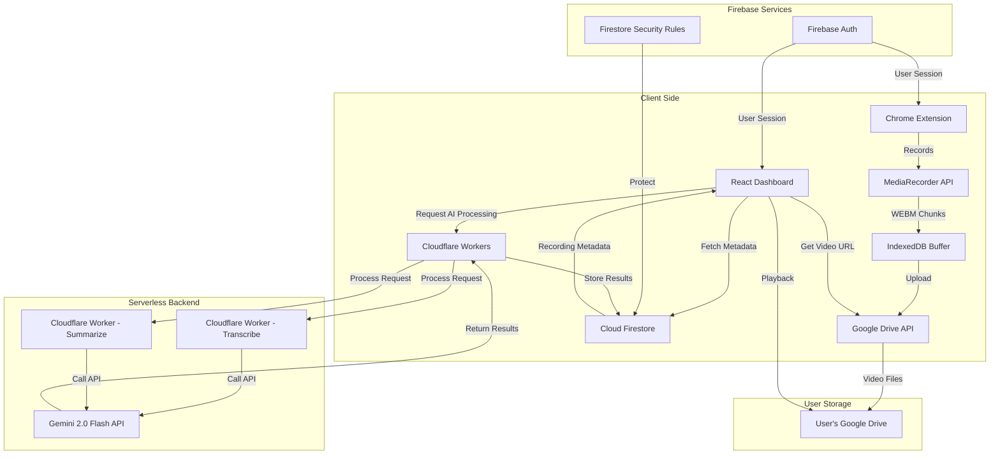
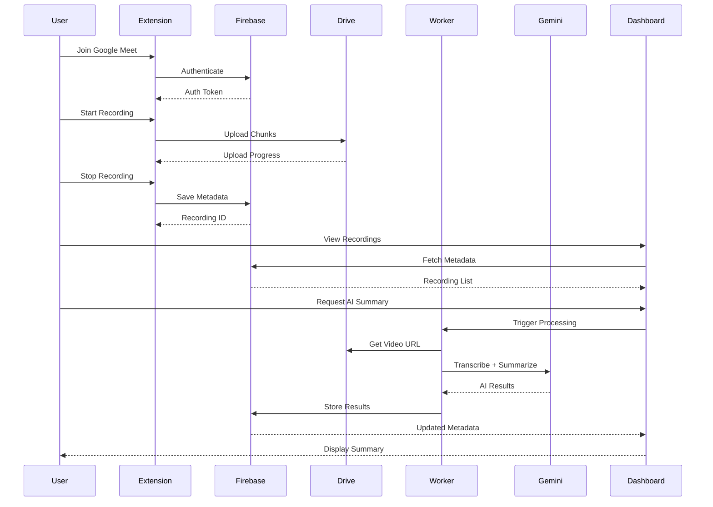
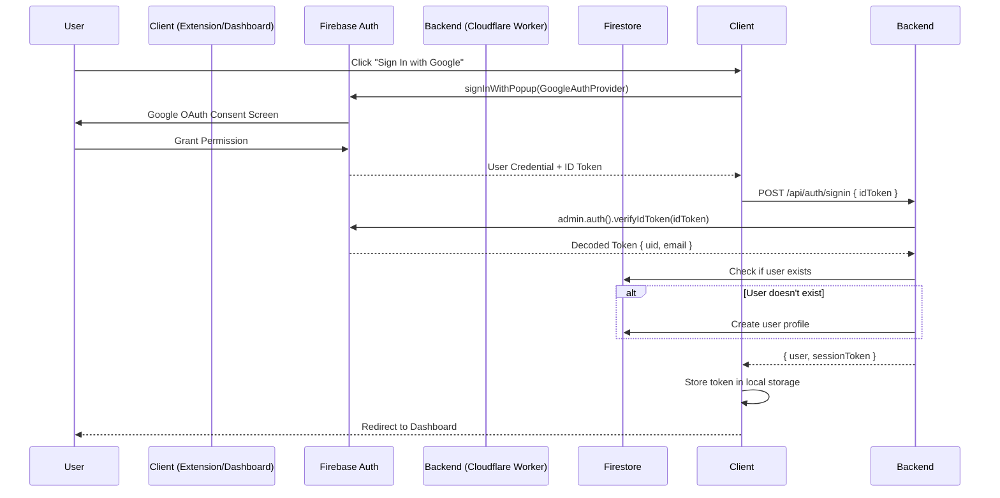

# Backend Agent Handoff Report
**OpenMeet Recorder - Backend Implementation Handoff**

---

## Document Control

| Property | Value |
|----------|-------|
| **Project** | OpenMeet Recorder |
| **Document Type** | Backend Agent Handoff Report |
| **Version** | 1.0.0 |
| **Created** | 2025-12-29 |
| **Status** | Ready for Backend Planning |
| **Prerequisite** | UI/UX and Frontend phases complete |
| **Target Audience** | Backend Planner Agent |
| **Purpose** | Enable Backend planning without reading full Implementation Plan |

---

## 1. Executive Summary

### 1.1 Project Status

**Completed Phases:**
- ✅ **UI/UX Phase:** Complete design system, all component specifications (3,948 lines)
- ✅ **UI/UX Prompts:** 47 task-by-task prompts for UI Agent (4,716 lines)
- ✅ **Frontend Handoff:** Comprehensive handoff report created (1,350 lines)

**Current Phase:**
- 🎯 **Backend Planning Phase:** Creating plan and prompt files for Backend Agent
- 🎯 **Backend Agent:** Will implement Firebase, Cloudflare Workers, AI integration

**What's Already Done:**
- All visual designs and component specifications
- Frontend architecture defined (React, TypeScript, Zustand)
- Chrome extension structure documented
- Dashboard layout and components specified
- API contracts and data schemas defined
- Authentication flow designed

**What Backend Agent Needs to Implement:**
- Firebase project setup (Auth, Firestore)
- Firestore security rules and indexes
- Google Drive API integration
- Cloudflare Workers for AI processing
- Gemini 2.0 Flash API integration (transcription + summarization)
- API endpoints for Frontend
- Database schema implementation
- Authentication backend logic
- Video processing triggers (optional)

### 1.2 Backend Scope Overview

The Backend Agent is responsible for **serverless infrastructure, database, authentication, and AI integration**. Unlike traditional backends, OpenMeet uses a **serverless-first architecture** with:

- **No dedicated backend servers** (cost optimization)
- **Firebase services** for auth and database
- **Cloudflare Workers** for serverless compute
- **Google Drive API** for storage (user's own Drive)
- **Gemini API** for AI processing

**Key Principle:** User data stays in user's own Google Drive. Backend only handles metadata, authentication, and AI processing orchestration.

---

## 2. Table of Contents

1. [Executive Summary](#1-executive-summary)
2. [Table of Contents](#2-table-of-contents)
3. [Project Context](#3-project-context)
4. [UI/UX & Frontend Phase Deliverables](#4-uiux--frontend-phase-deliverables)
5. [Backend Agent Scope](#5-backend-agent-scope)
6. [Technology Stack](#6-technology-stack)
7. [Database Schema](#7-database-schema)
8. [API Specifications](#8-api-specifications)
9. [Authentication Architecture](#9-authentication-architecture)
10. [AI Integration Architecture](#10-ai-integration-architecture)
11. [Cloudflare Workers Implementation](#11-cloudflare-workers-implementation)
12. [Recommended Phase Structure](#12-recommended-phase-structure)
13. [Critical Implementation Notes](#13-critical-implementation-notes)
14. [Security & Privacy](#14-security--privacy)
15. [Testing & Quality Assurance](#15-testing--quality-assurance)
16. [Dependencies & Handoff Points](#16-dependencies--handoff-points)
17. [Reference Documents](#17-reference-documents)
18. [Quick Start for Backend Planner Agent](#18-quick-start-for-backend-planner-agent)
19. [Conclusion](#19-conclusion)

---

## 3. Project Context

### 3.1 Product Overview

**OpenMeet Recorder** is a Chrome extension that records Google Meet sessions with:
- **Smart Recording:** Automatic mic synchronization, chunked uploads
- **AI-Powered:** Multilingual transcription and meeting summarization
- **Privacy-First:** Videos stored in user's own Google Drive
- **Serverless:** No backend servers, all serverless/edge functions

**Target Users:**
- Google Meet users who need to record meetings
- Teams conducting remote meetings
- Individuals needing searchable, summarizable meeting archives

### 3.2 Technical Architecture



### 3.3 User Workflow



### 3.4 Backend Responsibilities in Workflow

| Phase | Backend Component | Responsibility |
|-------|-------------------|----------------|
| **Setup** | Firebase Auth | User authentication with Google OAuth |
| **Recording** | Google Drive API | Accept chunk uploads, store videos |
| **Metadata** | Cloud Firestore | Store recording metadata (title, duration, fileId) |
| **AI Processing** | Cloudflare Worker | Orchestrate transcription and summarization |
| **AI Execution** | Gemini API | Generate transcript and summary |
| **Results Storage** | Cloud Firestore | Store AI results for dashboard display |
| **Playback** | Google Drive API | Provide signed URLs for video playback |

---

## 4. UI/UX & Frontend Phase Deliverables

### 4.1 Completed UI/UX Documents

**UIUX_PLAN.md** (3,948 lines) - Complete specifications:
- Section 3: Design System (colors, typography, spacing, shadows, animations)
- Section 4: Chrome Extension UI (popup, control bar, options page)
- Section 5: Dashboard UI (layout, recording cards, detail view, player)
- Section 6: User Flows (recording workflow, dashboard navigation)
- Section 7: Accessibility & Responsive Design
- Section 10: Handoff Documentation

**UIUX_PROMPT.md** (4,716 lines) - 47 task-by-task prompts:
- Phase 1-6: Design system setup through final testing
- Each task with detailed specifications and verification steps

### 4.2 Completed Frontend Documents

**PLAN_HANDOFF_FRONTEND.md** (1,350 lines) - Frontend handoff:
- Component inventory: 50+ components
- Implementation architecture
- State management (Zustand stores)
- Routing structure
- 7 recommended phases for Frontend implementation

**Frontend Agent Deliverables (Expected):**
- ✅ React components for extension and dashboard
- ✅ State management with Zustand
- ✅ Chrome extension logic (MediaRecorder, message passing)
- ✅ API service layer (TypeScript interfaces)
- ✅ Integration with Firebase SDK (client-side)
- ✅ Google Drive API calls (client-side)
- ✅ Video player with custom controls
- ✅ Responsive UI implementation

### 4.3 What Frontend Provides to Backend

**TypeScript Interfaces:**
```typescript
// Recording metadata structure
interface Recording {
  id: string;
  userId: string;
  title: string;
  duration: number; // seconds
  fileSize: number; // bytes
  quality: '720p' | '1080p';
  format: 'webm' | 'mp4';
  driveFileId: string;
  driveFileUrl?: string;
  thumbnailUrl?: string;
  createdAt: Timestamp;
  updatedAt: Timestamp;
  status: 'processing' | 'ready' | 'failed';
  transcript?: TranscriptEntry[];
  summary?: AISummary;
  tags?: string[];
  folderId?: string;
}

// Transcript entry structure
interface TranscriptEntry {
  timestamp: number; // seconds
  duration: number; // seconds
  speaker: string;
  text: string;
  confidence?: number;
}

// AI summary structure
interface AISummary {
  text: string; // Overview paragraph
  keyPoints: string[]; // Bullet points
  actionItems: ActionItem[];
  topics: string[]; // Extracted topics/tags
  participants: string[]; // Detected speaker names
  language: string; // Detected language
  model: string; // e.g., "gemini-2.0-flash"
  generatedAt: Timestamp;
}

// Action item structure
interface ActionItem {
  text: string;
  assignee?: string;
  dueDate?: string;
  completed: boolean;
}

// User profile structure
interface UserProfile {
  uid: string;
  email: string;
  displayName: string;
  photoURL?: string;
  driveConnected: boolean;
  createdAt: Timestamp;
  plan: 'free' | 'premium';
  quotaUsed: number; // MB
  quotaLimit: number; // MB
}
```

**API Contracts (Expected by Frontend):**
```typescript
// Frontend expects these endpoints from Backend
interface BackendAPI {
  // Authentication
  POST /api/auth/signin: { idToken: string } → { user: UserProfile }
  POST /api/auth/signout: {} → { success: boolean }
  GET /api/auth/me: {} → { user: UserProfile }
  
  // Recordings
  GET /api/recordings: { userId: string, limit?: number, offset?: number } → { recordings: Recording[] }
  GET /api/recordings/:id: { id: string } → { recording: Recording }
  POST /api/recordings: { recording: Omit<Recording, 'id'> } → { recording: Recording }
  PATCH /api/recordings/:id: { updates: Partial<Recording> } → { recording: Recording }
  DELETE /api/recordings/:id: { id: string } → { success: boolean }
  
  // AI Processing
  POST /api/ai/transcribe: { recordingId: string, driveFileId: string } → { jobId: string }
  POST /api/ai/summarize: { recordingId: string, transcript: TranscriptEntry[] } → { jobId: string }
  GET /api/ai/status/:jobId: { jobId: string } → { status: 'pending' | 'processing' | 'completed' | 'failed', result?: any }
  
  // Google Drive
  GET /api/drive/signed-url/:fileId: { fileId: string } → { url: string, expiresAt: string }
}
```

---

## 5. Backend Agent Scope

### 5.1 Core Responsibilities

The Backend Agent is responsible for implementing:

1. **Firebase Project Setup**
   - Initialize Firebase project
   - Configure Firebase Auth with Google OAuth
   - Set up Cloud Firestore database
   - Deploy security rules and indexes

2. **Database Schema Implementation**
   - Create Firestore collections: `users`, `recordings`, `folders`
   - Implement security rules for data protection
   - Create composite indexes for efficient queries

3. **Authentication Backend**
   - Google OAuth 2.0 configuration (Client IDs, secrets)
   - Firebase Auth setup for extension and dashboard
   - Token refresh logic
   - User profile creation on first sign-in

4. **Google Drive API Integration**
   - OAuth scope configuration: `drive.file`
   - Resumable upload endpoints (if needed)
   - Signed URL generation for video playback
   - File deletion on recording removal

5. **Cloudflare Workers Implementation**
   - Worker for transcription orchestration
   - Worker for summarization orchestration
   - API endpoint routing
   - Environment variable management

6. **Gemini AI Integration**
   - Gemini 2.0 Flash API setup
   - Transcription prompt engineering
   - Summarization prompt engineering
   - Error handling and retries

7. **API Endpoints**
   - RESTful API for recording CRUD operations
   - AI processing trigger endpoints
   - Status polling endpoints
   - Webhook handlers (if needed)

8. **Security Implementation**
   - Firestore security rules enforcement
   - API key protection (environment variables)
   - CORS configuration
   - Rate limiting (optional)

9. **Data Validation**
   - Input validation for API requests
   - Schema validation for Firestore writes
   - File size and format validation

10. **Error Handling & Logging**
    - Structured error responses
    - Logging for debugging
    - Error tracking integration (optional)

11. **Testing & Documentation**
    - API endpoint testing
    - Security rules testing
    - API documentation generation

### 5.2 Out of Scope (Not Backend Agent's Responsibility)

**Frontend Implementation:**
- React components
- State management
- Chrome extension UI
- Client-side validation
- Video player implementation

**DevOps & Deployment:**
- CI/CD pipeline setup (basic deployment only)
- Monitoring and alerting infrastructure
- CDN configuration (unless part of Cloudflare setup)

**Future Features (Post-MVP):**
- Video editing functionality
- Real-time collaboration
- Advanced analytics
- Payment processing (freemium → premium)

### 5.3 Deferred to Future Phases

**Phase 2 Enhancements:**
- Advanced search (full-text search)
- Real-time notifications
- Webhook integrations
- Third-party service integrations
- Team collaboration features

---

## 6. Technology Stack

### 6.1 Backend Services

| Service | Provider | Version/Tier | Purpose |
|---------|----------|--------------|---------|
| **Authentication** | Firebase Auth | Free Tier | Google OAuth, user sessions |
| **Database** | Cloud Firestore | Free Tier | Recording metadata, user profiles |
| **Storage** | Google Drive API | User's Drive | Video file storage (15GB free per user) |
| **AI Model** | Gemini 2.0 Flash | Pay-per-use | Transcription and summarization |
| **Serverless Compute** | Cloudflare Workers | Free Tier (100k req/day) | API endpoints, AI orchestration |
| **Hosting** | Cloudflare Pages | Free Tier | Dashboard static hosting |
| **Domain/DNS** | Cloudflare DNS | Free | openmeet.panotech.uk |

### 6.2 Development Tools

| Tool | Purpose |
|------|---------|
| **Firebase CLI** | Deploy rules, indexes, and test locally |
| **Wrangler CLI** | Develop and deploy Cloudflare Workers |
| **Postman / Insomnia** | API testing |
| **Firebase Emulator Suite** | Local development and testing |
| **gcloud CLI** | GCP API configuration |

### 6.3 SDKs & Libraries

**Firebase Admin SDK:**
```json
{
  "firebase-admin": "^12.0.0"
}
```

**Cloudflare Workers:**
```json
{
  "@cloudflare/workers-types": "^4.0.0",
  "hono": "^3.0.0"  // Lightweight web framework for Workers
}
```

**Gemini AI SDK:**
```json
{
  "@google/generative-ai": "^0.1.0"
}
```

---

## 7. Database Schema

### 7.1 Firestore Collections

#### **Collection: `users`**

**Purpose:** Store user profile information

**Document ID:** User's Firebase Auth UID

**Schema:**
```typescript
{
  uid: string;                    // Firebase Auth UID (matches doc ID)
  email: string;                  // User's email
  displayName: string;            // User's display name
  photoURL?: string;              // Profile picture URL
  driveConnected: boolean;        // Whether Google Drive is connected
  createdAt: Timestamp;           // Account creation timestamp
  updatedAt: Timestamp;           // Last update timestamp
  plan: 'free' | 'premium';       // Subscription plan
  quotaUsed: number;              // Storage quota used (MB)
  quotaLimit: number;             // Storage quota limit (MB)
  preferences: {
    defaultQuality: '720p' | '1080p';
    autoTranscribe: boolean;
    autoSummarize: boolean;
    language: string;             // Preferred language for AI
  };
}
```

**Indexes:**
- Single-field index on `email` (ascending)

**Security Rules:**
- Users can only read/write their own document

---

#### **Collection: `recordings`**

**Purpose:** Store recording metadata

**Document ID:** Auto-generated Firestore ID

**Schema:**
```typescript
{
  id: string;                     // Document ID (auto-generated)
  userId: string;                 // Owner's Firebase Auth UID
  title: string;                  // Recording title
  description?: string;           // Optional description
  duration: number;               // Duration in seconds
  fileSize: number;               // File size in bytes
  quality: '720p' | '1080p';      // Recording quality
  format: 'webm' | 'mp4';         // Video format
  driveFileId: string;            // Google Drive file ID
  driveFileUrl?: string;          // Temporary signed URL (client-generated)
  thumbnailUrl?: string;          // Thumbnail URL (optional)
  createdAt: Timestamp;           // Recording creation timestamp
  updatedAt: Timestamp;           // Last update timestamp
  status: 'uploading' | 'processing' | 'ready' | 'failed'; // Recording status
  
  // AI Processing
  transcript?: TranscriptEntry[]; // Transcript entries
  summary?: AISummary;            // AI-generated summary
  
  // Organization
  tags?: string[];                // User-defined tags
  folderId?: string;              // Parent folder ID (optional)
  
  // Privacy
  isPrivate: boolean;             // Privacy setting
  shareableLink?: string;         // Public shareable link (optional)
  
  // Metadata
  meetingUrl?: string;            // Google Meet URL
  participants?: string[];        // Detected participant names
}
```

**Composite Indexes:**
1. `(userId ASC, createdAt DESC)` - For fetching user's recordings sorted by creation date
2. `(userId ASC, updatedAt DESC)` - For fetching user's recordings sorted by update date
3. `(userId ASC, title ASC)` - For fetching user's recordings sorted alphabetically
4. `(userId ASC, folderId ASC, createdAt DESC)` - For folder-based queries

**Security Rules:**
- Users can only read/write recordings where `userId == auth.uid`
- Create: must set `userId` to `auth.uid`
- Update: cannot change `userId`, `driveFileId`, `createdAt`
- Delete: only owner can delete

---

#### **Collection: `folders`**

**Purpose:** Organize recordings into folders

**Document ID:** Auto-generated Firestore ID

**Schema:**
```typescript
{
  id: string;                     // Document ID (auto-generated)
  userId: string;                 // Owner's Firebase Auth UID
  name: string;                   // Folder name
  color?: string;                 // Folder color (hex)
  icon?: string;                  // Folder icon name
  createdAt: Timestamp;           // Folder creation timestamp
  updatedAt: Timestamp;           // Last update timestamp
  recordingCount: number;         // Number of recordings in folder (denormalized)
}
```

**Indexes:**
- Single-field index on `userId` (ascending)

**Security Rules:**
- Users can only read/write folders where `userId == auth.uid`

---

#### **Collection: `ai_jobs`** (Optional - for async processing)

**Purpose:** Track AI processing jobs

**Document ID:** Auto-generated Firestore ID

**Schema:**
```typescript
{
  id: string;                     // Job ID
  recordingId: string;            // Associated recording ID
  userId: string;                 // Owner's UID
  type: 'transcribe' | 'summarize'; // Job type
  status: 'pending' | 'processing' | 'completed' | 'failed'; // Job status
  progress: number;               // Progress percentage (0-100)
  result?: any;                   // Job result (transcript or summary)
  error?: string;                 // Error message if failed
  createdAt: Timestamp;           // Job creation timestamp
  completedAt?: Timestamp;        // Job completion timestamp
}
```

**Indexes:**
- Composite index: `(userId ASC, createdAt DESC)`
- Composite index: `(recordingId ASC, type ASC)`

**Security Rules:**
- Users can only read jobs where `userId == auth.uid`
- Only system (server-side) can write

---

### 7.2 Firestore Security Rules

**File:** `firebase/firestore.rules`

```javascript
rules_version = '2';
service cloud.firestore {
  match /databases/{database}/documents {
    
    // Helper Functions
    function isAuthenticated() {
      return request.auth != null;
    }
    
    function isOwner(userId) {
      return isAuthenticated() && request.auth.uid == userId;
    }
    
    function hasValidUserData() {
      return request.resource.data.keys().hasAll(['uid', 'email', 'displayName', 'createdAt']);
    }
    
    function hasValidRecordingData() {
      return request.resource.data.keys().hasAll([
        'userId', 'title', 'duration', 'fileSize', 'quality', 
        'format', 'driveFileId', 'createdAt', 'status'
      ]);
    }
    
    // Users Collection
    match /users/{userId} {
      allow read: if isOwner(userId);
      allow create: if isOwner(userId) && hasValidUserData();
      allow update: if isOwner(userId) && 
        request.resource.data.diff(resource.data).affectedKeys()
        .hasOnly(['displayName', 'photoURL', 'driveConnected', 'updatedAt', 'preferences']);
      allow delete: if false; // Users cannot delete their own profile
    }
    
    // Recordings Collection
    match /recordings/{recordingId} {
      allow read: if isAuthenticated() && resource.data.userId == request.auth.uid;
      
      allow create: if isAuthenticated() && 
        request.resource.data.userId == request.auth.uid &&
        hasValidRecordingData();
      
      allow update: if isAuthenticated() && 
        resource.data.userId == request.auth.uid &&
        !request.resource.data.diff(resource.data).affectedKeys().hasAny(['userId', 'driveFileId', 'createdAt']);
      
      allow delete: if isAuthenticated() && resource.data.userId == request.auth.uid;
    }
    
    // Folders Collection
    match /folders/{folderId} {
      allow read: if isAuthenticated() && resource.data.userId == request.auth.uid;
      
      allow create: if isAuthenticated() && 
        request.resource.data.userId == request.auth.uid &&
        request.resource.data.keys().hasAll(['userId', 'name', 'createdAt']);
      
      allow update: if isAuthenticated() && 
        resource.data.userId == request.auth.uid &&
        request.resource.data.diff(resource.data).affectedKeys()
        .hasOnly(['name', 'color', 'icon', 'updatedAt']);
      
      allow delete: if isAuthenticated() && resource.data.userId == request.auth.uid;
    }
    
    // AI Jobs Collection (system-only writes)
    match /ai_jobs/{jobId} {
      allow read: if isAuthenticated() && resource.data.userId == request.auth.uid;
      allow write: if false; // Only server-side can write
    }
  }
}
```

---

### 7.3 Firestore Indexes

**File:** `firebase/firestore.indexes.json`

```json
{
  "indexes": [
    {
      "collectionGroup": "recordings",
      "queryScope": "COLLECTION",
      "fields": [
        { "fieldPath": "userId", "order": "ASCENDING" },
        { "fieldPath": "createdAt", "order": "DESCENDING" }
      ]
    },
    {
      "collectionGroup": "recordings",
      "queryScope": "COLLECTION",
      "fields": [
        { "fieldPath": "userId", "order": "ASCENDING" },
        { "fieldPath": "updatedAt", "order": "DESCENDING" }
      ]
    },
    {
      "collectionGroup": "recordings",
      "queryScope": "COLLECTION",
      "fields": [
        { "fieldPath": "userId", "order": "ASCENDING" },
        { "fieldPath": "title", "order": "ASCENDING" }
      ]
    },
    {
      "collectionGroup": "recordings",
      "queryScope": "COLLECTION",
      "fields": [
        { "fieldPath": "userId", "order": "ASCENDING" },
        { "fieldPath": "folderId", "order": "ASCENDING" },
        { "fieldPath": "createdAt", "order": "DESCENDING" }
      ]
    },
    {
      "collectionGroup": "ai_jobs",
      "queryScope": "COLLECTION",
      "fields": [
        { "fieldPath": "userId", "order": "ASCENDING" },
        { "fieldPath": "createdAt", "order": "DESCENDING" }
      ]
    },
    {
      "collectionGroup": "ai_jobs",
      "queryScope": "COLLECTION",
      "fields": [
        { "fieldPath": "recordingId", "order": "ASCENDING" },
        { "fieldPath": "type", "order": "ASCENDING" }
      ]
    }
  ],
  "fieldOverrides": []
}
```

---

## 8. API Specifications

### 8.1 Authentication Endpoints

#### **POST /api/auth/signin**

**Purpose:** Sign in user with Google OAuth

**Request:**
```typescript
{
  idToken: string; // Firebase ID token from client
}
```

**Response:**
```typescript
{
  success: boolean;
  user: {
    uid: string;
    email: string;
    displayName: string;
    photoURL?: string;
  };
  token: string; // Custom token or session ID
}
```

**Implementation Notes:**
- Verify Firebase ID token using Firebase Admin SDK
- Create user profile in Firestore if first sign-in
- Return user data and session token

---

#### **POST /api/auth/signout**

**Purpose:** Sign out user

**Request:**
```typescript
{
  userId: string;
}
```

**Response:**
```typescript
{
  success: boolean;
}
```

---

#### **GET /api/auth/me**

**Purpose:** Get current user profile

**Headers:**
```
Authorization: Bearer <firebase-id-token>
```

**Response:**
```typescript
{
  user: UserProfile;
}
```

---

### 8.2 Recording Endpoints

#### **GET /api/recordings**

**Purpose:** Fetch user's recordings

**Query Parameters:**
- `limit` (optional): Number of recordings to fetch (default: 20)
- `offset` (optional): Pagination offset (default: 0)
- `sortBy` (optional): Sort field - `createdAt`, `updatedAt`, `title` (default: `createdAt`)
- `sortOrder` (optional): `asc` or `desc` (default: `desc`)
- `folderId` (optional): Filter by folder ID
- `status` (optional): Filter by status - `uploading`, `processing`, `ready`, `failed`

**Headers:**
```
Authorization: Bearer <firebase-id-token>
```

**Response:**
```typescript
{
  recordings: Recording[];
  total: number;
  hasMore: boolean;
}
```

**Implementation Notes:**
- Extract `userId` from Firebase token
- Query Firestore with filters and pagination
- Use composite indexes for efficient queries

---

#### **GET /api/recordings/:id**

**Purpose:** Fetch single recording details

**Headers:**
```
Authorization: Bearer <firebase-id-token>
```

**Response:**
```typescript
{
  recording: Recording;
}
```

**Errors:**
- `404`: Recording not found
- `403`: User doesn't own the recording

---

#### **POST /api/recordings**

**Purpose:** Create new recording metadata

**Headers:**
```
Authorization: Bearer <firebase-id-token>
```

**Request:**
```typescript
{
  title: string;
  duration: number;
  fileSize: number;
  quality: '720p' | '1080p';
  format: 'webm' | 'mp4';
  driveFileId: string;
  meetingUrl?: string;
}
```

**Response:**
```typescript
{
  recording: Recording;
}
```

**Implementation Notes:**
- Extract `userId` from token
- Validate input data
- Create Firestore document with `status: 'uploading'`
- Return created recording with generated ID

---

#### **PATCH /api/recordings/:id**

**Purpose:** Update recording metadata

**Headers:**
```
Authorization: Bearer <firebase-id-token>
```

**Request:**
```typescript
{
  title?: string;
  description?: string;
  tags?: string[];
  folderId?: string;
  isPrivate?: boolean;
}
```

**Response:**
```typescript
{
  recording: Recording;
}
```

**Implementation Notes:**
- Verify user owns the recording
- Update only allowed fields
- Update `updatedAt` timestamp

---

#### **DELETE /api/recordings/:id**

**Purpose:** Delete recording and associated files

**Headers:**
```
Authorization: Bearer <firebase-id-token>
```

**Response:**
```typescript
{
  success: boolean;
}
```

**Implementation Notes:**
- Verify user owns the recording
- Delete from Firestore
- Trigger Google Drive file deletion
- Handle cascading deletes (AI jobs, etc.)

---

### 8.3 AI Processing Endpoints

#### **POST /api/ai/transcribe**

**Purpose:** Trigger transcription job for a recording

**Headers:**
```
Authorization: Bearer <firebase-id-token>
```

**Request:**
```typescript
{
  recordingId: string;
  driveFileId: string;
  language?: string; // Optional language hint (e.g., 'en', 'hi', 'mixed')
}
```

**Response:**
```typescript
{
  jobId: string;
  status: 'pending';
  estimatedTime: number; // Estimated completion time in seconds
}
```

**Implementation Notes:**
- Create AI job document in Firestore
- Trigger Cloudflare Worker for transcription
- Return job ID for status polling

---

#### **POST /api/ai/summarize**

**Purpose:** Trigger summarization job for a recording

**Headers:**
```
Authorization: Bearer <firebase-id-token>
```

**Request:**
```typescript
{
  recordingId: string;
  transcript: TranscriptEntry[];
  language?: string;
}
```

**Response:**
```typescript
{
  jobId: string;
  status: 'pending';
}
```

**Implementation Notes:**
- Create AI job document
- Trigger Cloudflare Worker for summarization
- Return job ID

---

#### **GET /api/ai/status/:jobId**

**Purpose:** Check AI job status

**Headers:**
```
Authorization: Bearer <firebase-id-token>
```

**Response:**
```typescript
{
  jobId: string;
  status: 'pending' | 'processing' | 'completed' | 'failed';
  progress: number; // 0-100
  result?: TranscriptEntry[] | AISummary;
  error?: string;
}
```

---

### 8.4 Google Drive Endpoints

#### **GET /api/drive/signed-url/:fileId**

**Purpose:** Generate signed URL for video playback

**Headers:**
```
Authorization: Bearer <firebase-id-token>
```

**Response:**
```typescript
{
  url: string;
  expiresAt: string; // ISO 8601 timestamp
}
```

**Implementation Notes:**
- Use Google Drive API to generate signed URL
- Set expiration time (e.g., 1 hour)
- Return URL for client-side video player

---

## 9. Authentication Architecture

### 9.1 OAuth 2.0 Configuration

**Google Cloud Console Setup:**

1. **Create OAuth 2.0 Client IDs:**

   **For Chrome Extension:**
   - Application type: Chrome App
   - Name: OpenMeet Extension
   - Application ID: `[extension-id].apps.googleusercontent.com`

   **For Dashboard:**
   - Application type: Web application
   - Name: OpenMeet Dashboard
   - Authorized JavaScript origins:
     - `https://openmeet.panotech.uk`
     - `http://localhost:5173` (development)
   - Authorized redirect URIs:
     - `https://openmeet.panotech.uk/__/auth/handler`
     - `http://localhost:5173/__/auth/handler`

2. **OAuth Scopes:**
   ```
   https://www.googleapis.com/auth/userinfo.email
   https://www.googleapis.com/auth/userinfo.profile
   https://www.googleapis.com/auth/drive.file
   ```

3. **API Keys:**
   - Create API key for Gemini AI
   - Restrict to specific APIs: Vertex AI API
   - Store in Cloudflare Workers environment variables

---

### 9.2 Firebase Authentication Flow



---

### 9.3 Token Management

**Client-Side (Extension/Dashboard):**
```typescript
// Store Firebase ID token
const user = await signInWithPopup(auth, googleProvider);
const idToken = await user.user.getIdToken();
localStorage.setItem('firebase_token', idToken);

// Refresh token before expiration (every 50 minutes)
setInterval(async () => {
  const currentUser = auth.currentUser;
  if (currentUser) {
    const newToken = await currentUser.getIdToken(true);
    localStorage.setItem('firebase_token', newToken);
  }
}, 50 * 60 * 1000);

// Add token to API requests
const response = await fetch('/api/recordings', {
  headers: {
    'Authorization': `Bearer ${localStorage.getItem('firebase_token')}`
  }
});
```

**Server-Side (Cloudflare Worker):**
```typescript
// Verify token middleware
async function verifyToken(request: Request): Promise<{ uid: string; email: string } | null> {
  const authHeader = request.headers.get('Authorization');
  if (!authHeader || !authHeader.startsWith('Bearer ')) {
    return null;
  }
  
  const idToken = authHeader.split('Bearer ')[1];
  
  try {
    const decodedToken = await admin.auth().verifyIdToken(idToken);
    return {
      uid: decodedToken.uid,
      email: decodedToken.email!
    };
  } catch (error) {
    console.error('Token verification failed:', error);
    return null;
  }
}
```

---

### 9.4 User Profile Creation

**On First Sign-In:**
```typescript
// Backend (Cloudflare Worker)
async function createUserProfile(uid: string, email: string, displayName: string) {
  const userRef = db.collection('users').doc(uid);
  
  await userRef.set({
    uid,
    email,
    displayName,
    photoURL: null,
    driveConnected: true, // Assume connected after OAuth
    createdAt: Timestamp.now(),
    updatedAt: Timestamp.now(),
    plan: 'free',
    quotaUsed: 0,
    quotaLimit: 1024, // 1GB for free tier
    preferences: {
      defaultQuality: '720p',
      autoTranscribe: false,
      autoSummarize: false,
      language: 'en'
    }
  });
}
```


