# Frontend Agent Handoff Report

> **Document Type:** Phase Transition Handoff  
> **From Phase:** UI/UX Design Phase  
> **To Phase:** Frontend Implementation Phase  
> **Created:** 2025-12-29  
> **Version:** 1.0.0  
> **Status:** Ready for Frontend Planning

---

## Executive Summary

This document provides a comprehensive handoff from the **UI/UX Design Phase** to the **Frontend Implementation Phase** for the OpenMeet Recorder project. The UI/UX Agent has completed all design specifications, and this handoff enables the Frontend Planner Agent to create detailed implementation plans and prompts without reading the full 4,084-line Implementation Plan.

### What Has Been Completed (UI/UX Phase)
✅ Complete design system with all tokens (colors, typography, spacing, shadows, animations)  
✅ All Chrome extension UI components specified (popup, control bar, options page)  
✅ All dashboard UI components specified (layout, cards, detail views)  
✅ Comprehensive style guide with code examples  
✅ Interaction patterns and animation specifications  
✅ Accessibility and responsive design guidelines  
✅ 47 task-by-task prompts for UI/UX implementation

### What Needs to Be Done (Frontend Phase)
🎯 Implement the designed UI components in React + TypeScript  
🎯 Build Chrome extension UI (popup, control bar, options page)  
🎯 Build dashboard application (layout, views, components)  
🎯 Integrate with state management (Zustand)  
🎯 Connect to backend services (Firebase, Google Drive API)  
🎯 Implement routing and navigation  
🎯 Add error handling and loading states  
🎯 Ensure responsive behavior and accessibility

### Key Difference from UI/UX Phase
- **UI/UX Prompts:** Task-by-task (47 granular tasks)
- **Frontend Prompts:** Phase-based (6-7 major phases with grouped tasks)
- **Rationale:** Frontend implementation involves more interconnected work that benefits from phase-level context rather than isolated task-level prompts

---

## Table of Contents

1. [Project Context](#1-project-context)
2. [UI/UX Phase Deliverables](#2-uiux-phase-deliverables)
3. [Frontend Agent Scope](#3-frontend-agent-scope)
4. [Technology Stack](#4-technology-stack)
5. [Design System Reference](#5-design-system-reference)
6. [Component Inventory](#6-component-inventory)
7. [Implementation Architecture](#7-implementation-architecture)
8. [Recommended Phase Structure](#8-recommended-phase-structure)
9. [Critical Implementation Notes](#9-critical-implementation-notes)
10. [Testing & Quality Assurance](#10-testing--quality-assurance)
11. [Dependencies & Handoff Points](#11-dependencies--handoff-points)
12. [Reference Documents](#12-reference-documents)

---

## 1. Project Context

### 1.1 Project Overview

**Project Name:** OpenMeet Recorder  
**Type:** Chrome Extension + React Dashboard  
**Purpose:** Record Google Meet sessions with AI-powered summarization

**Primary Components:**
1. **Chrome Extension** (Manifest V3)
   - Records video/audio from Google Meet tabs
   - Provides recording controls via popup and overlay
   - Manages user settings and preferences
   - Handles chunk upload to Google Drive

2. **Dashboard Application** (React SPA)
   - Displays all recordings in grid/list views
   - Provides video playback with custom controls
   - Shows AI-generated transcripts and summaries
   - Manages recording metadata and sharing

### 1.2 User Workflow

```mermaid
graph LR
    A[User Opens Meet] --> B[Click Extension Icon]
    B --> C[Configure Settings]
    C --> D[Start Recording]
    D --> E[Meeting in Progress]
    E --> F[Stop Recording]
    F --> G[Upload to Drive]
    G --> H[Process with AI]
    H --> I[View in Dashboard]
    I --> J[Access Transcript/Summary]
```



### 1.3 Technical Architecture

```
┌─────────────────────────────────────────────────────────┐
│                    Google Meet Tab                       │
│  ┌────────────────────────────────────────────────┐    │
│  │  Content Script                                 │    │
│  │  - Injects Control Bar                         │    │
│  │  - Captures Media Stream                       │    │
│  └────────────────────────────────────────────────┘    │
└──────────────────────┬──────────────────────────────────┘
                       │
┌──────────────────────▼──────────────────────────────────┐
│           Chrome Extension (Background/Service Worker)   │
│  ┌────────────────────────────────────────────────┐    │
│  │  - State Management (Zustand)                  │    │
│  │  - Recording Logic (MediaRecorder API)         │    │
│  │  - Chunk Upload (Google Drive API)             │    │
│  │  - IndexedDB Storage (Dexie.js)                │    │
│  └────────────────────────────────────────────────┘    │
└──────────────────────┬──────────────────────────────────┘
                       │
┌──────────────────────▼──────────────────────────────────┐
│                  React Dashboard (SPA)                   │
│  ┌────────────────────────────────────────────────┐    │
│  │  - Recording List (Grid/List Views)            │    │
│  │  - Video Player (Custom Controls)              │    │
│  │  - Transcript Viewer                            │    │
│  │  - AI Summary Display                           │    │
│  │  - Settings Management                          │    │
│  └────────────────────────────────────────────────┘    │
└──────────────────────┬──────────────────────────────────┘
                       │
┌──────────────────────▼──────────────────────────────────┐
│                Backend Services (Serverless)             │
│  ┌────────────────────────────────────────────────┐    │
│  │  - Firebase Auth (User Authentication)         │    │
│  │  - Cloud Firestore (Metadata Storage)          │    │
│  │  - Google Drive API (Video Storage)            │    │
│  │  - Cloudflare Workers (AI Processing)          │    │
│  │  - Gemini 2.0 Flash (Transcription/Summary)   │    │
│  └────────────────────────────────────────────────┘    │
└─────────────────────────────────────────────────────────┘
```

### 1.4 Key Features

**Chrome Extension Features:**
- One-click recording start/stop from popup
- Floating control bar during recording with pause/resume
- Live timer and recording status indicator
- Settings for audio sources (mic, tab audio)
- Annotation tools (pen, highlighter, text)
- Chunk-based upload (100MB chunks to Google Drive)
- Background upload continuation

**Dashboard Features:**
- Grid and list view for recordings
- Search and filter by date, duration, title
- Video playback with custom controls (play, pause, skip, speed, quality)
- Timestamped transcript with click-to-jump
- AI-generated summary with key points and action items
- Recording details (metadata, tags, sharing)
- Comments and collaboration features
- Download, share, and delete recordings

---

## 2. UI/UX Phase Deliverables

### 2.1 Completed Documents

**Primary Specifications:**
1. **[plans/UIUX_PLAN.md](../plans/UIUX_PLAN.md)** (3,948 lines)
   - Complete design system specification
   - All component specifications with HTML/CSS code
   - User flows and interaction patterns
   - Accessibility guidelines (WCAG 2.1 Level AA - optional)
   - Responsive design specifications
   - 6 implementation phases
   - Handoff documentation

2. **[prompts/UIUX_PROMPT.md](../prompts/UIUX_PROMPT.md)** (4,716 lines)
   - 47 task-by-task prompts
   - Expected deliverables for each task
   - Verification steps
   - Dependencies tracked
   - Organized in 6 phases

**Supporting Documents:**
- Component style guide (embedded in UIUX_PLAN.md)
- Design decision log (design rationale documented)
- Asset requirements list
- Animation specifications
- Design token definitions

### 2.2 Design System Assets

**CSS Files (Specified, Ready to Implement):**
- `design-system.css` - All CSS custom properties (colors, typography, spacing, shadows, borders, animations, z-index)
- `globals.css` - Global styles, resets, base element styles
- `animations.css` - Animation utilities and keyframes

**Configuration Files (Specified, Ready to Create):**
- `tailwind.config.js` - Complete TailwindCSS configuration with extended theme
- `components.json` - ShadcnUI configuration
- `postcss.config.js` - PostCSS configuration (if needed)

**Design Tokens:**
```javascript
// Example from design system
colors: {
  primary: { 50: '#eff6ff', 500: '#3b82f6', 900: '#1e3a8a' },
  success: { 50: '#f0fdf4', 500: '#22c55e', 900: '#14532d' },
  error: { 50: '#fef2f2', 500: '#ef4444', 900: '#7f1d1d' },
  // ... complete scale
}

spacing: {
  1: '0.25rem',  // 4px
  4: '1rem',     // 16px
  8: '2rem',     // 32px
  // ... 4px grid system
}

fontSize: {
  sm: ['0.875rem', '1.25'],  // 14px, line-height 1.25
  base: ['1rem', '1.5'],      // 16px, line-height 1.5
  xl: ['1.25rem', '1.75'],    // 20px, line-height 1.75
  // ... complete scale
}
```

### 2.3 Component Specifications Summary

**Extension Components (13 components):**
- Popup container and layout
- Source selector (Desktop/Tab/Canvas)
- Settings checkboxes (mic, tab audio, annotations)
- Info notes and alerts
- Action buttons (Start/Close)
- Loading spinner
- Control bar overlay (floating during recording)
- Annotation toolbar (vertical, right side)
- Options page layout
- Settings input components (select, toggle, radio, text)
- Help text and validation messages

**Dashboard Components (25+ components):**
- Dashboard layout (sidebar + main content)
- Sidebar navigation with logo, menu items, user profile
- Header bar with search and notifications
- Recording cards (grid and list variants)
- Grid/list view layouts
- Filter and sort controls
- Skeleton loading components
- Button component system (6 variants, 3 sizes)
- Input components (text, textarea, select, checkbox, radio, toggle)
- Detail page layout
- Video player with custom controls
- Transcript view with timestamps
- AI summary view with sections
- Details tab with metadata
- Comments section with threading
- Empty and error states
- Toast notifications
- Modals and drawers

**Common/Shared Components:**
- Typography components
- Icon system (Lucide React)
- Card components
- Badge and tag components
- Avatar components
- Dropdown menus
- Tooltips and popovers
- Progress bars
- Dividers

### 2.4 Visual Design Specifications

**Color Palette:**
- Primary (Blue): 10-step scale, #3b82f6 as primary-500
- Secondary (Gray-Blue): 10-step scale
- Semantic colors: Success (green), Warning (orange), Error (red), Info (blue)
- Neutral grayscale: 11 steps (gray-50 to gray-900)
- Special states: Recording (#ef4444), Paused (#f59e0b), Uploading (#3b82f6)

**Typography:**
- Sans-serif stack: -apple-system, BlinkMacSystemFont, 'Segoe UI', Roboto, Arial
- Monospace stack: 'SF Mono', Monaco, 'Cascadia Code', 'Roboto Mono'
- 9 font sizes: xs (12px) to 5xl (48px)
- 5 line heights: tight (1.25) to loose (2)
- Weights: 100-900 with semantic names

**Spacing:**
- 4px base grid system
- 27 spacing values from 0 to 64 (256px)
- Consistent component padding and margins

**Shadows & Elevation:**
- 8 shadow levels: xs, sm, md, lg, xl, 2xl, inner, focus
- Proper z-index hierarchy (9 layers from base to tooltip)

**Border Radius:**
- 9 radius values: none to full circle
- Consistent rounding across components

**Animations:**
- 9 duration values: 75ms to 1000ms
- 5 easing functions: linear, ease-in, ease-out, ease-in-out, bounce
- 6 keyframe animations: fadeIn, slideInUp, slideInRight, scaleUp, pulse, spin
- Reduced-motion support

---

## 3. Frontend Agent Scope

### 3.1 What Frontend Agent Should Do

**Core Responsibilities:**
1. **Implement React Components**
   - Convert HTML/CSS specs to React components
   - Use TypeScript for type safety
   - Follow component composition patterns
   - Implement proper prop interfaces

2. **State Management**
   - Set up Zustand stores for:
     - Recording state (status, timer, settings)
     - User authentication state
     - Dashboard data (recordings list, filters, sort)
     - UI state (sidebar collapsed, modals open, etc.)
   - Implement state persistence where needed
   - Handle state synchronization between extension and dashboard

3. **Routing & Navigation**
   - Set up React Router for dashboard
   - Implement route guards for authentication
   - Handle deep linking and navigation state
   - Breadcrumb navigation

4. **API Integration**
   - Firebase Authentication (sign in, sign out, auth state)
   - Cloud Firestore queries (fetch recordings, metadata)
   - Google Drive API (upload chunks, fetch video URLs)
   - Cloudflare Workers API (trigger AI processing, fetch summaries)

5. **Chrome Extension Specifics**
   - Content script injection
   - Background service worker logic
   - Message passing between components
   - Storage API (chrome.storage) integration
   - Permissions handling

6. **Form Handling**
   - Input validation
   - Form state management
   - Error handling and display
   - Submit handling

7. **Media Handling**
   - MediaRecorder API integration
   - Video player implementation
   - Chunk upload logic
   - Progress tracking

8. **Error Handling**
   - Error boundaries in React
   - API error handling
   - User-friendly error messages
   - Retry logic for failed operations

9. **Loading States**
   - Skeleton loaders during data fetch
   - Spinners for actions
   - Progress indicators for uploads
   - Optimistic UI updates

10. **Responsive Behavior**
    - Implement media query breakpoints
    - Mobile-first approach
    - Touch-friendly interactions
    - Adaptive layouts

11. **Accessibility Implementation**
    - ARIA attributes
    - Keyboard navigation
    - Focus management
    - Screen reader support
    - Color contrast compliance

### 3.2 What Frontend Agent Should NOT Do

**Out of Scope:**
- ❌ Backend API development (Cloudflare Workers, Firebase functions)
- ❌ AI model integration (Gemini API calls handled by backend)
- ❌ Database schema design (Firestore structure defined in Implementation Plan)
- ❌ Google Drive API server-side logic
- ❌ Authentication backend logic (handled by Firebase)
- ❌ Video processing or transcoding
- ❌ DevOps and deployment configuration (handled separately)

**Deferred to Backend Agent:**
- Cloudflare Workers implementation
- Gemini AI integration
- Video processing logic
- Webhook handling
- Database optimization
- Caching strategies

---

## 4. Technology Stack

### 4.1 Chrome Extension Stack

**Core Technologies:**
- **Manifest Version:** V3
- **Language:** TypeScript 5.3+
- **Build Tool:** Vite 5.0+ with vite-plugin-chrome-extension
- **UI Library:** React 18.2+
- **Styling:** TailwindCSS 3.4+ with custom configuration
- **State Management:** Zustand 4.5+
- **Storage:** IndexedDB via Dexie.js 3.2+

**Key Libraries:**
```json
{
  "react": "^18.2.0",
  "react-dom": "^18.2.0",
  "typescript": "^5.3.0",
  "vite": "^5.0.0",
  "tailwindcss": "^3.4.0",
  "zustand": "^4.5.0",
  "dexie": "^3.2.0",
  "lucide-react": "latest"
}
```

**Chrome APIs Used:**
- `chrome.tabs` - Tab management
- `chrome.storage` - Settings persistence
- `chrome.runtime` - Message passing
- `chrome.identity` - OAuth authentication
- `chrome.scripting` - Content script injection
- `chrome.offscreen` - Video recording in background

### 4.2 Dashboard Stack

**Core Technologies:**
- **Language:** TypeScript 5.3+
- **Build Tool:** Vite 5.0+
- **UI Library:** React 18.2+
- **Styling:** TailwindCSS 3.4+ + ShadcnUI components
- **State Management:** Zustand 4.5+
- **Routing:** React Router 6.21+

**Key Libraries:**
```json
{
  "react": "^18.2.0",
  "react-dom": "^18.2.0",
  "react-router-dom": "^6.21.0",
  "typescript": "^5.3.0",
  "vite": "^5.0.0",
  "tailwindcss": "^3.4.0",
  "zustand": "^4.5.0",
  "lucide-react": "latest",
  "@radix-ui/react-*": "latest",
  "firebase": "^10.0.0"
}
```

**ShadcnUI Components to Install:**
- Button, Card, Dialog, Input, Select
- Dropdown Menu, Tabs, Avatar, Badge
- Tooltip, Popover, Progress, Switch
- Alert, Separator, Label, Checkbox

### 4.3 Shared Dependencies

**Development Tools:**
- ESLint for linting
- Prettier for formatting
- TypeScript for type checking
- Vite for bundling
- pnpm for package management

**Testing (Optional but Recommended):**
- Vitest for unit testing
- React Testing Library
- Playwright for E2E testing

---

## 5. Design System Reference

### 5.1 Quick Token Reference

**Colors:**
```css
/* Primary (Blue) */
--color-primary-50: #eff6ff;
--color-primary-500: #3b82f6;
--color-primary-900: #1e3a8a;

/* Semantic */
--color-success-500: #22c55e;
--color-warning-500: #f59e0b;
--color-error-500: #ef4444;

/* Neutrals */
--color-gray-50: #f9fafb;
--color-gray-500: #6b7280;
--color-gray-900: #111827;
```

**Typography:**
```css
/* Sizes */
--text-sm: 0.875rem;   /* 14px */
--text-base: 1rem;      /* 16px */
--text-lg: 1.125rem;    /* 18px */
--text-xl: 1.25rem;     /* 20px */
--text-2xl: 1.5rem;     /* 24px */

/* Weights */
--font-medium: 500;
--font-semibold: 600;
--font-bold: 700;
```

**Spacing (4px grid):**
```css
--spacing-1: 0.25rem;  /* 4px */
--spacing-2: 0.5rem;   /* 8px */
--spacing-4: 1rem;     /* 16px */
--spacing-6: 1.5rem;   /* 24px */
--spacing-8: 2rem;     /* 32px */
```

**Shadows:**
```css
--shadow-sm: 0 1px 2px rgba(0, 0, 0, 0.05);
--shadow-md: 0 4px 6px -1px rgba(0, 0, 0, 0.1);
--shadow-lg: 0 10px 15px -3px rgba(0, 0, 0, 0.1);
--shadow-focus: 0 0 0 3px rgba(59, 130, 246, 0.5);
```

### 5.2 Component Patterns

**Button Pattern:**
```tsx
// Primary button with hover lift
className="h-10 px-4 bg-primary-600 text-white rounded-md 
           hover:bg-primary-700 hover:-translate-y-0.5 hover:shadow-md
           transition-all duration-200"
```

**Card Pattern:**
```tsx
// Card with hover elevation
className="bg-white border border-gray-200 rounded-lg shadow-sm
           hover:border-primary-300 hover:-translate-y-1 hover:shadow-md
           transition-all duration-300 cursor-pointer"
```

**Input Pattern:**
```tsx
// Text input with focus state
className="h-11 px-4 border-2 border-gray-300 rounded-md
           focus:border-primary-500 focus:ring-4 focus:ring-primary-500/50
           transition-all duration-200"
```

### 5.3 Animation Guidelines

**Hover Interactions:**
- Duration: 200ms
- Easing: ease-out
- Properties: background-color, border-color, transform, box-shadow

**Modal/Drawer Entrance:**
- Backdrop: fade in 200ms
- Content: fade + scale up 300ms
- Easing: ease-out

**List Animations:**
- Staggered entrance: 50ms delay between items
- Each item: fadeIn + slideUp

**Recording Indicator:**
- Pulse animation: 1.5s infinite
- Opacity 1 → 0.3 → 1
- Scale 1 → 1.2 → 1

---

## 6. Component Inventory

### 6.1 Chrome Extension Components

#### 6.1.1 Popup Interface Components

| Component | Priority | Complexity | Dependencies | Location in UIUX_PLAN |
|-----------|----------|------------|--------------|----------------------|
| PopupContainer | 🔴 Critical | Low | None | Section 4.1.1 |
| PopupHeader | 🔴 Critical | Low | Icon, Button | Section 4.1.2 |
| SourceSelector | 🔴 Critical | Medium | Button | Section 4.1.3 |
| SettingsCheckboxes | 🔴 Critical | Low | Checkbox | Section 4.1.4 |
| InfoNote | 🟡 High | Low | Icon | Section 4.1.5 |
| ActionButtons | 🔴 Critical | Low | Button | Section 4.1.6 |
| LoadingSpinner | 🟡 High | Low | None | Section 4.1 |
| RecordingStatesUI | 🔴 Critical | Medium | Button, ProgressBar | Section 4.1 |

**Key Implementation Notes:**
- Popup has fixed width (400px) and height constraints
- Source selector uses grid layout (3 columns)
- Recording states change button colors and text dynamically
- Info notes should support multiple variants (info, success, warning, error)

#### 6.1.2 Control Bar Components

| Component | Priority | Complexity | Dependencies | Location in UIUX_PLAN |
|-----------|----------|------------|--------------|----------------------|
| ControlBarContainer | 🔴 Critical | High | Multiple | Section 4.2 |
| RecordingIndicator | 🔴 Critical | Low | Icon, Animation | Section 4.2 |
| TimerDisplay | 🔴 Critical | Low | Monospace font | Section 4.2 |
| ControlButtons | 🔴 Critical | Medium | Button, Icons | Section 4.2 |
| StopButton | 🔴 Critical | Low | Button | Section 4.2 |
| AnnotationToolbar | 🟡 High | High | Multiple tools | Section 4.2 |

**Key Implementation Notes:**
- Control bar is draggable (needs drag & drop logic)
- Fixed positioning at bottom center
- Dark glassmorphism effect (backdrop-filter: blur)
- Timer updates every second
- Pulsing red dot animation for recording
- Annotation toolbar opens on button click (separate component)

#### 6.1.3 Options Page Components

| Component | Priority | Complexity | Dependencies | Location in UIUX_PLAN |
|-----------|----------|------------|--------------|----------------------|
| OptionsPageLayout | 🟡 High | Low | Container | Section 4.3.1 |
| SettingsCard | 🟡 High | Low | Card | Section 4.3.1 |
| SelectDropdown | 🟡 High | Medium | Dropdown | Section 4.3.2 |
| ToggleSwitch | 🟡 High | Medium | Switch | Section 4.3.2 |
| RadioButtonGroup | 🟡 High | Low | Radio | Section 4.3.2 |
| TextInput | 🟡 High | Low | Input | Section 4.3.2 |
| HelpText | 🟢 Medium | Low | Text | Section 4.3 |
| ValidationMessages | 🟡 High | Low | Alert | Section 4.3 |

**Key Implementation Notes:**
- Options page is a full webpage (not popup)
- Settings organized in sections with dividers
- Form state management needed
- Validation on save
- Reset to defaults functionality

### 6.2 Dashboard Components

#### 6.2.1 Layout Components

| Component | Priority | Complexity | Dependencies | Location in UIUX_PLAN |
|-----------|----------|------------|--------------|----------------------|
| DashboardLayout | 🔴 Critical | Medium | Sidebar, MainContent | Section 5.1 |
| Sidebar | 🔴 Critical | High | Multiple | Section 5.2 |
| SidebarLogo | 🔴 Critical | Low | Icon, Image | Section 5.2.1 |
| NavigationMenu | 🔴 Critical | Medium | NavItem, Badge | Section 5.2.2 |
| UserProfile | 🔴 Critical | Medium | Avatar, Dropdown | Section 5.2.3 |
| HeaderBar | 🔴 Critical | High | Search, Buttons | Section 5.3 |
| SearchBar | 🔴 Critical | Medium | Input, Icon | Section 5.3 |
| NotificationBadge | 🟡 High | Low | Badge | Section 5.3 |

**Key Implementation Notes:**
- Sidebar: 280px (expanded), 80px (collapsed)
- Responsive: drawer overlay on mobile
- Header: sticky positioning
- Search bar: debounced search
- Sidebar state persisted in localStorage

#### 6.2.2 Recording Display Components

| Component | Priority | Complexity | Dependencies | Location in UIUX_PLAN |
|-----------|----------|------------|--------------|----------------------|
| RecordingCard | 🔴 Critical | High | Thumbnail, Badge | Section 5.4.1 |
| GridViewLayout | 🔴 Critical | Medium | Grid, Cards | Section 5.4 |
| ListViewLayout | 🔴 Critical | Medium | List, Cards | Section 5.4 |
| ViewToggle | 🔴 Critical | Low | ButtonGroup | Section 5.4 |
| FilterControls | 🟡 High | High | Dropdown, Panel | Section 5.4 |
| SortDropdown | 🔴 Critical | Medium | Dropdown | Section 5.4 |
| FilterPanel | 🟡 High | High | Sidebar, Form | Section 5.4 |
| ActiveFilterTags | 🟡 High | Medium | Chip, Button | Section 5.4 |
| EmptyState | 🔴 Critical | Low | Icon, Text | Section 5.4 |
| SkeletonCard | 🔴 Critical | Low | Skeleton | Section 5.4 |

**Key Implementation Notes:**
- Grid: responsive columns (1-4 based on screen width)
- List: horizontal card layout
- Cards: thumbnail with 16:9 aspect ratio
- Hover effects: elevation + border color change
- Filter panel: slides in from right
- Active filters: dismissible chips

#### 6.2.3 Detail View Components

| Component | Priority | Complexity | Dependencies | Location in UIUX_PLAN |
|-----------|----------|------------|--------------|----------------------|
| DetailPageLayout | 🔴 Critical | Medium | Multiple sections | Section 5.5.1 |
| Breadcrumb | 🔴 Critical | Low | Link, Icon | Section 5.5.1 |
| VideoPlayer | 🔴 Critical | Very High | Custom controls | Section 5.5.2 |
| PlayerControls | 🔴 Critical | Very High | Multiple buttons | Section 5.5.2 |
| ProgressBar | 🔴 Critical | High | Slider | Section 5.5.2 |
| VolumeControl | 🔴 Critical | Medium | Slider, Button | Section 5.5.2 |
| TranscriptView | 🔴 Critical | High | List, Scroll | Section 5.5.3 |
| TranscriptEntry | 🔴 Critical | Medium | Timestamp, Text | Section 5.5.3 |
| AISummaryView | 🔴 Critical | Medium | Sections, Lists | Section 5.5.4 |
| DetailsTab | 🟡 High | Low | Form, Properties | Section 5.5 |
| CommentsSection | 🟢 Medium | High | Form, Thread | Section 5.5 |

**Key Implementation Notes:**
- Video player: HTML5 video element with custom UI overlay
- Controls: appear on hover, hide after 3s of inactivity
- Progress bar: seekable, shows buffered progress
- Transcript: click timestamp to jump to video time
- Active transcript entry: auto-scroll and highlight
- AI Summary: sections with icons and formatting
- Comments: nested threading support

### 6.3 Shared/Common Components

| Component | Priority | Complexity | Dependencies | Location in UIUX_PLAN |
|-----------|----------|------------|--------------|----------------------|
| Button | 🔴 Critical | Medium | None | Section 5 |
| Input | 🔴 Critical | Low | None | Section 4.3.2 |
| Select | 🔴 Critical | Medium | Dropdown | Section 4.3.2 |
| Checkbox | 🔴 Critical | Low | None | Section 4.3.2 |
| Radio | 🔴 Critical | Low | None | Section 4.3.2 |
| Toggle/Switch | 🔴 Critical | Medium | None | Section 4.3.2 |
| Card | 🔴 Critical | Low | None | Section 5.4.1 |
| Badge | 🟡 High | Low | None | Section 5 |
| Avatar | 🟡 High | Low | Image | Section 5.2.3 |
| Dropdown | 🔴 Critical | High | Portal, Menu | Section 5 |
| Modal | 🟡 High | High | Portal, Backdrop | Section 5 |
| Drawer | 🟡 High | High | Portal, Animation | Section 5.4 |
| Toast | 🟡 High | Medium | Portal, Animation | Section 5 |
| Tooltip | 🟢 Medium | Medium | Portal, Popover | Section 5 |
| Spinner | 🔴 Critical | Low | Animation | Section 4.1 |
| Skeleton | 🔴 Critical | Low | Animation | Section 5.4 |
| ProgressBar | 🔴 Critical | Low | None | Section 4.1 |

**Key Implementation Notes:**
- Button: 6 variants (primary, secondary, success, error, ghost, link), 3 sizes (sm, md, lg)
- Inputs: consistent 44px height, focus states with blue ring
- Dropdown: use Portal for z-index management
- Modal/Drawer: backdrop with click-to-close, escape key support
- Toast: auto-dismiss after 3s, slide-in from right
- Skeleton: shimmer animation

### 6.4 Component Priority Legend

🔴 **Critical:** Must implement first, core functionality depends on it  
🟡 **High:** Important for user experience, implement early  
🟢 **Medium:** Nice-to-have, can be implemented later  
⚪ **Low:** Optional, future enhancement

---

## 7. Implementation Architecture

### 7.1 Project Structure

**Chrome Extension Structure:**
```
extension/
├── public/
│   ├── manifest.json          # Extension manifest (MV3)
│   ├── icons/                  # Extension icons
│   └── _locales/               # Internationalization (optional)
├── src/
│   ├── background/             # Service worker
│   │   ├── index.ts           # Main background script
│   │   ├── recording.ts       # Recording logic
│   │   ├── upload.ts          # Upload logic
│   │   └── storage.ts         # Storage management
│   ├── content/                # Content scripts
│   │   ├── index.ts           # Main content script
│   │   └── ControlBar.tsx     # Injected control bar
│   ├── popup/                  # Popup UI
│   │   ├── index.tsx          # Popup entry point
│   │   ├── Popup.tsx          # Main popup component
│   │   └── components/        # Popup components
│   ├── options/                # Options page
│   │   ├── index.tsx          # Options entry point
│   │   ├── Options.tsx        # Main options component
│   │   └── components/        # Options components
│   ├── components/             # Shared components
│   │   ├── ui/                # UI primitives (Button, Input, etc.)
│   │   └── common/            # Common components
│   ├── store/                  # Zustand stores
│   │   ├── recordingStore.ts  # Recording state
│   │   ├── settingsStore.ts   # Settings state
│   │   └── authStore.ts       # Auth state
│   ├── lib/                    # Utilities
│   │   ├── chrome-api.ts      # Chrome API wrappers
│   │   ├── storage.ts         # Storage utilities
│   │   └── utils.ts           # General utilities
│   ├── styles/                 # Global styles
│   │   ├── design-system.css  # Design tokens
│   │   ├── globals.css        # Global styles
│   │   └── animations.css     # Animation utilities
│   └── types/                  # TypeScript types
│       ├── chrome.d.ts        # Chrome API types
│       └── index.d.ts         # Global types
├── tailwind.config.js         # Tailwind configuration
├── vite.config.ts             # Vite configuration
├── tsconfig.json              # TypeScript configuration
└── package.json               # Dependencies
```

**Dashboard Structure:**
```
dashboard/
├── public/
│   ├── favicon.ico
│   └── assets/                 # Static assets
├── src/
│   ├── pages/                  # Route pages
│   │   ├── Home.tsx           # Home/recordings list
│   │   ├── Detail.tsx         # Recording detail
│   │   ├── Settings.tsx       # User settings
│   │   └── Auth.tsx           # Authentication
│   ├── components/             # Components
│   │   ├── layout/            # Layout components
│   │   │   ├── DashboardLayout.tsx
│   │   │   ├── Sidebar.tsx
│   │   │   └── Header.tsx
│   │   ├── recording/         # Recording components
│   │   │   ├── RecordingCard.tsx
│   │   │   ├── GridView.tsx
│   │   │   └── ListView.tsx
│   │   ├── player/            # Video player components
│   │   │   ├── VideoPlayer.tsx
│   │   │   └── PlayerControls.tsx
│   │   ├── transcript/        # Transcript components
│   │   │   └── TranscriptView.tsx
│   │   ├── summary/           # Summary components
│   │   │   └── AISummaryView.tsx
│   │   └── ui/                # UI primitives
│   ├── store/                  # Zustand stores
│   │   ├── authStore.ts       # Auth state
│   │   ├── recordingsStore.ts # Recordings state
│   │   └── uiStore.ts         # UI state
│   ├── services/               # API services
│   │   ├── firebase.ts        # Firebase config
│   │   ├── firestore.ts       # Firestore queries
│   │   ├── auth.ts            # Auth service
│   │   ├── storage.ts         # Google Drive
│   │   └── ai.ts              # AI processing
│   ├── hooks/                  # Custom React hooks
│   │   ├── useRecordings.ts   # Recordings data
│   │   ├── useAuth.ts         # Auth state
│   │   └── useMediaQuery.ts   # Responsive
│   ├── lib/                    # Utilities
│   │   ├── utils.ts           # General utilities
│   │   ├── cn.ts              # Class name utility
│   │   └── constants.ts       # Constants
│   ├── styles/                 # Global styles
│   │   ├── design-system.css  # Design tokens
│   │   ├── globals.css        # Global styles
│   │   └── animations.css     # Animation utilities
│   ├── types/                  # TypeScript types
│   │   ├── recording.ts       # Recording types
│   │   └── index.d.ts         # Global types
│   ├── App.tsx                 # Root component
│   ├── main.tsx                # Entry point
│   └── router.tsx              # Route configuration
├── components.json             # ShadcnUI config
├── tailwind.config.js         # Tailwind configuration
├── vite.config.ts             # Vite configuration
├── tsconfig.json              # TypeScript configuration
└── package.json               # Dependencies
```

### 7.2 State Management Architecture

**Zustand Stores:**

**1. Recording Store (Extension):**
```typescript
interface RecordingState {
  status: 'idle' | 'recording' | 'paused' | 'stopped' | 'uploading';
  startTime: number | null;
  duration: number;
  settings: {
    source: 'desktop' | 'tab' | 'canvas';
    tabAudio: boolean;
    microphone: boolean;
    annotations: boolean;
  };
  chunks: Blob[];
  uploadProgress: number;
  
  // Actions
  startRecording: () => Promise<void>;
  pauseRecording: () => void;
  resumeRecording: () => void;
  stopRecording: () => Promise<void>;
  updateSettings: (settings: Partial<Settings>) => void;
}
```

**2. Auth Store (Shared):**
```typescript
interface AuthState {
  user: User | null;
  loading: boolean;
  error: Error | null;
  
  // Actions
  signIn: () => Promise<void>;
  signOut: () => Promise<void>;
  refreshToken: () => Promise<void>;
}
```

**3. Recordings Store (Dashboard):**
```typescript
interface RecordingsState {
  recordings: Recording[];
  loading: boolean;
  error: Error | null;
  filters: {
    dateRange: DateRange;
    duration: DurationFilter;
    starred: boolean;
  };
  sort: SortOption;
  view: 'grid' | 'list';
  
  // Actions
  fetchRecordings: () => Promise<void>;
  fetchRecording: (id: string) => Promise<Recording>;
  updateRecording: (id: string, data: Partial<Recording>) => Promise<void>;
  deleteRecording: (id: string) => Promise<void>;
  setFilters: (filters: Partial<Filters>) => void;
  setSort: (sort: SortOption) => void;
  setView: (view: 'grid' | 'list') => void;
}
```

**4. UI Store (Dashboard):**
```typescript
interface UIState {
  sidebarCollapsed: boolean;
  filterPanelOpen: boolean;
  activeModal: string | null;
  toasts: Toast[];
  
  // Actions
  toggleSidebar: () => void;
  openFilterPanel: () => void;
  closeFilterPanel: () => void;
  openModal: (modalId: string) => void;
  closeModal: () => void;
  addToast: (toast: Toast) => void;
  removeToast: (id: string) => void;
}
```

### 7.3 Routing Architecture (Dashboard)

**Route Structure:**
```typescript
const routes = [
  {
    path: '/',
    element: <DashboardLayout />,
    children: [
      { index: true, element: <Home /> },
      { path: 'recording/:id', element: <Detail /> },
      { path: 'settings', element: <Settings /> },
      { path: 'starred', element: <Starred /> },
      { path: 'shared', element: <Shared /> },
      { path: 'trash', element: <Trash /> },
    ],
  },
  {
    path: '/auth',
    element: <Auth />,
    children: [
      { path: 'signin', element: <SignIn /> },
      { path: 'callback', element: <Callback /> },
    ],
  },
];
```

**Route Guards:**
- Protected routes: require authentication
- Redirect to /auth/signin if not authenticated
- Store intended destination for redirect after login

### 7.4 API Service Architecture

**Firebase Service:**
```typescript
// services/firebase.ts
import { initializeApp } from 'firebase/app';
import { getAuth } from 'firebase/auth';
import { getFirestore } from 'firebase/firestore';

const firebaseConfig = { /* config */ };
const app = initializeApp(firebaseConfig);
const auth = getAuth(app);
const db = getFirestore(app);

export { app, auth, db };
```

**Firestore Service:**
```typescript
// services/firestore.ts
import { collection, query, where, orderBy, getDocs } from 'firebase/firestore';
import { db } from './firebase';

export async function getRecordings(userId: string) {
  const q = query(
    collection(db, 'recordings'),
    where('userId', '==', userId),
    orderBy('createdAt', 'desc')
  );
  const snapshot = await getDocs(q);
  return snapshot.docs.map(doc => ({ id: doc.id, ...doc.data() }));
}

export async function getRecording(id: string) {
  // Implementation
}

export async function updateRecording(id: string, data: Partial<Recording>) {
  // Implementation
}

export async function deleteRecording(id: string) {
  // Implementation
}
```

**Google Drive Service:**
```typescript
// services/storage.ts
export async function uploadChunk(
  chunk: Blob,
  recordingId: string,
  chunkIndex: number,
  totalChunks: number
): Promise<void> {
  // Upload chunk to Google Drive
  // Update progress
}

export async function getVideoUrl(recordingId: string): Promise<string> {
  // Get signed URL for video playback
}
```

### 7.5 Chrome Extension Architecture

**Message Passing:**
```typescript
// Background <-> Content Script
chrome.runtime.sendMessage({ type: 'START_RECORDING' });
chrome.runtime.onMessage.addListener((message, sender, sendResponse) => {
  if (message.type === 'START_RECORDING') {
    // Handle recording start
  }
});

// Popup <-> Background
chrome.runtime.sendMessage({ type: 'GET_RECORDING_STATUS' });
```

**Storage Strategy:**
- `chrome.storage.local`: Recording settings, user preferences
- `chrome.storage.sync`: Synced settings across devices
- IndexedDB (Dexie): Recording chunks, temporary data

---

## 8. Recommended Phase Structure

### 8.1 Overview

The Frontend implementation should be broken down into **6-7 phases** with **phase-based prompts**. Each phase groups related tasks together for better context and workflow.

**Why Phase-Based (vs Task-by-Task)?**
- Frontend work is more interconnected than UI/UX design
- Components depend on each other and shared state
- Setting up infrastructure once benefits multiple components
- Maintains context across related implementation work
- Reduces redundant setup and configuration

### 8.2 Recommended Phases

#### **Phase 1: Project Setup & Design System** (2-3 days)

**Goal:** Set up both extension and dashboard projects with design system

**Tasks:**
1. Initialize Vite projects for extension and dashboard
2. Install and configure dependencies (React, TypeScript, TailwindCSS, etc.)
3. Implement design-system.css with all tokens
4. Configure TailwindCSS with extended theme
5. Set up ShadcnUI and install base components
6. Create globals.css and animations.css
7. Set up project folder structure
8. Configure ESLint, Prettier, TypeScript
9. Test build and dev server

**Deliverables:**
- ✅ Working Vite projects (extension and dashboard)
- ✅ Design system CSS implemented
- ✅ TailwindCSS configured
- ✅ ShadcnUI installed
- ✅ Project structure established

**Frontend Prompt (Phase 1):**
```
Set up the OpenMeet Recorder frontend projects with design system.

1. Create two Vite + React + TypeScript projects:
   - extension/ for Chrome extension
   - dashboard/ for React dashboard

2. Install dependencies:
   - React 18.2+, TypeScript 5.3+, TailwindCSS 3.4+
   - Zustand 4.5+, React Router 6.21+, Lucide React
   - For extension: vite-plugin-chrome-extension, Dexie.js 3.2+

3. Implement design system:
   - Create design-system.css with all CSS variables from UIUX_PLAN.md Section 3
   - Create globals.css with base styles and resets
   - Create animations.css with animation utilities from Section 3.6

4. Configure TailwindCSS:
   - Extend theme with design tokens from UIUX_PLAN.md
   - Set up responsive breakpoints
   - Configure purge for production

5. Initialize ShadcnUI:
   - Create components.json
   - Install base components: Button, Card, Input, Select, etc.

6. Set up folder structure as specified in Section 7.1

Reference: UIUX_PLAN.md Sections 3 (Design System), 7.1 (Architecture)
Handoff Document: Section 5 (Design System Reference)
```

---

#### **Phase 2: Shared Components Library** (3-4 days)

**Goal:** Build reusable UI components used across extension and dashboard

**Tasks:**
1. Create Button component with all variants and sizes
2. Create Input components (text, textarea, select, checkbox, radio, toggle)
3. Create Card component
4. Create Badge and Avatar components
5. Create Dropdown/Menu components
6. Create Modal and Drawer components
7. Create Toast notification system
8. Create Tooltip and Popover components
9. Create Spinner and Skeleton loaders
10. Create ProgressBar component
11. Test all components with different props and states

**Deliverables:**
- ✅ Complete UI component library
- ✅ All components follow design specs
- ✅ All variants and states implemented
- ✅ TypeScript interfaces defined
- ✅ Components are reusable

**Frontend Prompt (Phase 2):**
```
Implement the shared UI component library for OpenMeet Recorder.

Build the following components following specifications in UIUX_PLAN.md:

1. Button (Section 5, implied throughout)
   - Variants: primary, secondary, success, error, ghost, link
   - Sizes: sm (32px), md (40px), lg (48px)
   - States: default, hover, active, disabled, loading
   - Icon-only variant
   - Props: variant, size, disabled, loading, icon, onClick, children

2. Input Components (Section 4.3.2)
   - TextInput, Textarea, Select, Checkbox, Radio, Toggle
   - All with focus states, validation states
   - Consistent 44px height
   - Label support

3. Card (Section 5.4.1)
   - Base card with padding and shadow
   - Hover elevation effect

4. Badge, Avatar (Section 5)
   - Badge: multiple variants, size options
   - Avatar: circular, with fallback initials

5. Dropdown, Modal, Drawer, Toast (Section 5)
   - Portal-based for z-index management
   - Animations: fade in/out, slide
   - Click-outside and escape key support

6. Loading Components (Section 5.4)
   - Spinner: rotating animation
   - Skeleton: shimmer effect
   - ProgressBar: linear progress

Use TypeScript for all components with proper prop interfaces.
Reference design tokens from design-system.css.
Ensure all hover/focus states match UIUX_PLAN.md specifications.

Reference: UIUX_PLAN.md Sections 4.3.2, 5.4.1, 5 (various)
```

---

#### **Phase 3: Chrome Extension UI** (4-5 days)

**Goal:** Build all Chrome extension UI components

**Tasks:**
1. Set up manifest.json (MV3)
2. Create Popup interface
   - PopupContainer and layout
   - Source selector
   - Settings checkboxes
   - Action buttons
   - Loading and recording states
3. Create Control Bar overlay
   - Floating control bar
   - Recording indicator and timer
   - Control buttons
   - Annotation toolbar
4. Create Options page
   - Page layout
   - Settings sections
   - Form inputs
   - Save/reset functionality
5. Set up content script injection
6. Implement message passing
7. Test extension UI

**Deliverables:**
- ✅ Working popup interface
- ✅ Floating control bar
- ✅ Options page
- ✅ Content script injection
- ✅ Extension loads in Chrome

**Frontend Prompt (Phase 3):**
```
Implement Chrome extension UI for OpenMeet Recorder.

1. Manifest.json (Manifest V3):
   - Define popup, options, content scripts
   - Set permissions: tabs, storage, identity, scripting
   - Configure host permissions for Google Meet

2. Popup Interface (Section 4.1):
   - Container: 400px width, flexible height
   - Header with title and settings button
   - Source selector (3 options in grid)
   - Settings checkboxes (mic, tab audio, annotations)
   - Info note about echo prevention
   - Action buttons (Start/Close)
   - Recording states: change button to red "Stop" when recording
   - Loading spinner during initialization

3. Control Bar Overlay (Section 4.2):
   - Fixed positioning at bottom center
   - Dark glassmorphism background
   - Draggable positioning
   - Recording indicator (pulsing red dot)
   - Timer (monospace, format: HH:MM:SS)
   - Control buttons (pause/resume, annotation, mic toggle)
   - Stop button (red)
   - Annotation toolbar (vertical sidebar, opens on click)

4. Options Page (Section 4.3):
   - Full-page layout (max-width: 800px)
   - Settings sections: Recording Quality, Audio, Storage, Shortcuts
   - Form inputs: select, toggle, radio, text
   - Validation messages
   - Save and reset buttons

5. Integration:
   - Content script injects control bar into Meet tabs
   - Popup communicates with background via chrome.runtime.sendMessage
   - Settings persist in chrome.storage.local

All specifications in UIUX_PLAN.md Sections 4.1, 4.2, 4.3.
Use shared components from Phase 2.

Reference: UIUX_PLAN.md Section 4 (Extension UI)
```

---

#### **Phase 4: Dashboard Layout & Navigation** (3-4 days)

**Goal:** Build dashboard layout, sidebar, header, and navigation

**Tasks:**
1. Set up React Router
2. Create DashboardLayout component
3. Create Sidebar
   - Logo area
   - Navigation menu
   - User profile section
   - Collapse functionality
4. Create Header bar
   - Search functionality
   - Notification badge
   - User menu
5. Implement responsive behavior
6. Set up route guards for auth
7. Test navigation and layout

**Deliverables:**
- ✅ Dashboard layout structure
- ✅ Working sidebar with navigation
- ✅ Header with search
- ✅ Responsive behavior
- ✅ Route-based navigation

**Frontend Prompt (Phase 4):**
```
Implement dashboard layout and navigation for OpenMeet Recorder.

1. React Router Setup:
   - Configure routes: /, /recording/:id, /settings, /starred, /shared, /trash
   - Protected routes with auth guard
   - Redirect to /auth/signin if not authenticated

2. Dashboard Layout (Section 5.1):
   - Flexbox layout: Sidebar (280px) + Main content (flex-1)
   - Responsive: Mobile (<768px) sidebar as drawer overlay
   - Tablet (768-1024px) collapsible sidebar
   - Desktop (>1024px) always visible sidebar

3. Sidebar (Section 5.2):
   - Logo area at top (Section 5.2.1)
   - Navigation menu (Section 5.2.2):
     - Home, Recordings (with badge), Starred, Shared, Trash
     - Settings at bottom
     - Active state: blue background + left border
     - Hover effects
   - User profile at bottom (Section 5.2.3):
     - Avatar, name, email
     - Dropdown menu: My Account, Settings, Help, Sign Out
   - Collapse functionality: 280px ↔ 80px
   - Persist collapsed state in localStorage

4. Header Bar (Section 5.3):
   - Sticky positioning
   - Left: Sidebar toggle (mobile), page title
   - Center: Search bar (debounced search, max-width: 500px)
   - Right: Notification bell (with badge), Help, Profile
   - Search functionality: filter recordings by title

5. Responsive Behavior:
   - Mobile: Sidebar as drawer, hamburger menu, search icon only
   - Tablet: Collapsible sidebar, full search bar
   - Desktop: Full sidebar, all features visible

All specifications in UIUX_PLAN.md Sections 5.1, 5.2, 5.3.
Use shared components from Phase 2.

Reference: UIUX_PLAN.md Section 5 (Dashboard UI)
```

---

#### **Phase 5: Recording List & Display** (4-5 days)

**Goal:** Build recording cards, grid/list views, filtering, and sorting

**Tasks:**
1. Create RecordingCard component
2. Implement GridView layout
3. Implement ListView layout
4. Create View toggle (grid/list)
5. Implement Filter controls
   - Filter panel
   - Active filter tags
   - Filter logic
6. Implement Sort dropdown
7. Create Empty state
8. Create Skeleton loaders
9. Integrate with Firestore
10. Test with mock and real data

**Deliverables:**
- ✅ Recording cards in grid and list views
- ✅ View toggle functionality
- ✅ Filtering and sorting
- ✅ Empty and loading states
- ✅ Data fetching from Firestore

**Frontend Prompt (Phase 5):**
```
Implement recording list, cards, filtering, and sorting for OpenMeet Recorder dashboard.

1. Recording Card (Section 5.4.1):
   - Thumbnail: 16:9 aspect ratio, cover fit
   - Duration badge: bottom-right, dark background
   - Title: 2-line clamp with ellipsis
   - Date: with calendar icon
   - File size: in footer
   - Action buttons (star, share, more): show on hover
   - Status indicator: processing (blue, spinner) or completed (green, checkmark)
   - Hover effect: lift, border color change, shadow increase

2. Grid View (Section 5.4):
   - CSS Grid: auto-fill, minmax(320px, 1fr)
   - Gap: 24px
   - Responsive columns: 1 (mobile), 2-3 (tablet), 3-4 (desktop)

3. List View (Section 5.4):
   - Horizontal card layout
   - Thumbnail: 200px fixed width
   - Content: flex-grow
   - Actions: always visible (not on hover)

4. View Toggle (Section 5.4):
   - Button group: Grid icon, List icon
   - Active view: blue background
   - Persist view preference in localStorage

5. Filter Controls (Section 5.4):
   - Filter button: shows count if filters active
   - Filter panel: slides in from right
   - Sections: Date range, Duration, File size, Status, Starred only
   - Active filter tags: dismissible chips below filter bar
   - Clear all button

6. Sort Dropdown (Section 5.4):
   - Options: Date (newest/oldest), Name (A-Z/Z-A), Duration, File size
   - Active option: checkmark icon

7. Empty State (Section 5.4):
   - Icon, title, description
   - Center aligned, min-height: 400px

8. Skeleton Loaders (Section 5.4):
   - Show 6-8 skeleton cards during loading
   - Shimmer animation
   - Staggered animation (50ms delay per card)

9. Data Integration:
   - Fetch recordings from Firestore
   - Filter and sort on client-side
   - Real-time updates (optional)

All specifications in UIUX_PLAN.md Section 5.4.
Use shared components and layout from previous phases.

Reference: UIUX_PLAN.md Section 5.4 (Recording Display)
```

---

#### **Phase 6: Recording Detail & Playback** (5-6 days)

**Goal:** Build recording detail page with video player, transcript, and summary

**Tasks:**
1. Create Detail page layout
2. Implement Video Player with custom controls
   - Play/pause, skip, volume
   - Progress bar (seekable)
   - Playback speed and quality
   - Fullscreen and PIP
3. Create Transcript view
   - Timestamped entries
   - Click to jump to time
   - Active entry highlighting
   - Search functionality
4. Create AI Summary view
   - Sections: Overview, Key Points, Action Items, Topics
   - Formatted display
5. Create Details tab
   - Property display
   - Editable fields
   - Tags management
6. Create Comments section (optional)
7. Integrate with Firestore and Google Drive
8. Test playback and interactions

**Deliverables:**
- ✅ Complete detail page
- ✅ Working video player
- ✅ Interactive transcript
- ✅ AI summary display
- ✅ Details tab functional
- ✅ Video playback from Google Drive

**Frontend Prompt (Phase 6):**
```
Implement recording detail page with video player, transcript, and AI summary.

1. Detail Page Layout (Section 5.5.1):
   - Breadcrumb navigation at top
   - Action buttons: Download, Share, Delete, More
   - Video player section (16:9 aspect ratio, max-width)
   - Recording info header (title, date, duration, file size)
   - Tabs: Transcript, AI Summary, Details, Comments
   - Tab content area with min-height

2. Video Player (Section 5.5.2):
   - HTML5 video element
   - Custom controls overlay (appears on hover, hides after 3s)
   - Progress bar:
     - Seekable (click/drag to jump)
     - Show buffered progress
     - Thumb on hover
   - Control buttons:
     - Left: Play/pause, Volume (slider), Time display (current/total)
     - Center: Skip backward 10s, Skip forward 10s
     - Right: Playback speed (dropdown), Quality selector, Settings, PIP, Fullscreen
   - Loading spinner when buffering
   - Center play button when paused
   - Keyboard shortcuts: Space (play/pause), Arrow keys (seek), F (fullscreen)

3. Transcript View (Section 5.5.3):
   - Header with title and actions (Search, Copy, Download)
   - Search bar (toggleable): highlight matches, prev/next navigation
   - Transcript entries:
     - Layout: Timestamp (80px) | Speaker (100px) | Text (flex)
     - Timestamp: clickable, jumps to video time
     - Hover: background gray-50
   - Active entry (when video playing):
     - Background: primary-50
     - Border-left: 3px blue
     - Auto-scroll into view
   - Empty state: "Transcript not available"
   - Loading: skeleton entries

4. AI Summary View (Section 5.5.4):
   - Header with AI icon (Sparkles) and description
   - Sections:
     - Overview (paragraph)
     - Key Points (list with checkmark icons)
     - Action Items (checkboxes, assignee, due date)
     - Topics/Tags (pills)
     - Participants (cards with avatars)
   - Action bar at bottom: Regenerate, Copy, Export, Share
   - Loading: skeleton blocks
   - Error state: message + retry button

5. Details Tab (Section 5.5):
   - Property rows: label (left, 40%) | value (right, 60%)
   - Editable fields: Recording name (inline edit), Description (textarea)
   - Tags: input field + chips
   - Privacy options: radio buttons
   - Danger zone: red background, delete button

6. Comments Section (Optional, Section 5.5):
   - Comment input at top (avatar + textarea)
   - Comment thread with nested replies
   - Actions: Like, Reply, Edit, Delete
   - Empty state: "No comments yet"

7. Data Integration:
   - Fetch recording metadata from Firestore
   - Get video URL from Google Drive (signed URL)
   - Fetch transcript and summary from Firestore
   - Real-time updates for comments

All specifications in UIUX_PLAN.md Section 5.5.
Use shared components and layout from previous phases.

Reference: UIUX_PLAN.md Section 5.5 (Detail View)
```

---

#### **Phase 7: State Management & Integration** (3-4 days)

**Goal:** Implement Zustand stores, API services, and integrate extension with dashboard

**Tasks:**
1. Create Zustand stores
   - Recording store (extension)
   - Auth store (shared)
   - Recordings store (dashboard)
   - UI store (dashboard)
2. Implement Firebase services
   - Auth service
   - Firestore queries
   - Google Drive integration
3. Implement Chrome extension logic
   - Recording (MediaRecorder API)
   - Chunk upload
   - Background/content script communication
4. Connect UI to state
5. Implement error handling
6. Test end-to-end workflows
7. Performance optimization

**Deliverables:**
- ✅ All Zustand stores implemented
- ✅ API services functional
- ✅ Extension recording works
- ✅ Dashboard displays data
- ✅ Error handling in place
- ✅ End-to-end workflows tested

**Frontend Prompt (Phase 7):**
```
Implement state management, API services, and integrate extension with dashboard.

1. Zustand Stores (Section 7.2):
   - recordingStore.ts (Extension):
     - State: status, startTime, duration, settings, chunks, uploadProgress
     - Actions: startRecording, pauseRecording, resumeRecording, stopRecording, updateSettings
   - authStore.ts (Shared):
     - State: user, loading, error
     - Actions: signIn, signOut, refreshToken
   - recordingsStore.ts (Dashboard):
     - State: recordings, loading, error, filters, sort, view
     - Actions: fetchRecordings, fetchRecording, updateRecording, deleteRecording, setFilters, setSort, setView
   - uiStore.ts (Dashboard):
     - State: sidebarCollapsed, filterPanelOpen, activeModal, toasts
     - Actions: toggleSidebar, openFilterPanel, closeFilterPanel, openModal, closeModal, addToast, removeToast

2. Firebase Services (Section 7.4):
   - firebase.ts: Initialize Firebase app, auth, firestore
   - auth.ts: signInWithPopup (Google OAuth), signOut, onAuthStateChanged
   - firestore.ts: CRUD operations for recordings collection
   - storage.ts: Google Drive API integration
     - uploadChunk: Upload video chunks
     - getVideoUrl: Get signed URL for playback

3. Chrome Extension Logic:
   - Recording (background/recording.ts):
     - Use MediaRecorder API
     - Record in chunks (100MB each)
     - Handle pause/resume
     - Store chunks in IndexedDB
   - Upload (background/upload.ts):
     - Upload chunks to Google Drive
     - Retry on failure
     - Update progress
   - Message Passing:
     - Popup ↔ Background: recording commands
     - Content Script ↔ Background: control bar events
     - Use chrome.runtime.sendMessage / onMessage

4. Integration:
   - Connect UI components to stores
   - Fetch data on component mount
   - Update UI based on state changes
   - Handle loading and error states

5. Error Handling:
   - Try-catch in async operations
   - Display user-friendly error messages
   - Log errors for debugging
   - Retry logic for failed API calls

6. Testing:
   - Test recording start/stop/pause
   - Test chunk upload
   - Test dashboard data fetching
   - Test filtering, sorting, searching
   - Test video playback
   - Test responsive behavior

Reference: Section 7 (Implementation Architecture)
```

---

### 8.3 Optional Enhancement Phases

**Phase 8: Polish & Optimization** (2-3 days)
- Animation refinements
- Performance optimization (lazy loading, code splitting)
- Accessibility audit and fixes
- Cross-browser testing
- Bug fixes

**Phase 9: Advanced Features** (3-4 days)
- Annotation tools implementation
- Comments and collaboration
- Sharing functionality
- Advanced filters
- Keyboard shortcuts

---

## 9. Critical Implementation Notes

### 9.1 Chrome Extension Specific

**Manifest V3 Considerations:**
- Service workers instead of background pages (no DOM access)
- Use offscreen documents for MediaRecorder API
- Message passing must handle async responses
- Storage API is limited (5MB for sync, 10MB for local)
- Use IndexedDB for large data (video chunks)

**Content Script Injection:**
```javascript
// Inject into all Google Meet tabs
{
  "content_scripts": [{
    "matches": ["https://meet.google.com/*"],
    "js": ["content.js"],
    "run_at": "document_end"
  }]
}
```

**Permissions Required:**
```json
{
  "permissions": ["tabs", "storage", "identity", "scripting"],
  "host_permissions": ["https://meet.google.com/*"],
  "oauth2": {
    "client_id": "YOUR_CLIENT_ID",
    "scopes": ["https://www.googleapis.com/auth/drive.file"]
  }
}
```

### 9.2 Video Recording & Upload

**MediaRecorder Configuration:**
```typescript
const options = {
  mimeType: 'video/webm;codecs=vp9',
  videoBitsPerSecond: 2500000, // 2.5 Mbps
};
const mediaRecorder = new MediaRecorder(stream, options);

// Chunk size: ~100MB per chunk
mediaRecorder.ondataavailable = (event) => {
  if (event.data.size > 0) {
    chunks.push(event.data);
    if (getTotalSize(chunks) > 100 * 1024 * 1024) {
      uploadChunk(chunks);
      chunks = [];
    }
  }
};
```

**Upload Strategy:**
- Upload chunks in background while recording continues
- Resume upload on interruption
- Store upload state in IndexedDB
- Show progress in popup/control bar

### 9.3 Video Player Implementation

**Custom Controls Strategy:**
- Use HTML5 `<video>` element
- Hide default controls: `controls={false}`
- Overlay custom UI
- Sync state with video element events:
  - `timeupdate`: update progress and timestamp
  - `ended`: reset to beginning
  - `play`, `pause`: update button state
  - `volumechange`: update volume slider
  - `loadedmetadata`: get duration
  - `canplay`, `waiting`: loading state

**Seek Implementation:**
```typescript
const handleSeek = (newTime: number) => {
  if (videoRef.current) {
    videoRef.current.currentTime = newTime;
  }
};

const handleProgressClick = (e: React.MouseEvent) => {
  const rect = e.currentTarget.getBoundingClientRect();
  const pos = (e.clientX - rect.left) / rect.width;
  const newTime = pos * duration;
  handleSeek(newTime);
};
```

### 9.4 Transcript Synchronization

**Auto-Scroll Active Entry:**
```typescript
useEffect(() => {
  const activeEntry = transcriptEntries.find(
    entry => entry.timestamp <= currentTime && 
    (entry.timestamp + entry.duration) > currentTime
  );
  
  if (activeEntry && entryRef.current) {
    entryRef.current.scrollIntoView({ 
      behavior: 'smooth', 
      block: 'center' 
    });
  }
}, [currentTime]);
```

**Click Timestamp to Jump:**
```typescript
const handleTimestampClick = (timestamp: number) => {
  if (videoRef.current) {
    videoRef.current.currentTime = timestamp;
    videoRef.current.play();
  }
};
```

### 9.5 Responsive Design

**Breakpoint Strategy:**
```css
/* Mobile-first approach */
.component {
  /* Base styles for mobile */
}

@media (min-width: 640px) {
  /* Tablet styles */
}

@media (min-width: 1024px) {
  /* Desktop styles */
}
```

**Touch Targets:**
- Minimum 44x44px for all interactive elements
- Increase spacing on mobile
- Larger buttons on touch devices

**Mobile Optimizations:**
- Reduce shadow complexity
- Simplify animations (or remove on `prefers-reduced-motion`)
- Bottom navigation for key actions
- Drawer sidebar instead of fixed

### 9.6 Accessibility

**Keyboard Navigation:**
- Tab order follows visual order
- Focus indicators visible (blue ring)
- Skip links for main content
- Keyboard shortcuts documented

**ARIA Attributes:**
```tsx
<button
  aria-label="Play video"
  aria-pressed={isPlaying}
  onClick={togglePlay}
>
  <PlayIcon />
</button>
```

**Screen Reader Support:**
- Semantic HTML (header, nav, main, aside, footer)
- Alt text for images
- ARIA labels for icon buttons
- Live regions for dynamic content (toast, loading states)

**Color Contrast:**
- WCAG AA minimum: 4.5:1 for text, 3:1 for large text
- Test with contrast checker tools
- Don't rely on color alone (use icons, labels)

### 9.7 Error Handling Patterns

**API Error Handling:**
```typescript
try {
  const data = await fetchRecordings();
  recordingsStore.setState({ recordings: data, loading: false });
} catch (error) {
  console.error('Failed to fetch recordings:', error);
  recordingsStore.setState({ 
    error: 'Failed to load recordings. Please try again.',
    loading: false 
  });
  uiStore.getState().addToast({
    type: 'error',
    message: 'Failed to load recordings',
  });
}
```

**Retry Logic:**
```typescript
async function fetchWithRetry(fn, maxRetries = 3) {
  for (let i = 0; i < maxRetries; i++) {
    try {
      return await fn();
    } catch (error) {
      if (i === maxRetries - 1) throw error;
      await new Promise(resolve => setTimeout(resolve, 1000 * Math.pow(2, i)));
    }
  }
}
```

### 9.8 Performance Optimization

**Code Splitting:**
```typescript
// Lazy load routes
const Detail = lazy(() => import('./pages/Detail'));
const Settings = lazy(() => import('./pages/Settings'));

// Use Suspense
<Suspense fallback={<Spinner />}>
  <Detail />
</Suspense>
```

**Image Optimization:**
- Use WebP format
- Responsive images with srcset
- Lazy load thumbnails
- Blur placeholder while loading

**Bundle Optimization:**
- Tree shaking (remove unused code)
- Minification in production
- Compress assets
- CDN for static files (optional)

---

## 10. Testing & Quality Assurance

### 10.1 Testing Checklist

**Chrome Extension:**
- [ ] Extension installs without errors
- [ ] Popup opens on icon click
- [ ] Recording starts from popup
- [ ] Control bar appears during recording
- [ ] Timer updates every second
- [ ] Pause/resume works correctly
- [ ] Stop recording completes successfully
- [ ] Chunks upload in background
- [ ] Options page saves settings
- [ ] Settings persist across sessions
- [ ] Content script injects into Meet tabs
- [ ] No console errors

**Dashboard:**
- [ ] Dashboard loads without errors
- [ ] Authentication flow works (sign in/out)
- [ ] Recordings list displays
- [ ] Grid and list views toggle
- [ ] Filtering works correctly
- [ ] Sorting works correctly
- [ ] Search filters recordings
- [ ] Recording detail page loads
- [ ] Video playback works
- [ ] Seek/skip functions work
- [ ] Volume control works
- [ ] Transcript displays and syncs
- [ ] Clicking timestamp jumps to time
- [ ] AI summary displays correctly
- [ ] Details tab shows metadata
- [ ] Tags can be added/removed
- [ ] Delete recording works
- [ ] Responsive design works (mobile, tablet, desktop)
- [ ] No console errors

### 10.2 Accessibility Testing

- [ ] Keyboard navigation works (Tab, Enter, Escape)
- [ ] Focus indicators visible
- [ ] Screen reader announces content correctly
- [ ] ARIA labels present on icon buttons
- [ ] Color contrast meets WCAG AA
- [ ] Reduced motion respected
- [ ] Semantic HTML used
- [ ] Forms have labels
- [ ] Error messages announced

### 10.3 Responsive Testing

**Test Devices/Viewports:**
- Mobile (375px, 390px, 428px)
- Tablet (768px, 834px, 1024px)
- Desktop (1280px, 1440px, 1920px)

**Test Browsers:**
- Chrome/Edge (latest 2 versions)
- Firefox (latest 2 versions)
- Safari (latest 2 versions)
- Mobile Safari (iOS 14+)
- Chrome Mobile (latest)

### 10.4 Performance Benchmarks

**Target Metrics:**
- First Contentful Paint (FCP): < 1.5s
- Largest Contentful Paint (LCP): < 2.5s
- Time to Interactive (TTI): < 3.5s
- Cumulative Layout Shift (CLS): < 0.1
- First Input Delay (FID): < 100ms

**Bundle Size:**
- Extension: < 5MB total
- Dashboard: < 1MB initial bundle, < 500KB per lazy route

---

## 11. Dependencies & Handoff Points

### 11.1 UI/UX → Frontend Handoff

**Completed by UI/UX Agent:**
✅ Design system specifications (colors, typography, spacing, shadows, animations)
✅ All component HTML/CSS specifications
✅ Interaction patterns and states
✅ Responsive design guidelines
✅ Accessibility requirements
✅ Style guide and documentation

**Required from UI/UX Agent:**
- UIUX_PLAN.md (3,948 lines) - Complete specifications
- UIUX_PROMPT.md (4,716 lines) - Task-by-task prompts (reference only)
- Design system CSS files (ready to implement)
- TailwindCSS configuration (ready to create)
- Component specifications with code examples

**Frontend Agent Starts With:**
- Clear understanding of visual design
- Exact specifications for all components
- Animation and interaction guidelines
- Responsive behavior requirements

### 11.2 Frontend → Backend Handoff

**What Frontend Needs from Backend:**
- ✅ Firebase project set up (Auth, Firestore)
- ✅ Google Drive API configured and working
- ✅ Cloudflare Workers for AI processing
- ✅ Gemini API integration for transcription/summary
- ✅ API endpoints defined
- ✅ Database schema implemented
- ✅ Authentication flow working

**What Frontend Provides to Backend:**
- Data models and TypeScript interfaces
- Expected API request/response formats
- State management structure
- Upload chunk format
- Metadata structure for recordings

**Backend Agent Will Implement:**
- Cloudflare Workers API
- Gemini AI integration (transcription and summarization)
- Video processing logic (if any)
- Database triggers and functions
- Webhook handlers (if needed)
- Caching and optimization

### 11.3 Integration Points

**Extension ↔ Firebase:**
- OAuth authentication via chrome.identity
- Upload chunks to Google Drive
- Store metadata in Firestore
- Retrieve user settings

**Dashboard ↔ Firebase:**
- User authentication
- Fetch recordings list
- Fetch recording details (transcript, summary)
- Update recording metadata
- Delete recordings

**Dashboard ↔ Google Drive:**
- Get video URL for playback
- Download recordings

**Extension/Dashboard ↔ Cloudflare Workers:**
- Trigger AI processing
- Check processing status
- Fetch completed transcript/summary

---

## 12. Reference Documents

### 12.1 Primary References

**Must Read:**
1. **[plans/UIUX_PLAN.md](../plans/UIUX_PLAN.md)** (3,948 lines)
   - Complete UI/UX specifications
   - Design system (Section 3)
   - Extension UI (Section 4)
   - Dashboard UI (Section 5)
   - User flows (Section 6)
   - Accessibility & responsive (Section 7)
   - Implementation phases (Section 8)
   - Handoff documentation (Section 10)

2. **[prompts/UIUX_PROMPT.md](../prompts/UIUX_PROMPT.md)** (4,716 lines)
   - Task-by-task prompts (47 tasks)
   - Expected deliverables
   - Verification steps
   - Reference for detailed specifications

3. **This Document** (PLAN_HANDOFF_FRONTEND.md)
   - Frontend scope and requirements
   - Recommended phase structure
   - Implementation architecture
   - Critical notes

### 12.2 Optional References

**For Additional Context (if needed):**
1. **[docs/IMPLEMENTATION_PLAN.md](../docs/IMPLEMENTATION_PLAN.md)** (4,084 lines)
   - Overall project scope
   - Backend architecture
   - Database schema
   - API specifications
   - Deployment strategy

2. **[docs/DESCRIPTION.md](../docs/DESCRIPTION.md)**
   - Project overview
   - Features list
   - User stories

### 12.3 External Resources

**Technology Documentation:**
- [React Documentation](https://react.dev/)
- [TypeScript Handbook](https://www.typescriptlang.org/docs/)
- [TailwindCSS Documentation](https://tailwindcss.com/docs)
- [ShadcnUI Components](https://ui.shadcn.com/)
- [Zustand Documentation](https://docs.pmnd.rs/zustand/)
- [React Router Documentation](https://reactrouter.com/)
- [Chrome Extension API](https://developer.chrome.com/docs/extensions/mv3/)
- [Firebase Documentation](https://firebase.google.com/docs)
- [Google Drive API](https://developers.google.com/drive/api/v3/about-sdk)

**Design Resources:**
- [Lucide Icons](https://lucide.dev/)
- [WCAG Guidelines](https://www.w3.org/WAI/WCAG21/quickref/)
- [MDN Web Docs](https://developer.mozilla.org/)

---

## 13. Quick Start for Frontend Planner Agent

### 13.1 Immediate Actions

1. **Read This Handoff Document First** (you are here!)
   - Understand project scope
   - Review component inventory
   - Note recommended phase structure
   - Review critical implementation notes

2. **Review UIUX_PLAN.md Strategically**
   - Section 3: Design System (all tokens)
   - Section 4: Extension UI (popup, control bar, options)
   - Section 5: Dashboard UI (layout, cards, detail view)
   - Section 10: Handoff documentation

3. **Reference UIUX_PROMPT.md for Details**
   - Use as a reference for specific component details
   - See examples of prompt structure
   - Note: Frontend prompts should be phase-based, not task-by-task

4. **Create FRONTEND_PLAN.md**
   - Use this handoff as foundation
   - Expand each phase with detailed tasks
   - Specify deliverables for each phase
   - Include testing and validation steps

5. **Create FRONTEND_PROMPT.md**
   - Create 6-7 phase-based prompts (not 47 tasks)
   - Each prompt covers one complete phase
   - Include context from this handoff
   - Reference UIUX_PLAN.md sections

### 13.2 Success Criteria

**FRONTEND_PLAN.md Should Include:**
- [ ] Project setup and architecture
- [ ] Detailed component specifications
- [ ] State management structure
- [ ] API integration requirements
- [ ] Testing strategy
- [ ] 6-7 implementation phases with timelines
- [ ] Deliverables for each phase
- [ ] Handoff to Backend Agent

**FRONTEND_PROMPT.md Should Include:**
- [ ] 6-7 phase-based prompts (not task-by-task)
- [ ] Each prompt is comprehensive for the phase
- [ ] Clear references to UIUX_PLAN.md
- [ ] Expected deliverables
- [ ] Verification steps
- [ ] Context for the Frontend Agent

### 13.3 Key Differences from UI/UX Phase

| Aspect | UI/UX Phase | Frontend Phase |
|--------|-------------|----------------|
| **Prompt Structure** | Task-by-task (47 tasks) | Phase-based (6-7 phases) |
| **Rationale** | Design work is granular and independent | Implementation work is interconnected |
| **Context Needed** | Specific design decisions | Broader implementation context |
| **Deliverables** | HTML/CSS specs per task | Working components per phase |
| **Dependencies** | Minimal between tasks | High between components |
| **Timeline** | 18-25 days total | 20-30 days total |

### 13.4 Questions to Clarify Before Starting

**For User:**
- Are there any specific libraries or frameworks you prefer beyond what's listed?
- Any custom Chrome extension requirements not covered?
- Video player: use native HTML5 or third-party library (e.g., video.js)?
- Testing: unit tests required or optional?
- Timeline: any specific deadlines or milestones?

---

## 14. Conclusion

### 14.1 Summary

This handoff document provides everything needed to create comprehensive Frontend plans and prompts without reading the full 4,084-line Implementation Plan. The UI/UX phase has completed all visual design specifications, and the Frontend phase will implement these designs in React + TypeScript for both the Chrome extension and dashboard application.

**Key Takeaways:**
- ✅ UI/UX specifications are complete and ready
- ✅ Design system is fully defined
- ✅ All components are specified with HTML/CSS code
- ✅ Frontend implementation uses phase-based approach (6-7 phases)
- ✅ Clear handoff points to Backend Agent defined
- ✅ All critical implementation notes documented

### 14.2 Next Steps

1. **Frontend Planner Agent:**
   - Read this handoff document thoroughly
   - Review UIUX_PLAN.md strategically (focus on Sections 3, 4, 5, 10)
   - Create FRONTEND_PLAN.md with 6-7 phases
   - Create FRONTEND_PROMPT.md with phase-based prompts
   - Clarify any questions with user

2. **User:**
   - Review FRONTEND_PLAN.md and FRONTEND_PROMPT.md
   - Approve or request changes
   - Provide any additional requirements
   - Authorize handoff to Frontend Agent

3. **Frontend Agent:**
   - Execute prompts from FRONTEND_PROMPT.md
   - Implement components following UIUX_PLAN.md specs
   - Build extension and dashboard
   - Test thoroughly
   - Hand off to Backend Agent

### 14.3 Success Metrics

**Frontend Implementation Complete When:**
- ✅ All components from UIUX_PLAN.md are implemented
- ✅ Extension loads and runs without errors
- ✅ Dashboard is functional and responsive
- ✅ Video playback works
- ✅ Transcript and summary display correctly
- ✅ Accessibility requirements met
- ✅ Cross-browser tested
- ✅ Ready for Backend integration

### 14.4 Contact & Support

**Questions During Planning:**
- Refer to this handoff document
- Check UIUX_PLAN.md for specifications
- Ask user for clarifications

**Questions During Implementation:**
- Refer to FRONTEND_PLAN.md
- Check UIUX_PLAN.md for component specs
- Consult Frontend Agent or user

---

**Document End**

**Total Sections:** 14  
**Primary References:** 3 documents (UIUX_PLAN.md, UIUX_PROMPT.md, this handoff)  
**Recommended Phases:** 6-7 phase-based prompts  
**Estimated Timeline:** 20-30 days for Frontend implementation

**Ready for Frontend Planning:** ✅

