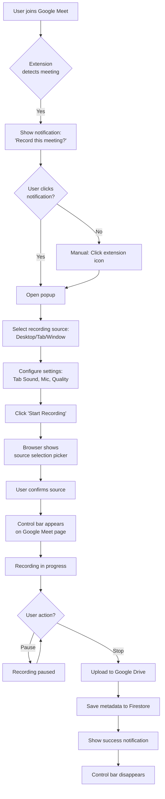
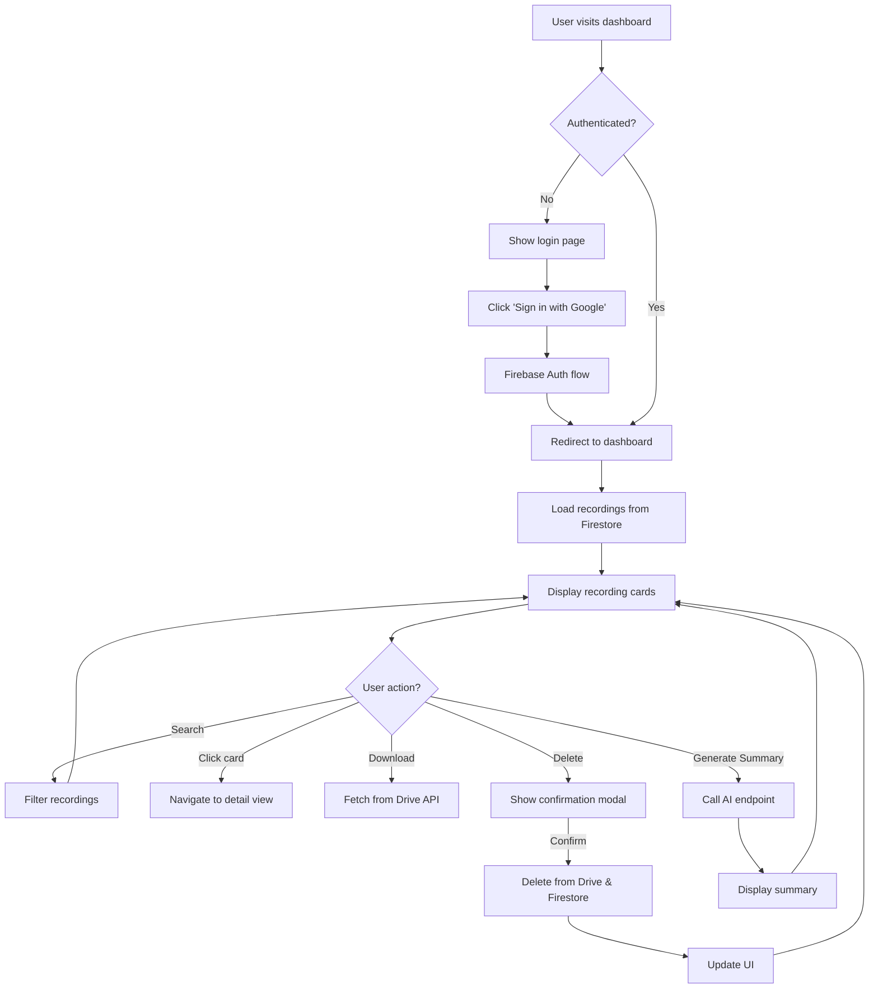

# OpenMeet Recorder - UI/UX Plan

> **Status:** Draft - Awaiting Review  
> **Created:** 2025-12-29  
> **Project Repository:** https://github.com/PRATS-gits/openmeet-chromium  
> **Agent:** UI/UX Agent  
> **Version:** 1.0.0

---

## Table of Contents
1. [Overview](#overview)
2. [UI/UX Agent Scope](#uiux-agent-scope)
3. [Design System Foundation](#design-system-foundation)
4. [Extension UI/UX Design](#extension-uiux-design)
5. [Dashboard UI/UX Design](#dashboard-uiux-design)
6. [User Flows & Interaction Design](#user-flows--interaction-design)
7. [Accessibility & Responsive Design](#accessibility--responsive-design)
8. [Implementation Phases](#implementation-phases)
9. [Deliverables Checklist](#deliverables-checklist)
10. [Handoff to Frontend Agent](#handoff-to-frontend-agent)

---

## 1. Overview

### 1.1 Purpose
This document defines the UI/UX implementation plan for the OpenMeet Recorder project. The UI/UX Agent is responsible for creating all visual designs, interaction patterns, component specifications, and user experience flows that will serve as the foundation for the Frontend Agent's implementation.

### 1.2 Project Context
**OpenMeet Recorder** is a Chrome extension that enables users to record Google Meet sessions with smart features like automatic mic synchronization, chunked concurrent uploads to Google Drive, and AI-powered multilingual meeting summarization.

### 1.3 Key Interfaces
The UI/UX Agent will design the following interfaces:
1. **Chrome Extension Popup** - Recording configuration and start interface
2. **Recording Control Bar** - In-meet recording controls overlay
3. **Extension Options Page** - Settings and preferences
4. **Dashboard Application** - Web-based recording management interface
5. **Recording Detail View** - Individual recording page with actions

### 1.4 Design Approach
- **Tool-Agnostic:** Specifications will be provided in code-ready format
- **Component-First:** Reusable component design with clear specifications
- **Accessibility-Aware:** WCAG 2.1 Level AA guidelines (optional implementation)
- **Modern Practices:** Following current web design standards (2025)
- **Performance-Conscious:** Designs optimized for fast rendering

---

## 2. UI/UX Agent Scope

### 2.1 Responsibilities (What UI/UX Agent DOES)

#### 2.1.1 Design System
- ✅ Define color palette (primary, secondary, semantic colors)
- ✅ Specify typography scale (font families, sizes, weights, line heights)
- ✅ Create spacing system (margin, padding scales)
- ✅ Define elevation/shadow system
- ✅ Specify border radius standards
- ✅ Create animation/transition specifications
- ✅ Design iconography system
- ✅ Define breakpoint system for responsive design

#### 2.1.2 Component Design
- ✅ Create component specifications with exact dimensions
- ✅ Define all component states (default, hover, active, disabled, error)
- ✅ Specify component variants (sizes, colors, styles)
- ✅ Design micro-interactions and animations
- ✅ Provide CSS/TailwindCSS class specifications
- ✅ Create component composition guidelines

#### 2.1.3 Layout & Structure
- ✅ Design page layouts with grid specifications
- ✅ Define responsive behavior at all breakpoints
- ✅ Specify spacing and alignment rules
- ✅ Create navigation patterns
- ✅ Design empty states and loading states

#### 2.1.4 User Experience
- ✅ Map user flows and journeys
- ✅ Define interaction patterns
- ✅ Specify error handling UX
- ✅ Design onboarding experiences
- ✅ Create feedback mechanisms (notifications, toasts, etc.)

#### 2.1.5 Visual Assets
- ✅ Design icons (or specify icon library)
- ✅ Create placeholder images
- ✅ Design logos and branding elements
- ✅ Specify image requirements (sizes, formats)

#### 2.1.6 Accessibility
- ✅ Define color contrast requirements
- ✅ Specify keyboard navigation patterns
- ✅ Design focus states for interactive elements
- ✅ Provide ARIA label guidelines
- ✅ Define screen reader considerations

### 2.2 Non-Responsibilities (What UI/UX Agent DOES NOT DO)

#### 2.2.1 Frontend Implementation (Frontend Agent's Role)
- ❌ Implement React components with TypeScript
- ❌ Set up state management (Zustand stores)
- ❌ Configure routing (React Router)
- ❌ Implement form validation logic
- ❌ Handle API integrations
- ❌ Manage browser extension APIs (chrome.*)

#### 2.2.2 Backend Infrastructure (Backend Agent's Role)
- ❌ Configure Firebase Authentication
- ❌ Set up Firestore database
- ❌ Implement security rules
- ❌ Configure Google OAuth
- ❌ Set up Drive API integration
- ❌ Deploy Cloudflare Workers
- ❌ Implement AI summarization endpoints

#### 2.2.3 Business Logic
- ❌ Implement recording state management
- ❌ Handle file upload logic
- ❌ Manage authentication flows
- ❌ Process video chunks
- ❌ Implement data synchronization

### 2.3 Clear Boundaries

| Concern | UI/UX Agent | Frontend Agent | Backend Agent |
|---------|-------------|----------------|---------------|
| **Visual Design** | ✅ Design specs | ❌ | ❌ |
| **Component Structure** | ✅ HTML/JSX structure | ✅ React implementation | ❌ |
| **Styling** | ✅ CSS/Tailwind classes | ✅ Apply styles | ❌ |
| **Interactions** | ✅ Specify behavior | ✅ Implement logic | ❌ |
| **State Management** | ❌ | ✅ Zustand/React state | ❌ |
| **API Calls** | ❌ | ✅ Client-side calls | ✅ API endpoints |
| **Authentication UI** | ✅ Sign-in button design | ✅ Auth flow UI logic | ✅ Firebase Auth setup |
| **Database** | ❌ | ❌ | ✅ Firestore setup |
| **Deployment** | ❌ | ❌ | ✅ Infrastructure |

---

## 3. Design System Foundation

### 3.1 Color Palette

#### 3.1.1 Brand Colors
```css
/* Primary Colors - Used for main actions and branding */
--color-primary-50: #eff6ff;    /* Lightest blue for backgrounds */
--color-primary-100: #dbeafe;   /* Light blue for hover states */
--color-primary-200: #bfdbfe;   /* Light blue for borders */
--color-primary-300: #93c5fd;   /* Medium light blue */
--color-primary-400: #60a5fa;   /* Medium blue */
--color-primary-500: #3b82f6;   /* Main brand blue (default) */
--color-primary-600: #2563eb;   /* Darker blue for hover */
--color-primary-700: #1d4ed8;   /* Dark blue for active */
--color-primary-800: #1e40af;   /* Very dark blue */
--color-primary-900: #1e3a8a;   /* Darkest blue */

/* Secondary Colors - Used for secondary actions and accents */
--color-secondary-50: #f8fafc;   /* Lightest gray-blue */
--color-secondary-100: #f1f5f9;  /* Very light gray */
--color-secondary-200: #e2e8f0;  /* Light gray for borders */
--color-secondary-300: #cbd5e1;  /* Medium light gray */
--color-secondary-400: #94a3b8;  /* Medium gray */
--color-secondary-500: #64748b;  /* Default secondary gray */
--color-secondary-600: #475569;  /* Darker gray for text */
--color-secondary-700: #334155;  /* Dark gray */
--color-secondary-800: #1e293b;  /* Very dark gray */
--color-secondary-900: #0f172a;  /* Darkest gray (almost black) */
```

#### 3.1.2 Semantic Colors
```css
/* Success - Green for successful operations */
--color-success-50: #f0fdf4;
--color-success-100: #dcfce7;
--color-success-500: #22c55e;   /* Default success green */
--color-success-600: #16a34a;   /* Darker success green */
--color-success-700: #15803d;

/* Warning - Yellow/Orange for warnings */
--color-warning-50: #fffbeb;
--color-warning-100: #fef3c7;
--color-warning-500: #f59e0b;   /* Default warning orange */
--color-warning-600: #d97706;
--color-warning-700: #b45309;

/* Error - Red for errors and destructive actions */
--color-error-50: #fef2f2;
--color-error-100: #fee2e2;
--color-error-500: #ef4444;     /* Default error red */
--color-error-600: #dc2626;     /* Darker error red */
--color-error-700: #b91c1c;

/* Info - Blue for informational messages */
--color-info-50: #eff6ff;
--color-info-100: #dbeafe;
--color-info-500: #3b82f6;      /* Default info blue */
--color-info-600: #2563eb;
--color-info-700: #1d4ed8;
```

#### 3.1.3 Neutral Colors (Grayscale)
```css
/* Neutral/Grayscale - For text, borders, backgrounds */
--color-white: #ffffff;
--color-gray-50: #f9fafb;       /* Background for cards */
--color-gray-100: #f3f4f6;      /* Background for inputs */
--color-gray-200: #e5e7eb;      /* Borders */
--color-gray-300: #d1d5db;      /* Muted borders */
--color-gray-400: #9ca3af;      /* Placeholder text */
--color-gray-500: #6b7280;      /* Secondary text */
--color-gray-600: #4b5563;      /* Primary text (light mode) */
--color-gray-700: #374151;      /* Headings */
--color-gray-800: #1f2937;      /* Dark headings */
--color-gray-900: #111827;      /* Darkest text */
--color-black: #000000;
```

#### 3.1.4 Special Colors
```css
/* Recording State Colors */
--color-recording: #ef4444;     /* Red for active recording */
--color-paused: #f59e0b;        /* Orange for paused state */
--color-uploading: #3b82f6;     /* Blue for uploading */

/* Overlay Colors */
--color-overlay-light: rgba(0, 0, 0, 0.5);   /* For modal overlays */
--color-overlay-dark: rgba(0, 0, 0, 0.75);   /* For darker overlays */
```

#### 3.1.5 TailwindCSS Color Mapping
```javascript
// tailwind.config.js - Colors section
module.exports = {
  theme: {
    extend: {
      colors: {
        primary: {
          50: '#eff6ff',
          100: '#dbeafe',
          200: '#bfdbfe',
          300: '#93c5fd',
          400: '#60a5fa',
          500: '#3b82f6',  // Default
          600: '#2563eb',
          700: '#1d4ed8',
          800: '#1e40af',
          900: '#1e3a8a',
        },
        // ... other color scales
      }
    }
  }
}
```

### 3.2 Typography System

#### 3.2.1 Font Families
```css
/* Primary Font Stack (Sans-serif) */
--font-family-sans: -apple-system, BlinkMacSystemFont, 'Segoe UI', 'Roboto', 
                     'Helvetica Neue', Arial, sans-serif;

/* Monospace Font Stack (For code/timestamps) */
--font-family-mono: 'SF Mono', Monaco, 'Cascadia Code', 'Roboto Mono', 
                     'Courier New', monospace;
```

#### 3.2.2 Font Sizes & Line Heights
```css
/* Font Sizes with Corresponding Line Heights */
--text-xs: 0.75rem;      /* 12px - Small labels, captions */
--text-sm: 0.875rem;     /* 14px - Secondary text, helper text */
--text-base: 1rem;       /* 16px - Body text (default) */
--text-lg: 1.125rem;     /* 18px - Large body text */
--text-xl: 1.25rem;      /* 20px - Small headings */
--text-2xl: 1.5rem;      /* 24px - Medium headings */
--text-3xl: 1.875rem;    /* 30px - Large headings */
--text-4xl: 2.25rem;     /* 36px - Extra large headings */
--text-5xl: 3rem;        /* 48px - Hero headings */

/* Line Heights */
--leading-none: 1;           /* For tight text (headings) */
--leading-tight: 1.25;       /* Slightly relaxed (subheadings) */
--leading-snug: 1.375;       /* Comfortable (large text) */
--leading-normal: 1.5;       /* Standard (body text) */
--leading-relaxed: 1.625;    /* Relaxed (long-form content) */
--leading-loose: 2;          /* Very relaxed (spacing emphasis) */
```

#### 3.2.3 Font Weights
```css
--font-thin: 100;
--font-extralight: 200;
--font-light: 300;
--font-normal: 400;       /* Default body text */
--font-medium: 500;       /* Emphasized text */
--font-semibold: 600;     /* Subheadings */
--font-bold: 700;         /* Headings, important text */
--font-extrabold: 800;    /* Hero headings */
--font-black: 900;        /* Maximum emphasis */
```

#### 3.2.4 Typography Scale Usage
| Element | Size | Weight | Line Height | Usage |
|---------|------|--------|-------------|-------|
| **Hero Heading** | 5xl (48px) | Bold (700) | Tight (1.25) | Landing page, marketing |
| **Page Title** | 3xl (30px) | Bold (700) | Tight (1.25) | Dashboard page headers |
| **Section Heading** | 2xl (24px) | Semibold (600) | Snug (1.375) | Section titles |
| **Card Title** | xl (20px) | Semibold (600) | Snug (1.375) | Recording card titles |
| **Subheading** | lg (18px) | Medium (500) | Normal (1.5) | Sub-sections |
| **Body Text** | base (16px) | Normal (400) | Normal (1.5) | Paragraph text |
| **Secondary Text** | sm (14px) | Normal (400) | Normal (1.5) | Metadata, timestamps |
| **Caption** | xs (12px) | Normal (400) | Normal (1.5) | Fine print, labels |
| **Button Text** | base (16px) | Medium (500) | None (1) | Button labels |
| **Input Text** | base (16px) | Normal (400) | Normal (1.5) | Form inputs |

#### 3.2.5 TailwindCSS Typography Configuration
```javascript
// tailwind.config.js - Typography section
module.exports = {
  theme: {
    extend: {
      fontFamily: {
        sans: ['-apple-system', 'BlinkMacSystemFont', 'Segoe UI', 'Roboto', 'sans-serif'],
        mono: ['SF Mono', 'Monaco', 'Cascadia Code', 'monospace'],
      },
      fontSize: {
        xs: ['0.75rem', { lineHeight: '1.5' }],
        sm: ['0.875rem', { lineHeight: '1.5' }],
        base: ['1rem', { lineHeight: '1.5' }],
        lg: ['1.125rem', { lineHeight: '1.5' }],
        xl: ['1.25rem', { lineHeight: '1.375' }],
        '2xl': ['1.5rem', { lineHeight: '1.375' }],
        '3xl': ['1.875rem', { lineHeight: '1.25' }],
        '4xl': ['2.25rem', { lineHeight: '1.25' }],
        '5xl': ['3rem', { lineHeight: '1.25' }],
      }
    }
  }
}
```

### 3.3 Spacing System

#### 3.3.1 Spacing Scale
```css
/* Spacing units based on 4px base unit */
--spacing-0: 0;           /* 0px */
--spacing-px: 1px;        /* 1px - For borders */
--spacing-0_5: 0.125rem;  /* 2px */
--spacing-1: 0.25rem;     /* 4px */
--spacing-1_5: 0.375rem;  /* 6px */
--spacing-2: 0.5rem;      /* 8px */
--spacing-2_5: 0.625rem;  /* 10px */
--spacing-3: 0.75rem;     /* 12px */
--spacing-3_5: 0.875rem;  /* 14px */
--spacing-4: 1rem;        /* 16px */
--spacing-5: 1.25rem;     /* 20px */
--spacing-6: 1.5rem;      /* 24px */
--spacing-7: 1.75rem;     /* 28px */
--spacing-8: 2rem;        /* 32px */
--spacing-9: 2.25rem;     /* 36px */
--spacing-10: 2.5rem;     /* 40px */
--spacing-11: 2.75rem;    /* 44px */
--spacing-12: 3rem;       /* 48px */
--spacing-14: 3.5rem;     /* 56px */
--spacing-16: 4rem;       /* 64px */
--spacing-20: 5rem;       /* 80px */
--spacing-24: 6rem;       /* 96px */
--spacing-32: 8rem;       /* 128px */
--spacing-40: 10rem;      /* 160px */
--spacing-48: 12rem;      /* 192px */
--spacing-56: 14rem;      /* 224px */
--spacing-64: 16rem;      /* 256px */
```

#### 3.3.2 Spacing Guidelines
| Use Case | Spacing Value | Example |
|----------|---------------|---------|
| **Component internal padding (small)** | 2 (8px) | Button padding vertical |
| **Component internal padding (medium)** | 4 (16px) | Card padding |
| **Component internal padding (large)** | 6-8 (24-32px) | Section padding |
| **Gap between small elements** | 2 (8px) | Icon and text gap |
| **Gap between medium elements** | 4 (16px) | Form field spacing |
| **Gap between large elements** | 6-8 (24-32px) | Section spacing |
| **Margin between sections** | 12-16 (48-64px) | Page section margins |
| **Container max-width** | Custom | See breakpoints |

### 3.4 Elevation & Shadows

#### 3.4.1 Shadow System
```css
/* Shadow levels for depth perception */
--shadow-xs: 0 1px 2px 0 rgba(0, 0, 0, 0.05);
/* Usage: Subtle elevation for inputs */

--shadow-sm: 0 1px 3px 0 rgba(0, 0, 0, 0.1), 
             0 1px 2px -1px rgba(0, 0, 0, 0.1);
/* Usage: Small cards, dropdowns */

--shadow-md: 0 4px 6px -1px rgba(0, 0, 0, 0.1), 
             0 2px 4px -2px rgba(0, 0, 0, 0.1);
/* Usage: Default cards, buttons on hover */

--shadow-lg: 0 10px 15px -3px rgba(0, 0, 0, 0.1), 
             0 4px 6px -4px rgba(0, 0, 0, 0.1);
/* Usage: Modals, popovers */

--shadow-xl: 0 20px 25px -5px rgba(0, 0, 0, 0.1), 
             0 8px 10px -6px rgba(0, 0, 0, 0.1);
/* Usage: Large modals, drawers */

--shadow-2xl: 0 25px 50px -12px rgba(0, 0, 0, 0.25);
/* Usage: Maximum elevation (rare) */

/* Inner shadow for inset effects */
--shadow-inner: inset 0 2px 4px 0 rgba(0, 0, 0, 0.05);
/* Usage: Pressed buttons, input fields */

/* Focus ring shadow */
--shadow-focus: 0 0 0 3px rgba(59, 130, 246, 0.5);
/* Usage: Keyboard focus indicator */
```

#### 3.4.2 TailwindCSS Shadow Configuration
```javascript
// tailwind.config.js - Shadow section
module.exports = {
  theme: {
    extend: {
      boxShadow: {
        'xs': '0 1px 2px 0 rgba(0, 0, 0, 0.05)',
        'sm': '0 1px 3px 0 rgba(0, 0, 0, 0.1), 0 1px 2px -1px rgba(0, 0, 0, 0.1)',
        'md': '0 4px 6px -1px rgba(0, 0, 0, 0.1), 0 2px 4px -2px rgba(0, 0, 0, 0.1)',
        'lg': '0 10px 15px -3px rgba(0, 0, 0, 0.1), 0 4px 6px -4px rgba(0, 0, 0, 0.1)',
        'xl': '0 20px 25px -5px rgba(0, 0, 0, 0.1), 0 8px 10px -6px rgba(0, 0, 0, 0.1)',
        '2xl': '0 25px 50px -12px rgba(0, 0, 0, 0.25)',
        'inner': 'inset 0 2px 4px 0 rgba(0, 0, 0, 0.05)',
        'focus': '0 0 0 3px rgba(59, 130, 246, 0.5)',
      }
    }
  }
}
```

### 3.5 Border Radius System

#### 3.5.1 Border Radius Values
```css
--radius-none: 0;           /* No rounding */
--radius-sm: 0.125rem;      /* 2px - Subtle rounding */
--radius-base: 0.25rem;     /* 4px - Default rounding */
--radius-md: 0.375rem;      /* 6px - Medium rounding */
--radius-lg: 0.5rem;        /* 8px - Large rounding */
--radius-xl: 0.75rem;       /* 12px - Extra large rounding */
--radius-2xl: 1rem;         /* 16px - Very large rounding */
--radius-3xl: 1.5rem;       /* 24px - Huge rounding */
--radius-full: 9999px;      /* Full circle/pill shape */
```

#### 3.5.2 Border Radius Usage
| Element | Radius | Usage |
|---------|--------|-------|
| **Buttons** | md (6px) | Standard buttons |
| **Input Fields** | md (6px) | Text inputs, selects |
| **Cards** | lg (8px) | Recording cards, content cards |
| **Modals** | lg (8px) | Dialog boxes |
| **Badges** | full (9999px) | Status badges, pills |
| **Avatar** | full (9999px) | User profile pictures |
| **Control Bar** | lg (8px) | Recording control bar |
| **Popover** | md (6px) | Dropdown menus |
| **Tooltips** | sm (2px) | Tooltip containers |

### 3.6 Animation & Transition System

#### 3.6.1 Transition Durations
```css
--duration-instant: 0ms;      /* No transition */
--duration-75: 75ms;          /* Micro-interactions */
--duration-100: 100ms;        /* Fast transitions */
--duration-150: 150ms;        /* Standard fast */
--duration-200: 200ms;        /* Default transition */
--duration-300: 300ms;        /* Moderate transition */
--duration-500: 500ms;        /* Slow transition */
--duration-700: 700ms;        /* Very slow transition */
--duration-1000: 1000ms;      /* Extra slow (1s) */
```

#### 3.6.2 Easing Functions
```css
--ease-linear: linear;
--ease-in: cubic-bezier(0.4, 0, 1, 1);           /* Accelerating */
--ease-out: cubic-bezier(0, 0, 0.2, 1);          /* Decelerating */
--ease-in-out: cubic-bezier(0.4, 0, 0.2, 1);     /* Smooth curve */
--ease-bounce: cubic-bezier(0.68, -0.55, 0.265, 1.55);  /* Bounce effect */
```

#### 3.6.3 Common Transition Patterns
```css
/* Standard transition for interactive elements */
.transition-standard {
  transition-property: background-color, border-color, color, fill, stroke;
  transition-duration: 200ms;
  transition-timing-function: cubic-bezier(0.4, 0, 0.2, 1);
}

/* Transform transition for scale/position changes */
.transition-transform {
  transition-property: transform;
  transition-duration: 200ms;
  transition-timing-function: cubic-bezier(0.4, 0, 0.2, 1);
}

/* Opacity fade transition */
.transition-opacity {
  transition-property: opacity;
  transition-duration: 300ms;
  transition-timing-function: cubic-bezier(0.4, 0, 0.2, 1);
}

/* All properties transition (use sparingly) */
.transition-all {
  transition-property: all;
  transition-duration: 200ms;
  transition-timing-function: cubic-bezier(0.4, 0, 0.2, 1);
}
```

#### 3.6.4 Animation Keyframes
```css
/* Fade in animation */
@keyframes fadeIn {
  from { opacity: 0; }
  to { opacity: 1; }
}

/* Slide in from bottom */
@keyframes slideInUp {
  from {
    transform: translateY(20px);
    opacity: 0;
  }
  to {
    transform: translateY(0);
    opacity: 1;
  }
}

/* Slide in from right */
@keyframes slideInRight {
  from {
    transform: translateX(20px);
    opacity: 0;
  }
  to {
    transform: translateX(0);
    opacity: 1;
  }
}

/* Scale up animation */
@keyframes scaleUp {
  from {
    transform: scale(0.95);
    opacity: 0;
  }
  to {
    transform: scale(1);
    opacity: 1;
  }
}

/* Pulse animation for recording indicator */
@keyframes pulse {
  0%, 100% {
    opacity: 1;
  }
  50% {
    opacity: 0.5;
  }
}

/* Spin animation for loading */
@keyframes spin {
  from {
    transform: rotate(0deg);
  }
  to {
    transform: rotate(360deg);
  }
}
```

#### 3.6.5 Animation Usage Guidelines
| Element | Animation | Duration | Easing | Purpose |
|---------|-----------|----------|--------|---------|
| **Modal appear** | fadeIn + scaleUp | 200ms | ease-out | Smooth modal entry |
| **Toast notification** | slideInRight | 300ms | ease-out | Notification entry |
| **Dropdown menu** | slideInUp | 150ms | ease-out | Menu appearance |
| **Hover scale** | transform: scale(1.05) | 200ms | ease-in-out | Button hover feedback |
| **Recording indicator** | pulse | 2000ms (loop) | linear | Recording status |
| **Loading spinner** | spin | 1000ms (loop) | linear | Loading state |
| **Page transition** | fadeIn | 300ms | ease-in-out | Page load |
| **Card hover** | shadow change | 200ms | ease-out | Interactive feedback |

### 3.7 Iconography System

#### 3.7.1 Icon Library
**Recommended:** Lucide React (or Lucide icons for web)
- **Why:** Modern, consistent, open-source, well-maintained
- **Size Range:** 16px, 20px, 24px, 32px
- **Stroke Width:** 2px (default), adjustable for emphasis
- **License:** ISC License (permissive)

**Installation:**
```bash
pnpm add lucide-react
```

#### 3.7.2 Icon Sizes
```css
--icon-xs: 16px;   /* Small icons in tight spaces */
--icon-sm: 20px;   /* Standard icons in buttons, inputs */
--icon-md: 24px;   /* Default icon size for UI elements */
--icon-lg: 32px;   /* Large icons for emphasis */
--icon-xl: 48px;   /* Extra large icons for empty states */
--icon-2xl: 64px;  /* Hero icons */
```

#### 3.7.3 Icon Usage Specifications
| Context | Icon Size | Stroke Width | Color | Example Icons |
|---------|-----------|--------------|-------|---------------|
| **Button (small)** | 16px | 2px | Inherit from button | Check, X, ChevronDown |
| **Button (default)** | 20px | 2px | Inherit from button | Play, Pause, Stop |
| **Input prefix/suffix** | 20px | 2px | gray-400 | Search, Calendar, Mail |
| **Navigation** | 24px | 2px | gray-600/gray-700 | Home, Settings, User |
| **Action icons** | 20px | 2px | gray-600 | Edit, Trash2, Download |
| **Status indicators** | 16px | 2px | Semantic colors | CheckCircle, AlertCircle |
| **Empty states** | 48px | 2px | gray-300 | Inbox, FileVideo, FolderOpen |
| **Loading spinner** | 24px | 2.5px | primary-500 | Loader2 |

#### 3.7.4 Icon Color Guidelines
```css
/* Icon colors based on context */
.icon-primary { color: var(--color-primary-500); }      /* Primary actions */
.icon-secondary { color: var(--color-gray-600); }       /* Secondary actions */
.icon-muted { color: var(--color-gray-400); }           /* Inactive/disabled */
.icon-success { color: var(--color-success-500); }      /* Success states */
.icon-warning { color: var(--color-warning-500); }      /* Warning states */
.icon-error { color: var(--color-error-500); }          /* Error/delete actions */
.icon-recording { color: var(--color-recording); }      /* Recording indicator */
```

### 3.8 Responsive Breakpoints

#### 3.8.1 Breakpoint System
```css
/* Mobile First Approach */
--breakpoint-xs: 0px;        /* Extra small devices (phones) */
--breakpoint-sm: 640px;      /* Small devices (large phones) */
--breakpoint-md: 768px;      /* Medium devices (tablets) */
--breakpoint-lg: 1024px;     /* Large devices (laptops) */
--breakpoint-xl: 1280px;     /* Extra large devices (desktops) */
--breakpoint-2xl: 1536px;    /* 2X large devices (large desktops) */
```

#### 3.8.2 Container Max Widths
```css
/* Container widths at each breakpoint */
@media (min-width: 640px) {   /* sm */
  .container { max-width: 640px; }
}
@media (min-width: 768px) {   /* md */
  .container { max-width: 768px; }
}
@media (min-width: 1024px) {  /* lg */
  .container { max-width: 1024px; }
}
@media (min-width: 1280px) {  /* xl */
  .container { max-width: 1280px; }
}
@media (min-width: 1536px) {  /* 2xl */
  .container { max-width: 1536px; }
}
```

#### 3.8.3 Responsive Design Guidelines
| Device Category | Breakpoint | Layout Adjustments | Grid Columns |
|-----------------|------------|-------------------|--------------|
| **Mobile (xs)** | 0-639px | Single column, full width | 1 |
| **Mobile (sm)** | 640-767px | Single column, some 2-col grids | 1-2 |
| **Tablet (md)** | 768-1023px | 2-3 columns, sidebar optional | 2-3 |
| **Laptop (lg)** | 1024-1279px | 3-4 columns, sidebar visible | 3-4 |
| **Desktop (xl)** | 1280-1535px | 4-5 columns, full layout | 4-5 |
| **Large Desktop (2xl)** | 1536px+ | Maximum 6 columns | 4-6 |

### 3.9 Z-Index System

#### 3.9.1 Z-Index Layers
```css
/* Organized z-index system to prevent conflicts */
--z-base: 0;              /* Default layer (normal flow) */
--z-dropdown: 1000;       /* Dropdown menus */
--z-sticky: 1020;         /* Sticky headers */
--z-fixed: 1030;          /* Fixed elements (control bar) */
--z-modal-backdrop: 1040; /* Modal overlay backdrop */
--z-modal: 1050;          /* Modal content */
--z-popover: 1060;        /* Popovers and tooltips */
--z-toast: 1070;          /* Toast notifications */
--z-tooltip: 1080;        /* Tooltips (highest) */
```

#### 3.9.2 Z-Index Usage
| Element | Z-Index | Reason |
|---------|---------|--------|
| **Page content** | 0 | Base layer |
| **Dropdown menus** | 1000 | Above content |
| **Sticky header** | 1020 | Above dropdowns |
| **Control bar** | 1030 | Above sticky elements |
| **Modal backdrop** | 1040 | Above all page content |
| **Modal dialog** | 1050 | Above backdrop |
| **Popovers** | 1060 | Above modals |
| **Toast notifications** | 1070 | Above popovers |
| **Tooltips** | 1080 | Highest UI element |

---

## 4. Extension UI/UX Design

### 4.1 Extension Popup Interface

#### 4.1.1 Popup Dimensions & Layout
```css
/* Popup container */
.popup-container {
  width: 400px;             /* Fixed width */
  max-height: 600px;        /* Maximum height */
  min-height: 450px;        /* Minimum height */
  background: white;
  border-radius: 8px;       /* lg radius */
  box-shadow: 0 20px 25px -5px rgba(0, 0, 0, 0.1);
  overflow: hidden;
}

/* Popup sections */
.popup-header {
  padding: 20px;            /* spacing-5 */
  border-bottom: 1px solid var(--color-gray-200);
  background: white;
}

.popup-body {
  padding: 20px;            /* spacing-5 */
  max-height: calc(600px - 140px); /* Account for header + footer */
  overflow-y: auto;
}

.popup-footer {
  padding: 16px 20px;       /* spacing-4 spacing-5 */
  border-top: 1px solid var(--color-gray-200);
  background: var(--color-gray-50);
}
```

#### 4.1.2 Popup Header Design
**Structure:**
```html
<div class="popup-header">
  <div class="flex items-center justify-between">
    <h2 class="text-xl font-semibold text-gray-900">OpenMeet Recorder</h2>
    <button class="icon-button" aria-label="Settings">
      <Settings size={20} />
    </button>
  </div>
  <p class="text-sm text-gray-500 mt-1">Configure recording settings</p>
</div>
```

**Specifications:**
- **Title:** text-xl (20px), font-semibold (600), text-gray-900
- **Subtitle:** text-sm (14px), text-gray-500, margin-top: 4px
- **Settings Icon:** 20px, gray-600, hover:gray-900
- **Padding:** 20px all sides
- **Border:** 1px solid gray-200 at bottom

#### 4.1.3 Source Selector Component

**Design Specification:**
```html
<div class="source-selector">
  <label class="block text-sm font-medium text-gray-700 mb-3">
    Choose Recording Source
  </label>
  <div class="grid grid-cols-3 gap-3">
    <!-- Desktop Option -->
    <button class="source-option" data-source="desktop">
      <div class="source-icon">
        <Monitor size={32} />
      </div>
      <span class="source-label">Desktop</span>
    </button>
    
    <!-- Tab Option (Default/Active) -->
    <button class="source-option source-option-active" data-source="tab">
      <div class="source-icon">
        <Square size={32} />
      </div>
      <span class="source-label">This Tab</span>
    </button>
    
    <!-- Window Option -->
    <button class="source-option" data-source="window">
      <div class="source-icon">
        <Maximize2 size={32} />
      </div>
      <span class="source-label">Canvas Only</span>
    </button>
  </div>
</div>
```

**CSS Specifications:**
```css
.source-selector {
  margin-bottom: 20px;  /* spacing-5 */
}

.source-option {
  display: flex;
  flex-direction: column;
  align-items: center;
  padding: 16px 12px;    /* spacing-4 spacing-3 */
  border: 2px solid var(--color-gray-200);
  border-radius: 8px;    /* radius-lg */
  background: white;
  cursor: pointer;
  transition: all 200ms ease-in-out;
}

.source-option:hover {
  border-color: var(--color-primary-300);
  background: var(--color-primary-50);
  transform: translateY(-2px);
  box-shadow: 0 4px 6px -1px rgba(0, 0, 0, 0.1);
}

.source-option-active {
  border-color: var(--color-primary-500);
  background: var(--color-primary-50);
}

.source-icon {
  color: var(--color-gray-600);
  margin-bottom: 8px;    /* spacing-2 */
}

.source-option-active .source-icon {
  color: var(--color-primary-600);
}

.source-label {
  font-size: 14px;       /* text-sm */
  font-weight: 500;      /* font-medium */
  color: var(--color-gray-700);
}

.source-option-active .source-label {
  color: var(--color-primary-700);
  font-weight: 600;      /* font-semibold */
}
```

**Interaction States:**
1. **Default:** Gray border, white background
2. **Hover:** Blue border (primary-300), light blue background (primary-50), lift effect
3. **Active/Selected:** Strong blue border (primary-500), light blue background
4. **Disabled:** Opacity 0.5, cursor not-allowed, no hover effects

#### 4.1.4 Settings Checkboxes Component

**Design Specification:**
```html
<div class="settings-section">
  <h3 class="section-title">Recording Settings</h3>
  
  <!-- Tab Sound Toggle -->
  <label class="checkbox-item">
    <input type="checkbox" class="checkbox-input" checked />
    <span class="checkbox-label">Tab Sound</span>
  </label>
  
  <!-- Mic Toggle -->
  <label class="checkbox-item">
    <input type="checkbox" class="checkbox-input" />
    <span class="checkbox-label">Microphone</span>
  </label>
  
  <!-- Annotation Tools Toggle -->
  <label class="checkbox-item">
    <input type="checkbox" class="checkbox-input" checked />
    <span class="checkbox-label">Control bar & Annotation tools</span>
  </label>
</div>
```

**CSS Specifications:**
```css
.settings-section {
  margin-bottom: 20px;  /* spacing-5 */
}

.section-title {
  font-size: 14px;      /* text-sm */
  font-weight: 600;     /* font-semibold */
  color: var(--color-gray-900);
  margin-bottom: 12px;  /* spacing-3 */
}

.checkbox-item {
  display: flex;
  align-items: center;
  padding: 12px 0;      /* spacing-3 0 */
  cursor: pointer;
  user-select: none;
}

.checkbox-input {
  width: 18px;
  height: 18px;
  border: 2px solid var(--color-gray-300);
  border-radius: 4px;   /* radius-base */
  margin-right: 12px;   /* spacing-3 */
  cursor: pointer;
  accent-color: var(--color-primary-600);  /* Modern checkbox color */
}

.checkbox-input:checked {
  background-color: var(--color-primary-600);
  border-color: var(--color-primary-600);
}

.checkbox-input:focus {
  outline: none;
  box-shadow: 0 0 0 3px rgba(59, 130, 246, 0.3);
}

.checkbox-label {
  font-size: 14px;      /* text-sm */
  color: var(--color-gray-700);
  font-weight: 400;
}

.checkbox-item:hover .checkbox-label {
  color: var(--color-gray-900);
}
```

#### 4.1.5 Info Note Component

**Design Specification:**
```html
<div class="info-note">
  <div class="info-icon">
    <Info size={16} />
  </div>
  <p class="info-text">
    The Mic is <strong>off</strong> & Tab Sound is <strong>on</strong> 
    to prevent echoes during recording. Turn on the Mic if you need 
    to record your voice.
  </p>
</div>
```

**CSS Specifications:**
```css
.info-note {
  display: flex;
  gap: 12px;            /* spacing-3 */
  padding: 12px;        /* spacing-3 */
  background: var(--color-primary-50);
  border: 1px solid var(--color-primary-200);
  border-radius: 6px;   /* radius-md */
  margin-bottom: 16px;  /* spacing-4 */
}

.info-icon {
  flex-shrink: 0;
  color: var(--color-primary-600);
  margin-top: 2px;      /* Align with text */
}

.info-text {
  font-size: 13px;      /* Between xs and sm */
  line-height: 1.5;
  color: var(--color-primary-900);
}

.info-text strong {
  font-weight: 600;     /* font-semibold */
  color: var(--color-primary-700);
}
```

**Variants:**
- **Info (Blue):** Primary colors as above
- **Success (Green):** Use success-* color scale
- **Warning (Yellow):** Use warning-* color scale
- **Error (Red):** Use error-* color scale

#### 4.1.6 Quality Selector Component

**Design Specification:**
```html
<div class="quality-section">
  <div class="quality-row">
    <label class="quality-label">Quality:</label>
    <select class="quality-select">
      <option value="720p" selected>720p</option>
      <option value="1080p">1080p</option>
    </select>
  </div>
  
  <div class="format-info">
    <div class="format-item">
      <span class="format-label">Format:</span>
      <span class="format-value">WebM (VP9)</span>
    </div>
    <div class="format-item">
      <span class="format-label">Storage:</span>
      <span class="format-value">Google Drive</span>
    </div>
  </div>
</div>
```

**CSS Specifications:**
```css
.quality-section {
  margin-bottom: 20px;  /* spacing-5 */
}

.quality-row {
  display: flex;
  align-items: center;
  gap: 12px;            /* spacing-3 */
  margin-bottom: 12px;  /* spacing-3 */
}

.quality-label {
  font-size: 14px;      /* text-sm */
  font-weight: 600;     /* font-semibold */
  color: var(--color-gray-700);
}

.quality-select {
  flex: 1;
  padding: 8px 12px;    /* spacing-2 spacing-3 */
  border: 1px solid var(--color-gray-300);
  border-radius: 6px;   /* radius-md */
  font-size: 14px;      /* text-sm */
  color: var(--color-gray-900);
  background: white;
  cursor: pointer;
  transition: all 150ms ease-out;
}

.quality-select:hover {
  border-color: var(--color-primary-400);
}

.quality-select:focus {
  outline: none;
  border-color: var(--color-primary-500);
  box-shadow: 0 0 0 3px rgba(59, 130, 246, 0.1);
}

.format-info {
  display: flex;
  gap: 16px;            /* spacing-4 */
  padding: 12px;        /* spacing-3 */
  background: var(--color-gray-50);
  border-radius: 6px;   /* radius-md */
}

.format-item {
  display: flex;
  gap: 6px;             /* spacing-1_5 */
}

.format-label {
  font-size: 13px;
  font-weight: 500;     /* font-medium */
  color: var(--color-gray-600);
}

.format-value {
  font-size: 13px;
  font-weight: 600;     /* font-semibold */
  color: var(--color-gray-900);
}
```

#### 4.1.7 Primary Action Button

**Design Specification:**
```html
<button class="btn-primary btn-large">
  <Play size={20} />
  <span>Start Recording</span>
</button>
```

**CSS Specifications:**
```css
.btn-primary {
  display: flex;
  align-items: center;
  justify-content: center;
  gap: 8px;             /* spacing-2 */
  padding: 12px 24px;   /* spacing-3 spacing-6 */
  background: var(--color-primary-600);
  color: white;
  font-size: 16px;      /* text-base */
  font-weight: 500;     /* font-medium */
  border: none;
  border-radius: 6px;   /* radius-md */
  cursor: pointer;
  transition: all 200ms ease-in-out;
  width: 100%;
}

.btn-primary:hover {
  background: var(--color-primary-700);
  transform: translateY(-1px);
  box-shadow: 0 4px 6px -1px rgba(0, 0, 0, 0.1);
}

.btn-primary:active {
  background: var(--color-primary-800);
  transform: translateY(0);
  box-shadow: inset 0 2px 4px 0 rgba(0, 0, 0, 0.05);
}

.btn-primary:disabled {
  background: var(--color-gray-300);
  color: var(--color-gray-500);
  cursor: not-allowed;
  transform: none;
  box-shadow: none;
}

/* Size variants */
.btn-large {
  padding: 14px 28px;   /* spacing-3_5 spacing-7 */
  font-size: 16px;      /* text-base */
}

.btn-medium {
  padding: 10px 20px;   /* spacing-2_5 spacing-5 */
  font-size: 14px;      /* text-sm */
}

.btn-small {
  padding: 8px 16px;    /* spacing-2 spacing-4 */
  font-size: 14px;      /* text-sm */
}
```

#### 4.1.8 Sign-In State Design

**Design Specification (Unauthenticated):**
```html
<div class="sign-in-container">
  <div class="sign-in-content">
    <div class="sign-in-icon">
      <LogIn size={48} />
    </div>
    <h3 class="sign-in-title">Welcome to OpenMeet Recorder</h3>
    <p class="sign-in-description">
      Sign in with Google to start recording your meetings and 
      save them directly to Google Drive.
    </p>
    <button class="btn-google">
      
      <span>Sign in with Google</span>
    </button>
  </div>
</div>
```

**CSS Specifications:**
```css
.sign-in-container {
  padding: 32px 24px;   /* spacing-8 spacing-6 */
  text-align: center;
}

.sign-in-content {
  max-width: 320px;
  margin: 0 auto;
}

.sign-in-icon {
  color: var(--color-primary-500);
  margin-bottom: 16px;  /* spacing-4 */
  display: flex;
  justify-content: center;
}

.sign-in-title {
  font-size: 20px;      /* text-xl */
  font-weight: 600;     /* font-semibold */
  color: var(--color-gray-900);
  margin-bottom: 8px;   /* spacing-2 */
}

.sign-in-description {
  font-size: 14px;      /* text-sm */
  line-height: 1.5;
  color: var(--color-gray-600);
  margin-bottom: 24px;  /* spacing-6 */
}

.btn-google {
  display: flex;
  align-items: center;
  justify-content: center;
  gap: 12px;            /* spacing-3 */
  padding: 12px 24px;   /* spacing-3 spacing-6 */
  background: white;
  color: var(--color-gray-700);
  font-size: 15px;
  font-weight: 500;     /* font-medium */
  border: 1px solid var(--color-gray-300);
  border-radius: 6px;   /* radius-md */
  cursor: pointer;
  transition: all 150ms ease-out;
  width: 100%;
}

.btn-google:hover {
  background: var(--color-gray-50);
  border-color: var(--color-gray-400);
  box-shadow: 0 1px 3px 0 rgba(0, 0, 0, 0.1);
}

.google-icon {
  width: 20px;
  height: 20px;
}
```

### 4.2 Recording Control Bar Design

#### 4.2.1 Control Bar Container

**Positioning & Layout:**
```css
.control-bar-wrapper {
  position: fixed;
  bottom: 20px;         /* spacing-5 */
  left: 50%;
  transform: translateX(-50%);
  z-index: 1030;        /* --z-fixed */
  animation: slideInUp 300ms ease-out;
}

.control-bar {
  display: flex;
  align-items: center;
  gap: 12px;            /* spacing-3 */
  padding: 12px 20px;   /* spacing-3 spacing-5 */
  background: rgba(0, 0, 0, 0.9);  /* Dark with transparency */
  backdrop-filter: blur(10px);
  border-radius: 12px;  /* radius-xl */
  box-shadow: 0 10px 15px -3px rgba(0, 0, 0, 0.3),
              0 4px 6px -4px rgba(0, 0, 0, 0.3);
  min-width: 400px;
}

/* Responsive adjustment for mobile */
@media (max-width: 640px) {
  .control-bar {
    min-width: calc(100vw - 32px);
    bottom: 12px;
    left: 16px;
    right: 16px;
    transform: none;
  }
}
```

#### 4.2.2 Recording Indicator Design

**Design Specification:**
```html
<div class="recording-indicator">
  <div class="recording-dot"></div>
  <span class="recording-label">Recording</span>
</div>
```

**CSS Specifications:**
```css
.recording-indicator {
  display: flex;
  align-items: center;
  gap: 8px;             /* spacing-2 */
}

.recording-dot {
  width: 12px;
  height: 12px;
  background: var(--color-recording);  /* Red */
  border-radius: 50%;   /* Full circle */
  animation: pulse 2s cubic-bezier(0.4, 0, 0.6, 1) infinite;
}

.recording-label {
  font-size: 14px;      /* text-sm */
  font-weight: 600;     /* font-semibold */
  color: white;
  text-transform: uppercase;
  letter-spacing: 0.05em;
}

/* Paused state variant */
.recording-indicator.paused .recording-dot {
  background: var(--color-paused);  /* Orange */
  animation: none;
}

.recording-indicator.paused .recording-label {
  color: var(--color-paused);
}
```

#### 4.2.3 Timer Display

**Design Specification:**
```html
<div class="timer-display">
  <Clock size={16} class="timer-icon" />
  <span class="timer-text">00:05:32</span>
</div>
```

**CSS Specifications:**
```css
.timer-display {
  display: flex;
  align-items: center;
  gap: 6px;             /* spacing-1_5 */
  padding: 6px 12px;    /* spacing-1_5 spacing-3 */
  background: rgba(255, 255, 255, 0.1);
  border-radius: 6px;   /* radius-md */
}

.timer-icon {
  color: rgba(255, 255, 255, 0.7);
}

.timer-text {
  font-size: 14px;      /* text-sm */
  font-weight: 600;     /* font-semibold */
  color: white;
  font-family: var(--font-family-mono);
  letter-spacing: 0.05em;
}
```

#### 4.2.4 Control Bar Action Buttons

**Design Specification:**
```html
<div class="control-actions">
  <!-- Pause/Play Button -->
  <button class="control-btn" aria-label="Pause recording">
    <Pause size={20} />
  </button>
  
  <!-- Stop Button -->
  <button class="control-btn control-btn-stop" aria-label="Stop recording">
    <Square size={20} />
  </button>
  
  <!-- Annotation Tools Toggle -->
  <button class="control-btn control-btn-toggle" aria-label="Toggle annotation tools">
    <ChevronUp size={20} />
  </button>
</div>
```

**CSS Specifications:**
```css
.control-actions {
  display: flex;
  align-items: center;
  gap: 8px;             /* spacing-2 */
  margin-left: auto;    /* Push to right */
}

.control-btn {
  display: flex;
  align-items: center;
  justify-content: center;
  width: 36px;
  height: 36px;
  background: rgba(255, 255, 255, 0.1);
  border: 1px solid rgba(255, 255, 255, 0.2);
  border-radius: 6px;   /* radius-md */
  color: white;
  cursor: pointer;
  transition: all 150ms ease-out;
}

.control-btn:hover {
  background: rgba(255, 255, 255, 0.2);
  border-color: rgba(255, 255, 255, 0.3);
  transform: scale(1.05);
}

.control-btn:active {
  transform: scale(0.98);
}

/* Stop button - Red highlight */
.control-btn-stop {
  background: rgba(239, 68, 68, 0.2);  /* error-500 with alpha */
  border-color: rgba(239, 68, 68, 0.4);
}

.control-btn-stop:hover {
  background: rgba(239, 68, 68, 0.3);
  border-color: rgba(239, 68, 68, 0.6);
}

/* Toggle button - Active state */
.control-btn-toggle.active {
  background: rgba(59, 130, 246, 0.3);  /* primary-500 with alpha */
  border-color: rgba(59, 130, 246, 0.5);
}

/* Disabled state */
.control-btn:disabled {
  opacity: 0.4;
  cursor: not-allowed;
  transform: none;
}

.control-btn:disabled:hover {
  background: rgba(255, 255, 255, 0.1);
  transform: none;
}
```

#### 4.2.5 Annotation Tools Section

**Design Specification:**
```html
<div class="annotation-tools">
  <div class="annotation-divider"></div>
  <div class="annotation-buttons">
    <button class="annotation-btn" data-tool="pen" aria-label="Pen tool">
      <Pen size={18} />
    </button>
    <button class="annotation-btn" data-tool="highlighter" aria-label="Highlighter">
      <Highlighter size={18} />
    </button>
    <button class="annotation-btn" data-tool="text" aria-label="Text">
      <Type size={18} />
    </button>
    <button class="annotation-btn" data-tool="arrow" aria-label="Arrow">
      <ArrowRight size={18} />
    </button>
  </div>
</div>
```

**CSS Specifications:**
```css
.annotation-tools {
  display: flex;
  align-items: center;
  gap: 12px;            /* spacing-3 */
  padding-left: 12px;   /* spacing-3 */
  border-left: 1px solid rgba(255, 255, 255, 0.2);
}

.annotation-divider {
  width: 1px;
  height: 24px;
  background: rgba(255, 255, 255, 0.2);
}

.annotation-buttons {
  display: flex;
  gap: 6px;             /* spacing-1_5 */
}

.annotation-btn {
  display: flex;
  align-items: center;
  justify-content: center;
  width: 32px;
  height: 32px;
  background: transparent;
  border: 1px solid transparent;
  border-radius: 4px;   /* radius-base */
  color: rgba(255, 255, 255, 0.7);
  cursor: pointer;
  transition: all 150ms ease-out;
}

.annotation-btn:hover {
  background: rgba(255, 255, 255, 0.1);
  color: white;
}

.annotation-btn.active {
  background: rgba(59, 130, 246, 0.3);
  border-color: rgba(59, 130, 246, 0.6);
  color: white;
}

/* Hidden state when collapsed */
.annotation-tools.hidden {
  display: none;
}

/* Animation when expanding/collapsing */
.annotation-tools {
  animation: slideInRight 200ms ease-out;
}

@keyframes slideInRight {
  from {
    opacity: 0;
    transform: translateX(-10px);
  }
  to {
    opacity: 1;
    transform: translateX(0);
  }
}
```

### 4.3 Extension Options Page Design

#### 4.3.1 Options Page Layout

**Structure:**
```html
<div class="options-container">
  <header class="options-header">
    <h1 class="options-title">OpenMeet Recorder Settings</h1>
    <p class="options-subtitle">Configure your recording preferences and defaults</p>
  </header>
  
  <main class="options-main">
    <!-- Settings sections will go here -->
  </main>
  
  <footer class="options-footer">
    <button class="btn-secondary">Cancel</button>
    <button class="btn-primary">Save Changes</button>
  </footer>
</div>
```

**CSS Specifications:**
```css
.options-container {
  max-width: 800px;
  margin: 0 auto;
  padding: 40px 24px;   /* spacing-10 spacing-6 */
  min-height: 100vh;
  background: var(--color-gray-50);
}

.options-header {
  margin-bottom: 32px;  /* spacing-8 */
}

.options-title {
  font-size: 30px;      /* text-3xl */
  font-weight: 700;     /* font-bold */
  color: var(--color-gray-900);
  margin-bottom: 8px;   /* spacing-2 */
}

.options-subtitle {
  font-size: 16px;      /* text-base */
  color: var(--color-gray-600);
}

.options-main {
  background: white;
  border-radius: 8px;   /* radius-lg */
  padding: 24px;        /* spacing-6 */
  box-shadow: 0 1px 3px 0 rgba(0, 0, 0, 0.1);
  margin-bottom: 24px;  /* spacing-6 */
}

.options-footer {
  display: flex;
  justify-content: flex-end;
  gap: 12px;            /* spacing-3 */
}
```

#### 4.3.2 Settings Section Component

**Design Specification:**
```html
<section class="settings-section">
  <h2 class="settings-section-title">Default Recording Quality</h2>
  <p class="settings-section-description">
    Choose the default video quality for recordings
  </p>
  
  <div class="settings-field">
    <label class="field-label" for="quality-select">Quality</label>
    <select id="quality-select" class="field-select">
      <option value="720p">720p (HD)</option>
      <option value="1080p">1080p (Full HD)</option>
    </select>
    <p class="field-help">Higher quality requires more storage space</p>
  </div>
</section>
```

**CSS Specifications:**
```css
.settings-section {
  padding: 24px 0;      /* spacing-6 0 */
  border-bottom: 1px solid var(--color-gray-200);
}

.settings-section:last-child {
  border-bottom: none;
}

.settings-section-title {
  font-size: 18px;      /* text-lg */
  font-weight: 600;     /* font-semibold */
  color: var(--color-gray-900);
  margin-bottom: 4px;   /* spacing-1 */
}

.settings-section-description {
  font-size: 14px;      /* text-sm */
  color: var(--color-gray-600);
  margin-bottom: 16px;  /* spacing-4 */
}

.settings-field {
  margin-bottom: 16px;  /* spacing-4 */
}

.field-label {
  display: block;
  font-size: 14px;      /* text-sm */
  font-weight: 500;     /* font-medium */
  color: var(--color-gray-700);
  margin-bottom: 6px;   /* spacing-1_5 */
}

.field-select {
  width: 100%;
  max-width: 320px;
  padding: 10px 12px;   /* spacing-2_5 spacing-3 */
  border: 1px solid var(--color-gray-300);
  border-radius: 6px;   /* radius-md */
  font-size: 14px;      /* text-sm */
  color: var(--color-gray-900);
  background: white;
  cursor: pointer;
  transition: all 150ms ease-out;
}

.field-select:hover {
  border-color: var(--color-primary-400);
}

.field-select:focus {
  outline: none;
  border-color: var(--color-primary-500);
  box-shadow: 0 0 0 3px rgba(59, 130, 246, 0.1);
}

.field-help {
  font-size: 13px;
  color: var(--color-gray-500);
  margin-top: 6px;      /* spacing-1_5 */
}
```

---

## 5. Dashboard UI/UX Design

### 5.1 Dashboard Layout Structure

#### 5.1.1 Main Layout Grid

**Structure:**
```html
<div class="dashboard-wrapper">
  <!-- Sidebar -->
  <aside class="dashboard-sidebar">
    <!-- Sidebar content -->
  </aside>
  
  <!-- Main Content Area -->
  <div class="dashboard-main">
    <header class="dashboard-header">
      <!-- Header content -->
    </header>
    
    <main class="dashboard-content">
      <!-- Page content -->
    </main>
  </div>
</div>
```

**CSS Specifications:**
```css
.dashboard-wrapper {
  display: grid;
  grid-template-columns: 260px 1fr;  /* Sidebar + Main */
  min-height: 100vh;
  background: var(--color-gray-50);
}

/* Responsive: Hide sidebar on mobile, show hamburger menu */
@media (max-width: 1024px) {
  .dashboard-wrapper {
    grid-template-columns: 1fr;
  }
  
  .dashboard-sidebar {
    position: fixed;
    left: -260px;
    top: 0;
    height: 100vh;
    transition: left 300ms ease-out;
    z-index: 1040;
  }
  
  .dashboard-sidebar.open {
    left: 0;
  }
}

.dashboard-main {
  display: flex;
  flex-direction: column;
  min-height: 100vh;
}
```

#### 5.1.2 Sidebar Design

**Structure:**
```html
<aside class="dashboard-sidebar">
  <!-- Logo -->
  <div class="sidebar-logo">
    <VideoIcon size={24} />
    <span class="sidebar-logo-text">OpenMeet</span>
  </div>
  
  <!-- Navigation -->
  <nav class="sidebar-nav">
    <a href="/dashboard" class="sidebar-nav-item active">
      <Home size={20} />
      <span>All Recordings</span>
    </a>
    <a href="/folders" class="sidebar-nav-item">
      <Folder size={20} />
      <span>Folders</span>
    </a>
    <a href="/settings" class="sidebar-nav-item">
      <Settings size={20} />
      <span>Settings</span>
    </a>
  </nav>
  
  <!-- Folders Section -->
  <div class="sidebar-section">
    <div class="sidebar-section-header">
      <span class="sidebar-section-title">Folders</span>
      <button class="sidebar-action-btn" aria-label="Create folder">
        <Plus size={16} />
      </button>
    </div>
    <div class="sidebar-folders">
      <!-- Folder items -->
    </div>
  </div>
  
  <!-- User Section -->
  <div class="sidebar-user">
    
    <div class="sidebar-user-info">
      <span class="sidebar-user-name">Pratham</span>
      <span class="sidebar-user-email">pratham@example.com</span>
    </div>
    <button class="sidebar-user-menu" aria-label="User menu">
      <MoreVertical size={16} />
    </button>
  </div>
</aside>
```

**CSS Specifications:**
```css
.dashboard-sidebar {
  background: white;
  border-right: 1px solid var(--color-gray-200);
  display: flex;
  flex-direction: column;
  padding: 24px 16px;   /* spacing-6 spacing-4 */
  position: sticky;
  top: 0;
  height: 100vh;
  overflow-y: auto;
}

/* Logo Section */
.sidebar-logo {
  display: flex;
  align-items: center;
  gap: 12px;            /* spacing-3 */
  padding: 12px;        /* spacing-3 */
  margin-bottom: 24px;  /* spacing-6 */
  color: var(--color-primary-600);
}

.sidebar-logo-text {
  font-size: 20px;      /* text-xl */
  font-weight: 700;     /* font-bold */
  color: var(--color-gray-900);
}

/* Navigation */
.sidebar-nav {
  display: flex;
  flex-direction: column;
  gap: 4px;             /* spacing-1 */
  margin-bottom: 24px;  /* spacing-6 */
}

.sidebar-nav-item {
  display: flex;
  align-items: center;
  gap: 12px;            /* spacing-3 */
  padding: 10px 12px;   /* spacing-2_5 spacing-3 */
  color: var(--color-gray-700);
  font-size: 14px;      /* text-sm */
  font-weight: 500;     /* font-medium */
  border-radius: 6px;   /* radius-md */
  text-decoration: none;
  transition: all 150ms ease-out;
}

.sidebar-nav-item:hover {
  background: var(--color-gray-100);
  color: var(--color-gray-900);
}

.sidebar-nav-item.active {
  background: var(--color-primary-50);
  color: var(--color-primary-700);
}

.sidebar-nav-item.active svg {
  color: var(--color-primary-600);
}

/* Folders Section */
.sidebar-section {
  margin-bottom: 24px;  /* spacing-6 */
  flex: 1;              /* Take remaining space */
  overflow-y: auto;
}

.sidebar-section-header {
  display: flex;
  align-items: center;
  justify-content: space-between;
  padding: 8px 12px;    /* spacing-2 spacing-3 */
  margin-bottom: 8px;   /* spacing-2 */
}

.sidebar-section-title {
  font-size: 12px;      /* text-xs */
  font-weight: 600;     /* font-semibold */
  color: var(--color-gray-600);
  text-transform: uppercase;
  letter-spacing: 0.05em;
}

.sidebar-action-btn {
  display: flex;
  align-items: center;
  justify-content: center;
  width: 20px;
  height: 20px;
  background: transparent;
  border: none;
  color: var(--color-gray-500);
  cursor: pointer;
  border-radius: 4px;   /* radius-base */
  transition: all 150ms ease-out;
}

.sidebar-action-btn:hover {
  background: var(--color-gray-200);
  color: var(--color-gray-700);
}

/* User Section */
.sidebar-user {
  display: flex;
  align-items: center;
  gap: 12px;            /* spacing-3 */
  padding: 12px;        /* spacing-3 */
  border-top: 1px solid var(--color-gray-200);
  margin-top: auto;     /* Push to bottom */
}

.sidebar-user-avatar {
  width: 36px;
  height: 36px;
  border-radius: 50%;   /* Full circle */
  object-fit: cover;
}

.sidebar-user-info {
  flex: 1;
  display: flex;
  flex-direction: column;
  gap: 2px;
  overflow: hidden;
}

.sidebar-user-name {
  font-size: 14px;      /* text-sm */
  font-weight: 600;     /* font-semibold */
  color: var(--color-gray-900);
  white-space: nowrap;
  overflow: hidden;
  text-overflow: ellipsis;
}

.sidebar-user-email {
  font-size: 12px;      /* text-xs */
  color: var(--color-gray-500);
  white-space: nowrap;
  overflow: hidden;
  text-overflow: ellipsis;
}

.sidebar-user-menu {
  display: flex;
  align-items: center;
  justify-content: center;
  width: 24px;
  height: 24px;
  background: transparent;
  border: none;
  color: var(--color-gray-500);
  cursor: pointer;
  border-radius: 4px;   /* radius-base */
  transition: all 150ms ease-out;
}

.sidebar-user-menu:hover {
  background: var(--color-gray-200);
  color: var(--color-gray-700);
}
```

#### 5.1.3 Dashboard Header Design

**Structure:**
```html
<header class="dashboard-header">
  <!-- Mobile menu toggle -->
  <button class="mobile-menu-toggle" aria-label="Toggle sidebar">
    <Menu size={24} />
  </button>
  
  <!-- Page Title -->
  <div class="header-title-section">
    <h1 class="header-title">All Recordings</h1>
    <p class="header-subtitle">12 recordings • 2.4 GB</p>
  </div>
  
  <!-- Header Actions -->
  <div class="header-actions">
    <!-- Search -->
    <div class="header-search">
      <Search size={20} class="search-icon" />
      <input 
        type="text" 
        placeholder="Search recordings..." 
        class="search-input"
      />
    </div>
    
    <!-- View Toggle -->
    <div class="view-toggle">
      <button class="view-toggle-btn active" aria-label="Grid view">
        <Grid size={20} />
      </button>
      <button class="view-toggle-btn" aria-label="List view">
        <List size={20} />
      </button>
    </div>
    
    <!-- Sort Dropdown -->
    <select class="sort-select">
      <option value="date-desc">Newest First</option>
      <option value="date-asc">Oldest First</option>
      <option value="name-asc">Name A-Z</option>
      <option value="name-desc">Name Z-A</option>
      <option value="size-desc">Largest First</option>
    </select>
  </div>
</header>
```

**CSS Specifications:**
```css
.dashboard-header {
  display: flex;
  align-items: center;
  gap: 24px;            /* spacing-6 */
  padding: 24px 32px;   /* spacing-6 spacing-8 */
  background: white;
  border-bottom: 1px solid var(--color-gray-200);
  position: sticky;
  top: 0;
  z-index: 1020;        /* --z-sticky */
}

/* Mobile menu toggle (hidden on desktop) */
.mobile-menu-toggle {
  display: none;
}

@media (max-width: 1024px) {
  .mobile-menu-toggle {
    display: flex;
    align-items: center;
    justify-content: center;
    width: 40px;
    height: 40px;
    background: transparent;
    border: none;
    color: var(--color-gray-700);
    cursor: pointer;
    border-radius: 6px;
    transition: all 150ms ease-out;
  }
  
  .mobile-menu-toggle:hover {
    background: var(--color-gray-100);
  }
  
  .dashboard-header {
    padding: 16px 20px;
  }
}

/* Title Section */
.header-title-section {
  flex: 1;
}

.header-title {
  font-size: 24px;      /* text-2xl */
  font-weight: 600;     /* font-semibold */
  color: var(--color-gray-900);
  margin-bottom: 2px;
}

.header-subtitle {
  font-size: 14px;      /* text-sm */
  color: var(--color-gray-600);
}

/* Header Actions */
.header-actions {
  display: flex;
  align-items: center;
  gap: 12px;            /* spacing-3 */
}

@media (max-width: 768px) {
  .header-actions {
    flex-wrap: wrap;
    width: 100%;
  }
  
  .header-search {
    flex: 1 1 100%;
    order: 3;
  }
}

/* Search Input */
.header-search {
  position: relative;
  width: 320px;
}

@media (max-width: 1024px) {
  .header-search {
    width: 240px;
  }
}

.search-icon {
  position: absolute;
  left: 12px;
  top: 50%;
  transform: translateY(-50%);
  color: var(--color-gray-400);
  pointer-events: none;
}

.search-input {
  width: 100%;
  padding: 10px 12px 10px 40px;  /* spacing-2_5 spacing-3 spacing-2_5 spacing-10 */
  border: 1px solid var(--color-gray-300);
  border-radius: 6px;   /* radius-md */
  font-size: 14px;      /* text-sm */
  color: var(--color-gray-900);
  background: white;
  transition: all 150ms ease-out;
}

.search-input::placeholder {
  color: var(--color-gray-400);
}

.search-input:hover {
  border-color: var(--color-gray-400);
}

.search-input:focus {
  outline: none;
  border-color: var(--color-primary-500);
  box-shadow: 0 0 0 3px rgba(59, 130, 246, 0.1);
}

/* View Toggle */
.view-toggle {
  display: flex;
  gap: 4px;             /* spacing-1 */
  padding: 4px;         /* spacing-1 */
  background: var(--color-gray-100);
  border-radius: 6px;   /* radius-md */
}

.view-toggle-btn {
  display: flex;
  align-items: center;
  justify-content: center;
  width: 36px;
  height: 36px;
  background: transparent;
  border: none;
  color: var(--color-gray-600);
  cursor: pointer;
  border-radius: 4px;   /* radius-base */
  transition: all 150ms ease-out;
}

.view-toggle-btn:hover {
  background: var(--color-gray-200);
  color: var(--color-gray-900);
}

.view-toggle-btn.active {
  background: white;
  color: var(--color-primary-600);
  box-shadow: 0 1px 2px 0 rgba(0, 0, 0, 0.05);
}

/* Sort Select */
.sort-select {
  padding: 10px 12px;   /* spacing-2_5 spacing-3 */
  border: 1px solid var(--color-gray-300);
  border-radius: 6px;   /* radius-md */
  font-size: 14px;      /* text-sm */
  color: var(--color-gray-700);
  background: white;
  cursor: pointer;
  transition: all 150ms ease-out;
}

.sort-select:hover {
  border-color: var(--color-primary-400);
}

.sort-select:focus {
  outline: none;
  border-color: var(--color-primary-500);
  box-shadow: 0 0 0 3px rgba(59, 130, 246, 0.1);
}
```

### 5.2 Recording Cards Design

#### 5.2.1 Recording Card Container (Grid View)

**Structure:**
```html
<div class="recordings-grid">
  <!-- Individual Recording Card -->
  <article class="recording-card">
    <!-- Thumbnail with duration -->
    <div class="recording-thumbnail-wrapper">
      
      <div class="recording-duration">05:32</div>
    </div>
    
    <!-- Card Content -->
    <div class="recording-card-content">
      <h3 class="recording-title">Team Sync Meeting - December 2025</h3>
      <div class="recording-meta">
        <span class="meta-item">
          <Calendar size={14} />
          <span>Dec 28, 2025</span>
        </span>
        <span class="meta-item">
          <FileVideo size={14} />
          <span>125 MB</span>
        </span>
      </div>
      
      <!-- Folder Badge (if exists) -->
      <div class="recording-folder">
        <Folder size={12} />
        <span>Work Meetings</span>
      </div>
    </div>
    
    <!-- Card Actions -->
    <div class="recording-card-actions">
      <button class="card-action-btn" aria-label="Play recording">
        <Play size={16} />
      </button>
      <button class="card-action-btn" aria-label="Download recording">
        <Download size={16} />
      </button>
      <button class="card-action-btn" aria-label="More options">
        <MoreVertical size={16} />
      </button>
    </div>
  </article>
</div>
```

**CSS Specifications:**
```css
.recordings-grid {
  display: grid;
  grid-template-columns: repeat(auto-fill, minmax(320px, 1fr));
  gap: 24px;            /* spacing-6 */
  padding: 24px 32px;   /* spacing-6 spacing-8 */
}

@media (max-width: 768px) {
  .recordings-grid {
    grid-template-columns: 1fr;
    padding: 16px;
  }
}

.recording-card {
  background: white;
  border: 1px solid var(--color-gray-200);
  border-radius: 8px;   /* radius-lg */
  overflow: hidden;
  transition: all 200ms ease-out;
  cursor: pointer;
}

.recording-card:hover {
  border-color: var(--color-primary-300);
  box-shadow: 0 10px 15px -3px rgba(0, 0, 0, 0.1);
  transform: translateY(-2px);
}

/* Thumbnail Section */
.recording-thumbnail-wrapper {
  position: relative;
  width: 100%;
  aspect-ratio: 16 / 9;  /* Maintain 16:9 aspect ratio */
  background: var(--color-gray-200);
  overflow: hidden;
}

.recording-thumbnail {
  width: 100%;
  height: 100%;
  object-fit: cover;
  transition: transform 300ms ease-out;
}

.recording-card:hover .recording-thumbnail {
  transform: scale(1.05);
}

.recording-duration {
  position: absolute;
  bottom: 8px;          /* spacing-2 */
  right: 8px;           /* spacing-2 */
  padding: 4px 8px;     /* spacing-1 spacing-2 */
  background: rgba(0, 0, 0, 0.75);
  color: white;
  font-size: 12px;      /* text-xs */
  font-weight: 600;     /* font-semibold */
  font-family: var(--font-family-mono);
  border-radius: 4px;   /* radius-base */
}

/* Card Content */
.recording-card-content {
  padding: 16px;        /* spacing-4 */
}

.recording-title {
  font-size: 16px;      /* text-base */
  font-weight: 600;     /* font-semibold */
  color: var(--color-gray-900);
  margin-bottom: 8px;   /* spacing-2 */
  overflow: hidden;
  text-overflow: ellipsis;
  display: -webkit-box;
  -webkit-line-clamp: 2;
  -webkit-box-orient: vertical;
  line-height: 1.4;
}

.recording-meta {
  display: flex;
  gap: 16px;            /* spacing-4 */
  margin-bottom: 8px;   /* spacing-2 */
}

.meta-item {
  display: flex;
  align-items: center;
  gap: 6px;             /* spacing-1_5 */
  font-size: 13px;
  color: var(--color-gray-600);
}

.meta-item svg {
  color: var(--color-gray-400);
}

/* Folder Badge */
.recording-folder {
  display: inline-flex;
  align-items: center;
  gap: 4px;             /* spacing-1 */
  padding: 4px 8px;     /* spacing-1 spacing-2 */
  background: var(--color-primary-50);
  color: var(--color-primary-700);
  font-size: 12px;      /* text-xs */
  font-weight: 500;     /* font-medium */
  border-radius: 4px;   /* radius-base */
}

.recording-folder svg {
  color: var(--color-primary-600);
}

/* Card Actions */
.recording-card-actions {
  display: flex;
  gap: 4px;             /* spacing-1 */
  padding: 12px 16px;   /* spacing-3 spacing-4 */
  border-top: 1px solid var(--color-gray-100);
  background: var(--color-gray-50);
}

.card-action-btn {
  display: flex;
  align-items: center;
  justify-content: center;
  width: 32px;
  height: 32px;
  background: white;
  border: 1px solid var(--color-gray-200);
  border-radius: 4px;   /* radius-base */
  color: var(--color-gray-600);
  cursor: pointer;
  transition: all 150ms ease-out;
}

.card-action-btn:hover {
  background: var(--color-primary-50);
  border-color: var(--color-primary-300);
  color: var(--color-primary-600);
  transform: scale(1.05);
}

.card-action-btn:active {
  transform: scale(0.95);
}

/* Prevent card click when action buttons are clicked */
.card-action-btn {
  position: relative;
  z-index: 10;
}
```

#### 5.2.2 Empty State Design

**Structure:**
```html
<div class="empty-state">
  <div class="empty-state-icon">
    <FileVideo size={64} />
  </div>
  <h3 class="empty-state-title">No recordings yet</h3>
  <p class="empty-state-description">
    Install the Chrome extension and start recording your Google Meet sessions
  </p>
  <button class="btn-primary">
    <Download size={20} />
    <span>Install Extension</span>
  </button>
</div>
```

**CSS Specifications:**
```css
.empty-state {
  display: flex;
  flex-direction: column;
  align-items: center;
  justify-content: center;
  padding: 80px 24px;   /* spacing-20 spacing-6 */
  text-align: center;
  min-height: 400px;
}

.empty-state-icon {
  color: var(--color-gray-300);
  margin-bottom: 24px;  /* spacing-6 */
}

.empty-state-title {
  font-size: 24px;      /* text-2xl */
  font-weight: 600;     /* font-semibold */
  color: var(--color-gray-900);
  margin-bottom: 8px;   /* spacing-2 */
}

.empty-state-description {
  font-size: 16px;      /* text-base */
  color: var(--color-gray-600);
  max-width: 440px;
  margin-bottom: 24px;  /* spacing-6 */
  line-height: 1.5;
}
```

### 5.3 Recording Detail View Page

#### 5.3.1 Detail Page Layout

**Structure:**
```html
<div class="recording-detail-page">
  <!-- Breadcrumb -->
  <nav class="breadcrumb">
    <a href="/dashboard" class="breadcrumb-item">All Recordings</a>
    <ChevronRight size={16} class="breadcrumb-divider" />
    <span class="breadcrumb-item breadcrumb-current">Recording Title</span>
  </nav>
  
  <!-- Main Content Grid -->
  <div class="detail-grid">
    <!-- Video Player Section (Left) -->
    <div class="detail-player-section">
      <div class="video-player-wrapper">
        <video 
          controls 
          poster="/thumbnail.jpg" 
          class="video-player"
        >
          <source src="/recording.webm" type="video/webm" />
        </video>
      </div>
      
      <!-- Tabs (Manage / Comments) -->
      <div class="detail-tabs">
        <button class="detail-tab active">Manage</button>
        <button class="detail-tab">Comments</button>
      </div>
      
      <!-- Tab Content -->
      <div class="detail-tab-content">
        <!-- Manage tab content -->
      </div>
    </div>
    
    <!-- Sidebar Section (Right) -->
    <aside class="detail-sidebar">
      <!-- Recording info and actions -->
    </aside>
  </div>
</div>
```

**CSS Specifications:**
```css
.recording-detail-page {
  padding: 24px 32px;   /* spacing-6 spacing-8 */
}

@media (max-width: 768px) {
  .recording-detail-page {
    padding: 16px;
  }
}

/* Breadcrumb */
.breadcrumb {
  display: flex;
  align-items: center;
  gap: 8px;             /* spacing-2 */
  margin-bottom: 24px;  /* spacing-6 */
}

.breadcrumb-item {
  font-size: 14px;      /* text-sm */
  color: var(--color-gray-600);
  text-decoration: none;
  transition: color 150ms ease-out;
}

.breadcrumb-item:hover {
  color: var(--color-primary-600);
}

.breadcrumb-current {
  color: var(--color-gray-900);
  font-weight: 500;     /* font-medium */
}

.breadcrumb-divider {
  color: var(--color-gray-400);
}

/* Detail Grid */
.detail-grid {
  display: grid;
  grid-template-columns: 1fr 380px;
  gap: 24px;            /* spacing-6 */
}

@media (max-width: 1024px) {
  .detail-grid {
    grid-template-columns: 1fr;
  }
  
  .detail-sidebar {
    order: -1;          /* Show sidebar first on mobile */
  }
}

/* Video Player */
.detail-player-section {
  background: white;
  border: 1px solid var(--color-gray-200);
  border-radius: 8px;   /* radius-lg */
  overflow: hidden;
}

.video-player-wrapper {
  position: relative;
  width: 100%;
  aspect-ratio: 16 / 9;
  background: black;
}

.video-player {
  width: 100%;
  height: 100%;
  object-fit: contain;
}

/* Tabs */
.detail-tabs {
  display: flex;
  gap: 4px;             /* spacing-1 */
  padding: 12px 16px 0; /* spacing-3 spacing-4 0 */
  border-bottom: 1px solid var(--color-gray-200);
}

.detail-tab {
  padding: 10px 16px;   /* spacing-2_5 spacing-4 */
  background: transparent;
  border: none;
  border-bottom: 2px solid transparent;
  color: var(--color-gray-600);
  font-size: 14px;      /* text-sm */
  font-weight: 500;     /* font-medium */
  cursor: pointer;
  transition: all 150ms ease-out;
  margin-bottom: -1px;  /* Overlap border */
}

.detail-tab:hover {
  color: var(--color-gray-900);
  background: var(--color-gray-50);
}

.detail-tab.active {
  color: var(--color-primary-600);
  border-bottom-color: var(--color-primary-600);
}

/* Tab Content */
.detail-tab-content {
  padding: 20px;        /* spacing-5 */
}

#### 5.3.2 Detail Sidebar Design

**Structure:**
```html
<aside class="detail-sidebar">
  <!-- Recording Title & Description -->
  <div class="detail-header">
    <h1 class="detail-title">Team Sync Meeting - December 2025</h1>
    <p class="detail-description">Weekly team synchronization meeting</p>
  </div>
  
  <!-- Quick Actions -->
  <div class="detail-actions">
    <button class="action-btn action-btn-primary">
      <Download size={18} />
      <span>Download WebM</span>
    </button>
    <button class="action-btn action-btn-secondary">
      <Download size={18} />
      <span>Download MP4</span>
    </button>
  </div>
  
  <!-- Shareable Link -->
  <div class="detail-section">
    <h3 class="section-heading">Share</h3>
    <div class="shareable-link">
      <input 
        type="text" 
        readonly 
        value="https://openmeet.panotech.uk/r/abc123" 
        class="link-input"
      />
      <button class="link-copy-btn" aria-label="Copy link">
        <Copy size={16} />
      </button>
    </div>
  </div>
  
  <!-- Recording Info -->
  <div class="detail-section">
    <h3 class="section-heading">Recording Info</h3>
    <dl class="info-list">
      <div class="info-item">
        <dt class="info-label">Quality</dt>
        <dd class="info-value">1080p</dd>
      </div>
      <div class="info-item">
        <dt class="info-label">Duration</dt>
        <dd class="info-value">05:32</dd>
      </div>
      <div class="info-item">
        <dt class="info-label">File Size</dt>
        <dd class="info-value">125 MB</dd>
      </div>
      <div class="info-item">
        <dt class="info-label">Created</dt>
        <dd class="info-value">Dec 28, 2025 at 2:30 PM</dd>
      </div>
    </dl>
  </div>
  
  <!-- Additional Actions -->
  <div class="detail-section">
    <h3 class="section-heading">More Actions</h3>
    <div class="action-list">
      <button class="action-list-item">
        <FolderOpen size={18} />
        <span>Move to Folder</span>
        <ChevronRight size={16} class="action-chevron" />
      </button>
      <button class="action-list-item">
        <Edit size={18} />
        <span>Edit Video (Beta)</span>
        <ChevronRight size={16} class="action-chevron" />
      </button>
      <button class="action-list-item action-list-item-danger">
        <Trash2 size={18} />
        <span>Delete Recording</span>
      </button>
    </div>
  </div>
</aside>
```

**CSS Specifications:**
```css
.detail-sidebar {
  display: flex;
  flex-direction: column;
  gap: 24px;            /* spacing-6 */
}

/* Detail Header */
.detail-header {
  background: white;
  padding: 20px;        /* spacing-5 */
  border: 1px solid var(--color-gray-200);
  border-radius: 8px;   /* radius-lg */
}

.detail-title {
  font-size: 20px;      /* text-xl */
  font-weight: 600;     /* font-semibold */
  color: var(--color-gray-900);
  margin-bottom: 8px;   /* spacing-2 */
  line-height: 1.3;
}

.detail-description {
  font-size: 14px;      /* text-sm */
  color: var(--color-gray-600);
  line-height: 1.5;
}

/* Quick Actions */
.detail-actions {
  display: flex;
  flex-direction: column;
  gap: 8px;             /* spacing-2 */
  background: white;
  padding: 16px;        /* spacing-4 */
  border: 1px solid var(--color-gray-200);
  border-radius: 8px;   /* radius-lg */
}

.action-btn {
  display: flex;
  align-items: center;
  justify-content: center;
  gap: 8px;             /* spacing-2 */
  padding: 10px 16px;   /* spacing-2_5 spacing-4 */
  border-radius: 6px;   /* radius-md */
  font-size: 14px;      /* text-sm */
  font-weight: 500;     /* font-medium */
  cursor: pointer;
  transition: all 150ms ease-out;
}

.action-btn-primary {
  background: var(--color-primary-600);
  border: none;
  color: white;
}

.action-btn-primary:hover {
  background: var(--color-primary-700);
  transform: translateY(-1px);
  box-shadow: 0 4px 6px -1px rgba(0, 0, 0, 0.1);
}

.action-btn-secondary {
  background: white;
  border: 1px solid var(--color-gray-300);
  color: var(--color-gray-700);
}

.action-btn-secondary:hover {
  background: var(--color-gray-50);
  border-color: var(--color-gray-400);
}

/* Detail Section */
.detail-section {
  background: white;
  padding: 20px;        /* spacing-5 */
  border: 1px solid var(--color-gray-200);
  border-radius: 8px;   /* radius-lg */
}

.section-heading {
  font-size: 14px;      /* text-sm */
  font-weight: 600;     /* font-semibold */
  color: var(--color-gray-900);
  margin-bottom: 12px;  /* spacing-3 */
}

/* Shareable Link */
.shareable-link {
  display: flex;
  gap: 8px;             /* spacing-2 */
}

.link-input {
  flex: 1;
  padding: 8px 12px;    /* spacing-2 spacing-3 */
  border: 1px solid var(--color-gray-300);
  border-radius: 6px;   /* radius-md */
  font-size: 13px;
  color: var(--color-gray-700);
  background: var(--color-gray-50);
  font-family: var(--font-family-mono);
}

.link-input:focus {
  outline: none;
  border-color: var(--color-primary-500);
  background: white;
}

.link-copy-btn {
  display: flex;
  align-items: center;
  justify-content: center;
  width: 36px;
  height: 36px;
  background: white;
  border: 1px solid var(--color-gray-300);
  border-radius: 6px;   /* radius-md */
  color: var(--color-gray-600);
  cursor: pointer;
  transition: all 150ms ease-out;
}

.link-copy-btn:hover {
  background: var(--color-primary-50);
  border-color: var(--color-primary-300);
  color: var(--color-primary-600);
}

/* Info List */
.info-list {
  display: flex;
  flex-direction: column;
  gap: 12px;            /* spacing-3 */
}

.info-item {
  display: flex;
  justify-content: space-between;
  align-items: center;
}

.info-label {
  font-size: 13px;
  font-weight: 500;     /* font-medium */
  color: var(--color-gray-600);
}

.info-value {
  font-size: 14px;      /* text-sm */
  font-weight: 600;     /* font-semibold */
  color: var(--color-gray-900);
}

/* Action List */
.action-list {
  display: flex;
  flex-direction: column;
  gap: 4px;             /* spacing-1 */
}

.action-list-item {
  display: flex;
  align-items: center;
  gap: 12px;            /* spacing-3 */
  padding: 10px 12px;   /* spacing-2_5 spacing-3 */
  background: transparent;
  border: none;
  border-radius: 6px;   /* radius-md */
  font-size: 14px;      /* text-sm */
  color: var(--color-gray-700);
  cursor: pointer;
  transition: all 150ms ease-out;
  text-align: left;
  width: 100%;
}

.action-list-item:hover {
  background: var(--color-gray-100);
  color: var(--color-gray-900);
}

.action-list-item svg:first-child {
  color: var(--color-gray-600);
}

.action-chevron {
  margin-left: auto;
  color: var(--color-gray-400);
}

/* Danger action (Delete) */
.action-list-item-danger {
  color: var(--color-error-600);
}

.action-list-item-danger:hover {
  background: var(--color-error-50);
  color: var(--color-error-700);
}

.action-list-item-danger svg {
  color: var(--color-error-600);
}
```

### 5.4 Common UI Components

#### 5.4.1 Button Variants

**CSS Specifications:**
```css
/* Base button styles */
.btn {
  display: inline-flex;
  align-items: center;
  justify-content: center;
  gap: 8px;             /* spacing-2 */
  padding: 10px 16px;   /* spacing-2_5 spacing-4 */
  font-size: 14px;      /* text-sm */
  font-weight: 500;     /* font-medium */
  border-radius: 6px;   /* radius-md */
  cursor: pointer;
  transition: all 200ms ease-out;
  border: 1px solid transparent;
  white-space: nowrap;
}

.btn:disabled {
  opacity: 0.5;
  cursor: not-allowed;
  pointer-events: none;
}

/* Primary Button */
.btn-primary {
  background: var(--color-primary-600);
  color: white;
}

.btn-primary:hover {
  background: var(--color-primary-700);
  transform: translateY(-1px);
  box-shadow: 0 4px 6px -1px rgba(0, 0, 0, 0.1);
}

.btn-primary:active {
  background: var(--color-primary-800);
  transform: translateY(0);
}

/* Secondary Button */
.btn-secondary {
  background: white;
  color: var(--color-gray-700);
  border-color: var(--color-gray-300);
}

.btn-secondary:hover {
  background: var(--color-gray-50);
  border-color: var(--color-gray-400);
}

/* Ghost Button */
.btn-ghost {
  background: transparent;
  color: var(--color-gray-700);
}

.btn-ghost:hover {
  background: var(--color-gray-100);
  color: var(--color-gray-900);
}

/* Danger Button */
.btn-danger {
  background: var(--color-error-600);
  color: white;
}

.btn-danger:hover {
  background: var(--color-error-700);
}

/* Size Variants */
.btn-sm {
  padding: 6px 12px;    /* spacing-1_5 spacing-3 */
  font-size: 13px;
}

.btn-lg {
  padding: 12px 24px;   /* spacing-3 spacing-6 */
  font-size: 16px;      /* text-base */
}

/* Icon Only Button */
.btn-icon {
  padding: 8px;         /* spacing-2 */
  aspect-ratio: 1;
}
```

#### 5.4.2 Modal/Dialog Design

**Structure:**
```html
<div class="modal-overlay">
  <div class="modal">
    <div class="modal-header">
      <h2 class="modal-title">Delete Recording</h2>
      <button class="modal-close" aria-label="Close">
        <X size={20} />
      </button>
    </div>
    
    <div class="modal-body">
      <p>Are you sure you want to delete this recording? This action cannot be undone.</p>
    </div>
    
    <div class="modal-footer">
      <button class="btn-secondary">Cancel</button>
      <button class="btn-danger">Delete</button>
    </div>
  </div>
</div>
```

**CSS Specifications:**
```css
.modal-overlay {
  position: fixed;
  inset: 0;
  background: rgba(0, 0, 0, 0.5);
  display: flex;
  align-items: center;
  justify-content: center;
  z-index: 1050;        /* --z-modal */
  padding: 16px;
  animation: fadeIn 200ms ease-out;
}

.modal {
  background: white;
  border-radius: 8px;   /* radius-lg */
  box-shadow: 0 20px 25px -5px rgba(0, 0, 0, 0.1);
  max-width: 480px;
  width: 100%;
  animation: scaleUp 200ms ease-out;
}

.modal-header {
  display: flex;
  align-items: center;
  justify-content: space-between;
  padding: 20px;        /* spacing-5 */
  border-bottom: 1px solid var(--color-gray-200);
}

.modal-title {
  font-size: 18px;      /* text-lg */
  font-weight: 600;     /* font-semibold */
  color: var(--color-gray-900);
}

.modal-close {
  display: flex;
  align-items: center;
  justify-content: center;
  width: 32px;
  height: 32px;
  background: transparent;
  border: none;
  color: var(--color-gray-500);
  cursor: pointer;
  border-radius: 4px;
  transition: all 150ms ease-out;
}

.modal-close:hover {
  background: var(--color-gray-100);
  color: var(--color-gray-700);
}

.modal-body {
  padding: 20px;        /* spacing-5 */
  font-size: 14px;      /* text-sm */
  line-height: 1.5;
  color: var(--color-gray-700);
}

.modal-footer {
  display: flex;
  justify-content: flex-end;
  gap: 12px;            /* spacing-3 */
  padding: 16px 20px;   /* spacing-4 spacing-5 */
  border-top: 1px solid var(--color-gray-200);
  background: var(--color-gray-50);
}
```

#### 5.4.3 Toast Notification Design

**Structure:**
```html
<div class="toast toast-success">
  <div class="toast-icon">
    <CheckCircle size={20} />
  </div>
  <div class="toast-content">
    <p class="toast-title">Recording Deleted</p>
    <p class="toast-message">The recording has been successfully deleted.</p>
  </div>
  <button class="toast-close" aria-label="Close">
    <X size={16} />
  </button>
</div>
```

**CSS Specifications:**
```css
.toast {
  display: flex;
  align-items: flex-start;
  gap: 12px;            /* spacing-3 */
  padding: 16px;        /* spacing-4 */
  background: white;
  border: 1px solid var(--color-gray-200);
  border-radius: 8px;   /* radius-lg */
  box-shadow: 0 10px 15px -3px rgba(0, 0, 0, 0.1);
  min-width: 320px;
  max-width: 420px;
  animation: slideInRight 300ms ease-out;
}

.toast-icon {
  flex-shrink: 0;
  margin-top: 2px;
}

.toast-content {
  flex: 1;
}

.toast-title {
  font-size: 14px;      /* text-sm */
  font-weight: 600;     /* font-semibold */
  color: var(--color-gray-900);
  margin-bottom: 2px;
}

.toast-message {
  font-size: 13px;
  color: var(--color-gray-600);
  line-height: 1.4;
}

.toast-close {
  flex-shrink: 0;
  display: flex;
  align-items: center;
  justify-content: center;
  width: 20px;
  height: 20px;
  background: transparent;
  border: none;
  color: var(--color-gray-400);
  cursor: pointer;
  border-radius: 4px;
  transition: all 150ms ease-out;
}

.toast-close:hover {
  background: var(--color-gray-100);
  color: var(--color-gray-600);
}

/* Toast Variants */
.toast-success {
  border-left: 4px solid var(--color-success-500);
}

.toast-success .toast-icon {
  color: var(--color-success-600);
}

.toast-error {
  border-left: 4px solid var(--color-error-500);
}

.toast-error .toast-icon {
  color: var(--color-error-600);
}

.toast-warning {
  border-left: 4px solid var(--color-warning-500);
}

.toast-warning .toast-icon {
  color: var(--color-warning-600);
}

.toast-info {
  border-left: 4px solid var(--color-info-500);
}

.toast-info .toast-icon {
  color: var(--color-info-600);
}
```

#### 5.4.4 Loading Spinner Design

**Structure:**
```html
<div class="spinner">
  <Loader2 size={24} class="spinner-icon" />
</div>
```

**CSS Specifications:**
```css
.spinner {
  display: inline-flex;
  align-items: center;
  justify-content: center;
}

.spinner-icon {
  animation: spin 1s linear infinite;
  color: var(--color-primary-600);
}

/* Spinner sizes */
.spinner-sm .spinner-icon {
  width: 16px;
  height: 16px;
}

.spinner-md .spinner-icon {
  width: 24px;
  height: 24px;
}

.spinner-lg .spinner-icon {
  width: 32px;
  height: 32px;
}

/* Full page loading */
.loading-overlay {
  position: fixed;
  inset: 0;
  background: rgba(255, 255, 255, 0.9);
  display: flex;
  flex-direction: column;
  align-items: center;
  justify-content: center;
  gap: 12px;
  z-index: 1060;
}

.loading-text {
  font-size: 14px;
  color: var(--color-gray-600);
  font-weight: 500;
}
```

---

## 6. User Flows & Interaction Design

### 6.1 Extension Recording Flow



### 6.2 Dashboard Interaction Flow



### 6.3 Interaction States Specification

| Element | Default | Hover | Active | Focus | Disabled |
|---------|---------|-------|--------|-------|----------|
| **Primary Button** | Blue bg | Darker blue, lift | Darkest blue, press | Blue ring | Gray, opacity 50% |
| **Recording Card** | White, border | Lift, blue border | - | Blue ring | - |
| **Input Field** | White, gray border | Gray-400 border | - | Blue border, ring | Gray bg, opacity 50% |
| **Control Button** | Transparent | Light white bg | Scale 98% | White ring | Opacity 40% |
| **Navigation Item** | Gray text | Darker gray | - | Blue ring | - |
| **Checkbox** | White, gray border | - | Blue checked | Blue ring | Gray, opacity 50% |

---

## 7. Accessibility & Responsive Design

### 7.1 Accessibility Requirements (WCAG 2.1 Level AA - Optional)

#### 7.1.1 Color Contrast
- **Text on Background:** Minimum 4.5:1 ratio for normal text
- **Large Text:** Minimum 3:1 ratio (18px+ or 14px+ bold)
- **Interactive Elements:** Minimum 3:1 contrast ratio against adjacent colors
- **Status Colors:** Never use color alone to convey information

#### 7.1.2 Keyboard Navigation
```css
/* All interactive elements must be keyboard accessible */
.interactive-element:focus-visible {
  outline: 2px solid var(--color-primary-500);
  outline-offset: 2px;
}

/* Skip to main content link */
.skip-to-main {
  position: absolute;
  top: -40px;
  left: 0;
  padding: 8px 16px;
  background: var(--color-primary-600);
  color: white;
  z-index: 1100;
}

.skip-to-main:focus {
  top: 0;
}
```

**Tab Order Priority:**
1. Main navigation
2. Search input
3. Primary action buttons
4. Recording cards
5. Secondary actions
6. Footer links

#### 7.1.3 ARIA Labels & Roles

**Required ARIA Attributes:**
```html
<!-- Navigation -->
<nav aria-label="Main navigation">...</nav>

<!-- Buttons without text -->
<button aria-label="Play recording">
  <Play size={20} />
</button>

<!-- Live regions for dynamic content -->
<div aria-live="polite" aria-atomic="true">
  Recording started
</div>

<!-- Modal dialogs -->
<div role="dialog" aria-labelledby="modal-title" aria-describedby="modal-description">
  <h2 id="modal-title">Delete Recording</h2>
  <p id="modal-description">This action cannot be undone.</p>
</div>

<!-- Loading states -->
<div aria-live="polite" aria-busy="true">
  <span class="sr-only">Loading recordings...</span>
</div>
```

#### 7.1.4 Screen Reader Support

**Visually Hidden Class:**
```css
.sr-only {
  position: absolute;
  width: 1px;
  height: 1px;
  padding: 0;
  margin: -1px;
  overflow: hidden;
  clip: rect(0, 0, 0, 0);
  white-space: nowrap;
  border-width: 0;
}
```

**Usage Examples:**
- Recording duration labels
- Icon-only button purposes
- Loading state messages
- Form field requirements

### 7.2 Responsive Design Specifications

#### 7.2.1 Mobile (320px - 767px)
- Single column layout
- Collapsible sidebar (hamburger menu)
- Stacked action buttons
- Touch-friendly button sizes (minimum 44x44px)
- Simplified navigation
- Full-width cards
- Reduced padding (16px instead of 32px)

#### 7.2.2 Tablet (768px - 1023px)
- Two-column grid for recordings
- Collapsible sidebar option
- Reduced spacing
- Maintained touch targets
- Optimized typography scale

#### 7.2.3 Desktop (1024px+)
- Full sidebar visible
- Multi-column grid (3-4 columns)
- Hover states active
- Full feature set visible
- Optimal spacing

#### 7.2.4 Touch Target Sizes
```css
/* Minimum touch target size for mobile */
@media (max-width: 1024px) {
  .btn,
  .card-action-btn,
  .control-btn,
  .annotation-btn {
    min-width: 44px;
    min-height: 44px;
  }
}
```

---

## 8. Implementation Phases

### Phase 1: Design System Setup (3-4 days)

**Tasks:**
1. **Create CSS Variables File** (1 day)
   - Define all color variables
   - Define typography scale
   - Define spacing system
   - Define shadow and radius values
   - Create animation keyframes

2. **Configure TailwindCSS** (1 day)
   - Set up `tailwind.config.js` with design tokens
   - Configure theme extensions
   - Set up custom utilities
   - Configure PostCSS

3. **Set Up ShadcnUI Components** (1 day)
   - Initialize ShadcnUI with `npx shadcn-ui@latest init`
   - Configure `components.json`
   - Install base components (Button, Card, Dialog, Input, Select)

4. **Create Base CSS Files** (0.5 day)
   - Global styles
   - Reset styles
   - Typography base styles
   - Utility classes

**Deliverables:**
- ✅ `design-system.css` with all CSS variables
- ✅ `tailwind.config.js` configured
- ✅ ShadcnUI components installed
- ✅ Base component styles documented

**User Prompt for This Phase:**
> "Set up the design system foundation including CSS variables for colors, typography, spacing, shadows, and animations. Configure TailwindCSS with the specified theme. Initialize ShadcnUI and install the base components."

---

### Phase 2: Extension UI Components (4-5 days)

**Tasks:**
1. **Extension Popup Design** (2 days)
   - Create popup container structure
   - Design source selector buttons
   - Design settings checkboxes
   - Design quality selector
   - Design info note component
   - Design primary action button
   - Create sign-in state design
   - Implement responsive behavior

2. **Recording Control Bar** (2 days)
   - Design control bar container with positioning
   - Create recording indicator with pulse animation
   - Design timer display
   - Create control action buttons
   - Design annotation tools section
   - Implement expand/collapse animation
   - Test overlay positioning

3. **Extension Options Page** (1 day)
   - Design options page layout
   - Create settings sections
   - Design form fields
   - Implement save/cancel actions

**Deliverables:**
- ✅ Complete popup HTML/CSS structure
- ✅ Control bar HTML/CSS with animations
- ✅ Options page HTML/CSS
- ✅ All component states documented

**User Prompts for This Phase:**

**Prompt 1: Popup Design**
> "Create the extension popup interface (400px wide) including: 1) Source selector with three buttons (Desktop/Tab/Canvas Only) with hover states, 2) Settings checkboxes with custom styling, 3) Quality selector dropdown, 4) Info note component with icon, 5) Primary 'Start Recording' button with hover animation. Use the defined design system tokens."

**Prompt 2: Control Bar Design**
> "Design the recording control bar as a fixed bottom overlay with: 1) Recording indicator with pulsing red dot, 2) Timer display with monospace font, 3) Pause/Stop/Toggle buttons, 4) Annotation tools section (collapsible) with Pen/Highlighter/Text/Arrow buttons. Include dark background with blur effect and proper z-index positioning."

**Prompt 3: Options Page**
> "Create the extension options page with max-width 800px container including: 1) Page header, 2) Settings sections with borders, 3) Form fields (select, checkbox, input), 4) Save/Cancel footer buttons. Follow the dashboard color scheme."

---

### Phase 3: Dashboard Core Components (5-6 days)

**Tasks:**
1. **Dashboard Layout Structure** (1.5 days)
   - Create dashboard grid (sidebar + main)
   - Design sidebar with logo, navigation, folders, user section
   - Implement sidebar collapse for mobile
   - Create dashboard header with search and actions

2. **Recording Cards Component** (2 days)
   - Design recording card with thumbnail
   - Implement aspect ratio maintenance (16:9)
   - Create card content section (title, metadata, folder badge)
   - Design card actions footer
   - Implement hover states with lift animation
   - Create grid layout with responsive columns

3. **Empty State Design** (0.5 day)
   - Create empty state component with icon
   - Design call-to-action button

4. **Common Components** (2 days)
   - Design button variants (primary, secondary, ghost, danger)
   - Create modal/dialog component
   - Design toast notification system
   - Create loading spinner component
   - Design form inputs and selects

**Deliverables:**
- ✅ Complete dashboard layout structure
- ✅ Recording card component with all states
- ✅ Empty state component
- ✅ Reusable UI components library

**User Prompts for This Phase:**

**Prompt 1: Dashboard Layout**
> "Create the dashboard layout with a 260px sidebar and main content area. The sidebar should include: 1) Logo section, 2) Navigation items with icons and active states, 3) Folders section with header and action button, 4) User section at bottom with avatar and menu. Design the header with search bar, view toggle, and sort dropdown. Make sidebar collapsible for mobile."

**Prompt 2: Recording Cards**
> "Design recording card components in a responsive grid (320px min column width). Each card should have: 1) 16:9 thumbnail with duration overlay, 2) Title (2-line clamp), 3) Metadata (date, size), 4) Folder badge, 5) Actions footer with play/download/menu buttons. Include hover state with lift animation and scale effect on thumbnail."

**Prompt 3: Common Components**
> "Create reusable UI components: 1) Button variants with all states (hover, active, disabled), 2) Modal dialog with header/body/footer, 3) Toast notifications with variants (success, error, warning, info), 4) Loading spinner with sizes (sm, md, lg). Follow the design system specifications."

---

### Phase 4: Dashboard Detail View (3-4 days)

**Tasks:**
1. **Detail Page Layout** (1.5 days)
   - Create breadcrumb navigation
   - Design detail grid (player + sidebar)
   - Implement responsive layout (mobile stacks vertically)

2. **Video Player Section** (1 day)
   - Design video player wrapper (16:9 aspect ratio)
   - Create tabs component (Manage/Comments)
   - Design tab content area

3. **Detail Sidebar** (1.5 days)
   - Design recording title and description
   - Create quick action buttons
   - Design shareable link component with copy button
   - Create recording info list
   - Design additional actions list

**Deliverables:**
- ✅ Complete detail view layout
- ✅ Video player section with tabs
- ✅ Detail sidebar with all components

**User Prompts for This Phase:**

**Prompt 1: Detail View Layout**
> "Create the recording detail page with: 1) Breadcrumb navigation, 2) Two-column grid (video player left, sidebar right, 380px), 3) Make responsive (stack on mobile). Include a 16:9 video player wrapper with black background and tabs component below (Manage/Comments)."

**Prompt 2: Detail Sidebar**
> "Design the detail sidebar with: 1) Recording header (title + description), 2) Quick actions (Download WebM/MP4 buttons), 3) Shareable link input with copy button, 4) Recording info list (Quality, Duration, Size, Created), 5) More actions list (Move to Folder, Edit, Delete). Use white cards with spacing."

---

### Phase 5: Interaction & Animation Polish (2-3 days)

**Tasks:**
1. **Animation Implementation** (1.5 days)
   - Add page transition animations
   - Implement modal enter/exit animations
   - Create toast slide-in animations
   - Add button hover effects
   - Implement card hover transforms
   - Create loading state animations

2. **Interaction Refinement** (1 day)
   - Implement focus states for keyboard navigation
   - Add ripple effects (optional)
   - Refine timing curves
   - Test all micro-interactions

3. **Responsive Behavior** (0.5 day)
   - Test all breakpoints
   - Adjust spacing for mobile
   - Ensure touch targets meet minimum size
   - Test sidebar collapse/expand

**Deliverables:**
- ✅ All animations implemented
- ✅ Smooth transitions throughout
- ✅ Fully responsive across breakpoints
- ✅ Keyboard navigation functional

**User Prompt for This Phase:**
> "Implement animations and interactions: 1) Modal fade-in with scale-up effect (200ms), 2) Toast slide-in from right (300ms), 3) Button hover lift effect, 4) Card hover with shadow and slight scale on thumbnail, 5) Page transition fade-in, 6) Focus states with blue ring on all interactive elements. Test responsiveness at all breakpoints (mobile/tablet/desktop)."

---

### Phase 6: Documentation & Handoff (1-2 days)

**Tasks:**
1. **Component Documentation** (1 day)
   - Document all component HTML structures
   - Document CSS class naming conventions
   - Create usage examples for each component
   - Document responsive behavior

2. **Style Guide Creation** (1 day)
   - Compile design system documentation
   - Create color palette reference
   - Document typography scale
   - Create spacing/sizing reference
   - Document icon usage

3. **Handoff Preparation** (0.5 day)
   - Create handoff checklist
   - Prepare assets (icons, images)
   - Document any special requirements
   - Schedule handoff meeting with Frontend Agent

**Deliverables:**
- ✅ Complete component documentation
- ✅ Style guide document
- ✅ Design assets prepared
- ✅ Handoff checklist completed

**User Prompt for This Phase:**
> "Create comprehensive documentation for Frontend Agent handoff: 1) Document all component structures with HTML examples, 2) Document CSS class conventions and utilities, 3) Create a style guide with color, typography, and spacing references, 4) List all required icons from Lucide React, 5) Prepare a handoff checklist with implementation notes."

---

## 9. Deliverables Checklist

### 9.1 Design System
- [ ] CSS variables file with all tokens defined
- [ ] TailwindCSS configuration complete
- [ ] ShadcnUI initialized and components installed
- [ ] Base styles and resets applied
- [ ] Typography scale documented
- [ ] Color palette documented
- [ ] Spacing system documented
- [ ] Shadow and elevation system defined
- [ ] Animation specifications documented
- [ ] Icon library selected and documented

### 9.2 Extension UI
- [ ] Popup interface complete with all states
- [ ] Source selector component designed
- [ ] Settings checkboxes styled
- [ ] Quality selector designed
- [ ] Info note component created
- [ ] Sign-in state designed
- [ ] Recording control bar complete
- [ ] Control bar buttons designed
- [ ] Annotation tools section complete
- [ ] Options page designed
- [ ] All extension components responsive

### 9.3 Dashboard UI
- [ ] Dashboard layout structure complete
- [ ] Sidebar designed with all sections
- [ ] Navigation items styled with active states
- [ ] Folders section designed
- [ ] User section designed
- [ ] Dashboard header complete
- [ ] Search input designed
- [ ] View toggle component created
- [ ] Sort dropdown styled
- [ ] Recording card component complete
- [ ] Card thumbnail with duration overlay
- [ ] Card metadata and folder badge
- [ ] Card actions designed
- [ ] Empty state component created
- [ ] Recording detail view complete
- [ ] Video player section designed
- [ ] Detail sidebar complete
- [ ] Shareable link component created

### 9.4 Common Components
- [ ] Button variants (primary, secondary, ghost, danger)
- [ ] Modal/dialog component
- [ ] Toast notification component
- [ ] Loading spinner component
- [ ] Form input components
- [ ] Checkbox component
- [ ] Select dropdown component

### 9.5 Interactions & Animations
- [ ] All hover states defined
- [ ] Focus states for keyboard navigation
- [ ] Page transition animations
- [ ] Modal enter/exit animations
- [ ] Toast slide-in animations
- [ ] Button hover effects
- [ ] Card hover transforms
- [ ] Loading animations

### 9.6 Responsive Design
- [ ] Mobile layout (320px - 767px) tested
- [ ] Tablet layout (768px - 1023px) tested
- [ ] Desktop layout (1024px+) tested
- [ ] Touch targets meet 44x44px minimum
- [ ] Sidebar collapse on mobile works
- [ ] All components responsive

### 9.7 Accessibility (Optional)
- [ ] Color contrast meets WCAG 2.1 AA
- [ ] All interactive elements keyboard accessible
- [ ] Focus states visible
- [ ] ARIA labels on icon-only buttons
- [ ] Screen reader support implemented
- [ ] Skip to main content link added

### 9.8 Documentation
- [ ] Component documentation complete
- [ ] Style guide created
- [ ] Usage examples provided
- [ ] Responsive behavior documented
- [ ] Handoff checklist prepared
- [ ] Assets prepared for Frontend Agent

---

## 10. Handoff to Frontend Agent

### 10.1 Handoff Assets

**Files to Provide:**
1. `design-system.css` - All CSS variables and base styles
2. `tailwind.config.js` - TailwindCSS configuration
3. `components.json` - ShadcnUI configuration
4. Component HTML/JSX structures - For reference
5. Icon list - Required Lucide React icons
6. Image assets - Logos, placeholder images
7. Style guide document - PDF or Markdown

### 10.2 Implementation Notes for Frontend Agent

**Critical Notes:**
1. **CSS Variables Usage:** All colors, spacing, and typography use CSS variables. Frontend Agent should reference these in React components.

2. **TailwindCSS Classes:** Most styling can be achieved with Tailwind utility classes. Custom classes are defined in `design-system.css`.

3. **ShadcnUI Components:** Base components from ShadcnUI can be customized. Frontend Agent should refer to component specifications for customizations.

4. **Responsive Breakpoints:** Use TailwindCSS responsive prefixes (`sm:`, `md:`, `lg:`, etc.) following the defined breakpoint system.

5. **Animations:** Use the defined keyframes and transition classes. Frontend Agent implements JavaScript for triggering animations.

6. **Z-Index System:** Follow the defined z-index layers to prevent stacking conflicts.

7. **Icon Usage:** Import icons from `lucide-react` as needed. Sizes and colors are specified in component documentation.

8. **State Management:** UI/UX Agent has designed all visual states (default, hover, active, disabled). Frontend Agent implements the state logic.

### 10.3 Frontend Agent Responsibilities

**What Frontend Agent Will Implement:**
1. React component logic with TypeScript
2. State management (Zustand stores)
3. Event handlers for user interactions
4. API integration (Firebase, Drive API)
5. Form validation logic
6. Routing configuration
7. Chrome extension APIs integration
8. Real-time data synchronization
9. Error handling logic
10. Testing and bug fixes

### 10.4 Collaboration Points

**When to Consult UI/UX Agent:**
- Design clarifications needed
- New components not specified
- Responsive behavior questions
- Animation timing adjustments
- Accessibility implementation questions

**Communication Protocol:**
- Frontend Agent tags UI/UX Agent in issues for design questions
- UI/UX Agent provides design clarifications within 24 hours
- Weekly sync meeting for progress review

---

## Appendix: Quick Reference

### A.1 Color Quick Reference
```
Primary: #3b82f6
Success: #22c55e
Warning: #f59e0b
Error: #ef4444
Recording: #ef4444 (with pulse)
```

### A.2 Typography Quick Reference
```
Hero: 48px / Bold / 1.25
Page Title: 30px / Bold / 1.25
Section: 24px / Semibold / 1.375
Card Title: 20px / Semibold / 1.375
Body: 16px / Normal / 1.5
Secondary: 14px / Normal / 1.5
```

### A.3 Spacing Quick Reference
```
xs: 2px
sm: 4px
md: 8px
lg: 16px
xl: 24px
2xl: 32px
3xl: 48px
```

### A.4 Common Patterns
```
Card padding: 16px (spacing-4)
Button padding: 10px 16px
Modal padding: 20px
Container max-width: 1280px
Sidebar width: 260px
```

---

**END OF UI/UX PLAN**

This comprehensive UI/UX plan provides all necessary specifications for the Frontend Agent to implement the OpenMeet Recorder interface. All design decisions are documented, and clear boundaries are established between UI/UX and Frontend responsibilities.
