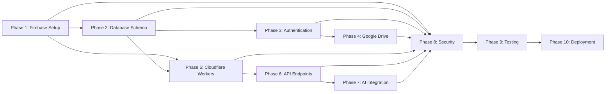

# Backend Agent Prompts
**OpenMeet Recorder - Phase-Based Implementation Prompts**

---

## Document Information

| Property | Value |
|----------|-------|
| **Project** | OpenMeet Recorder |
| **Document Type** | Backend Agent Phase Prompts |
| **Version** | 1.0.0 |
| **Created** | 2025-12-29 |
| **Target Agent** | Backend Agent |
| **Reference Plan** | `plans/BACKEND_PLAN.md` (3,869 lines) |
| **Total Phases** | 10 sequential phases |
| **Estimated Time** | 27-37 hours |

---

## How to Use These Prompts

### Purpose

These prompts are designed to guide you (the user) through giving instructions to the Backend Agent. Each prompt corresponds to one phase of the backend implementation.

### Workflow

1. **Read the prompt** for the current phase
2. **Copy the prompt text** (marked between `---START PROMPT---` and `---END PROMPT---`)
3. **Give it to the Backend Agent** in your VS Code chat
4. **Wait for completion** - Agent will reference the detailed plan
5. **Verify deliverables** - Check the completion checklist
6. **Move to next phase** - Only proceed when current phase is complete

### Important Notes

- ✅ **Sequential execution required** - Do not skip phases
- ✅ **Agent will reference** `plans/BACKEND_PLAN.md` for detailed instructions
- ✅ **Each phase builds on previous** - Ensure all prerequisites are met
- ✅ **Verify before proceeding** - Check completion checklist after each phase
- ❌ **Do not rush** - Backend infrastructure requires careful setup
- ❌ **Do not skip testing** - Test each phase thoroughly

### Phase Dependencies



---

## Table of Contents

1. [Phase 1 Prompt: Firebase Project Setup](#phase-1-prompt-firebase-project-setup)
2. [Phase 2 Prompt: Database Schema Implementation](#phase-2-prompt-database-schema-implementation)
3. [Phase 3 Prompt: Authentication Backend](#phase-3-prompt-authentication-backend)
4. [Phase 4 Prompt: Google Drive Integration](#phase-4-prompt-google-drive-integration)
5. [Phase 5 Prompt: Cloudflare Workers Setup](#phase-5-prompt-cloudflare-workers-setup)
6. [Phase 6 Prompt: API Endpoints Implementation](#phase-6-prompt-api-endpoints-implementation)
7. [Phase 7 Prompt: AI Integration (Gemini)](#phase-7-prompt-ai-integration-gemini)
8. [Phase 8 Prompt: Security & Validation](#phase-8-prompt-security--validation)
9. [Phase 9 Prompt: Testing & Documentation](#phase-9-prompt-testing--documentation)
10. [Phase 10 Prompt: Deployment & Monitoring](#phase-10-prompt-deployment--monitoring)

---

## Phase 1 Prompt: Firebase Project Setup

### Phase Overview

**Goal:** Set up Firebase project infrastructure with Auth, Firestore, and development environment

**Duration:** 2-3 hours

**Prerequisites:** None (this is the starting phase)

**Deliverables:**
- Firebase project created and configured
- Firebase Auth enabled with Google provider
- Cloud Firestore database provisioned
- Firebase Admin SDK configured
- Service account credentials generated
- Local emulators ready

### Prompt to Give Backend Agent

---START PROMPT---

**Task: Implement Phase 1 - Firebase Project Setup**

Please implement Phase 1 of the Backend Plan as detailed in `plans/BACKEND_PLAN.md` (lines 288-516).

**Your Objectives:**
1. Create a new Firebase project named "openmeet-recorder"
2. Enable Firebase Authentication with Google Sign-In provider
3. Create OAuth 2.0 Client IDs for Chrome Extension and Dashboard
4. Enable required Google Cloud APIs (Identity Toolkit, Firestore, Drive, Vertex AI)
5. Provision Cloud Firestore database in production mode
6. Install Firebase CLI and initialize the project locally
7. Generate Firebase Admin SDK service account key
8. Create Firebase Admin SDK initialization code (`firebase/admin.ts`)
9. Create TypeScript type definitions (`firebase/types.ts`)
10. Test Firebase Admin SDK connection
11. Set up Firebase Local Emulators for development

**Reference Documentation:**
- Detailed instructions: `plans/BACKEND_PLAN.md` - Phase 1 (Tasks 1.1 through 1.10)
- Handoff context: `docs/PLAN_HANDOFF_BACKEND.md` - Section 9 (Authentication Architecture)

**Key Files to Create:**
- `firebase/admin.ts` - Firebase Admin SDK initialization
- `firebase/types.ts` - TypeScript interfaces (UserProfile, Recording, Folder, AIJob)
- `firebase/test-connection.ts` - Connection test script
- `firebase.json` - Firebase configuration
- `.firebaserc` - Firebase project configuration
- `firebase/serviceAccountKey.json` - Service account (DO NOT COMMIT)

**Important Security Notes:**
- Add `firebase/serviceAccountKey.json` to `.gitignore` immediately
- Store OAuth Client IDs and secrets in `.env` file (DO NOT COMMIT)
- Use proper environment variable management

**Verification Checklist:**
Before moving to Phase 2, ensure:
- [ ] Firebase project visible in Firebase Console
- [ ] Firebase Auth has Google provider enabled
- [ ] OAuth Client IDs created for Extension and Dashboard
- [ ] All required APIs enabled in Google Cloud Console
- [ ] Firestore database created (check location/region)
- [ ] Firebase CLI installed and logged in
- [ ] Service account key downloaded and secured
- [ ] `firebase/admin.ts` and `firebase/types.ts` created
- [ ] Test script runs successfully and connects to Firestore
- [ ] Firebase Emulators start without errors
- [ ] No sensitive credentials committed to Git

**Expected Output:**
When complete, you should be able to:
1. Run `firebase --version` and see version 13.x.x or higher
2. Run `firebase projects:list` and see openmeet-recorder
3. Run `ts-node firebase/test-connection.ts` and see "✅ All tests passed!"
4. Run `firebase emulators:start` and access UI at http://localhost:4000

**Time Estimate:** 2-3 hours

Please follow the detailed step-by-step instructions in the Backend Plan and let me know when Phase 1 is complete with all verification items checked.

---END PROMPT---

### Post-Phase Verification

After the Backend Agent completes Phase 1, verify:

1. **Firebase Console Check:**
   - Visit https://console.firebase.google.com/
   - Confirm project "openmeet-recorder" exists
   - Check Authentication → Sign-in method → Google (Enabled)
   - Check Firestore Database → Data tab (Database created)

2. **Local Environment Check:**
   - Check if `firebase/` folder exists with all required files
   - Verify `.gitignore` includes sensitive files
   - Confirm no secrets in Git history

3. **Functional Test:**
   - Run the connection test script
   - Start Firebase Emulators
   - Create a test user in Auth emulator

**If any issues arise, ask the Backend Agent to troubleshoot using the "Critical Implementation Notes" section in the Backend Plan.**

---

## Phase 2 Prompt: Database Schema Implementation

### Phase Overview

**Goal:** Implement Firestore database schema with collections, security rules, and indexes

**Duration:** 3-4 hours

**Prerequisites:** Phase 1 completed successfully

**Deliverables:**
- Firestore collections defined (users, recordings, folders, ai_jobs)
- Comprehensive security rules deployed
- Composite indexes for efficient queries
- Database helper functions created
- Security rules tested

### Prompt to Give Backend Agent

---START PROMPT---

**Task: Implement Phase 2 - Database Schema Implementation**

Please implement Phase 2 of the Backend Plan as detailed in `plans/BACKEND_PLAN.md` (lines 518-904).

**Your Objectives:**
1. Document Firestore collections structure in `firebase/schema.md`
2. Implement comprehensive Firestore security rules in `firebase/firestore.rules`
3. Define composite indexes in `firebase/firestore.indexes.json`
4. Deploy security rules and indexes to Firebase
5. Create database helper functions in `firebase/db-helpers.ts`
6. Test security rules with test script

**Reference Documentation:**
- Detailed instructions: `plans/BACKEND_PLAN.md` - Phase 2 (Tasks 2.1 through 2.6)
- Database schema: `docs/PLAN_HANDOFF_BACKEND.md` - Section 7
- Handoff context: `docs/PLAN_HANDOFF_BACKEND.md` - Section 8 (API Specifications)

**Collections to Implement:**

1. **users** - User profile information
   - Document ID: Firebase Auth UID
   - Fields: uid, email, displayName, photoURL, driveConnected, plan, quotaUsed, quotaLimit, preferences
   - Security: Users can only access their own profile

2. **recordings** - Recording metadata
   - Document ID: Auto-generated
   - Fields: id, userId, title, duration, fileSize, quality, format, driveFileId, status, transcript, summary, tags, folderId
   - Security: Users can only access recordings they own
   - Indexes: Multiple composite indexes for efficient queries

3. **folders** - Organization folders
   - Document ID: Auto-generated
   - Fields: id, userId, name, color, icon, recordingCount
   - Security: Users can only access their own folders

4. **ai_jobs** - AI processing job tracking
   - Document ID: Auto-generated
   - Fields: id, recordingId, userId, type, status, progress, result, error
   - Security: Read-only for users, write-only for server

**Key Files to Create:**
- `firebase/schema.md` - Complete schema documentation
- `firebase/firestore.rules` - Security rules with helper functions
- `firebase/firestore.indexes.json` - Composite indexes configuration
- `firebase/db-helpers.ts` - CRUD helper functions for all collections
- `firebase/test-security-rules.ts` - Security rules test script

**Security Rules Requirements:**
- Implement authentication checks (isAuthenticated, isOwner)
- Validate data on create operations (hasValidUserData, hasValidRecordingData, etc.)
- Restrict update operations to allowed fields only
- Prevent users from modifying protected fields (userId, createdAt, etc.)
- Ensure users can only access their own data

**Verification Checklist:**
Before moving to Phase 3, ensure:
- [ ] Schema documentation created with all collections defined
- [ ] Security rules file created with all helper functions
- [ ] Indexes file created with all composite indexes
- [ ] Rules deployed successfully: `firebase deploy --only firestore:rules`
- [ ] Indexes deployed successfully: `firebase deploy --only firestore:indexes`
- [ ] Helper functions file created with CRUD operations
- [ ] Test script created and runs successfully
- [ ] All indexes show "Enabled" status in Firebase Console
- [ ] Security rules visible in Firebase Console Rules tab

**Expected Output:**
When complete, you should be able to:
1. View deployed security rules in Firebase Console
2. See all indexes building/enabled in Firestore Indexes tab
3. Run `ts-node firebase/test-security-rules.ts` and see "✅ All security rule tests passed!"
4. Use helper functions to create/read/update/delete documents

**Time Estimate:** 3-4 hours

Please follow the detailed step-by-step instructions in the Backend Plan and let me know when Phase 2 is complete with all verification items checked.

---END PROMPT---

### Post-Phase Verification

After the Backend Agent completes Phase 2, verify:

1. **Firebase Console Check:**
   - Firestore Database → Rules → Verify rules are deployed
   - Firestore Database → Indexes → Check all indexes are "Enabled"
   - Try creating a test document in Firestore Console

2. **Local Files Check:**
   - Verify all files exist: `schema.md`, `firestore.rules`, `firestore.indexes.json`, `db-helpers.ts`
   - Check helper functions export CRUD operations
   - Review security rules for completeness

3. **Functional Test:**
   - Run security rules test script
   - Verify appropriate error messages for unauthorized access
   - Test helper functions create documents correctly

**If any issues arise, reference "Phase 2 Completion Checklist" in the Backend Plan.**

---

## Phase 3 Prompt: Authentication Backend

### Phase Overview

**Goal:** Implement authentication backend logic with token verification

**Duration:** 2-3 hours

**Prerequisites:** Phase 1 and Phase 2 completed

**Deliverables:**
- Token verification middleware
- User profile creation logic
- Authentication service functions
- Authentication flow tested

### Prompt to Give Backend Agent

---START PROMPT---

**Task: Implement Phase 3 - Authentication Backend**

Please implement Phase 3 of the Backend Plan as detailed in `plans/BACKEND_PLAN.md` (lines 906-1038).

**Your Objectives:**
1. Create token verification middleware for API authentication
2. Implement user profile creation logic for first-time sign-ins
3. Create authentication service functions (sign-in handler, user retrieval, account deletion)
4. Test authentication flow end-to-end

**Reference Documentation:**
- Detailed instructions: `plans/BACKEND_PLAN.md` - Phase 3 (Tasks 3.1 through 3.3)
- Authentication architecture: `docs/PLAN_HANDOFF_BACKEND.md` - Section 9
- User profile schema: Phase 2 schema documentation

**Key Files to Create:**
- `firebase/auth-middleware.ts` - Token verification middleware
- `firebase/auth-service.ts` - User sign-in/sign-out logic
- `firebase/test-auth.ts` - Authentication test script

**Authentication Flow to Implement:**

1. **Token Verification:**
   - Extract Firebase ID token from Authorization header
   - Verify token using Firebase Admin SDK
   - Attach decoded user info to request object
   - Return 401 for invalid/missing tokens

2. **User Sign-In Handler:**
   - Check if user profile exists in Firestore
   - If exists: Update last sign-in timestamp
   - If new: Create user profile with default settings
   - Return complete user profile

3. **Account Deletion:**
   - Delete user from Firebase Auth
   - Delete user profile from Firestore
   - Delete all user's recordings, folders, and AI jobs
   - Use Firestore batch operations for efficiency

**Verification Checklist:**
Before moving to Phase 4, ensure:
- [ ] `auth-middleware.ts` created with verifyFirebaseToken function
- [ ] `auth-service.ts` created with handleUserSignIn function
- [ ] User profile auto-created on first sign-in
- [ ] Test script runs successfully
- [ ] Test user created in Firebase Auth
- [ ] Test user profile created in Firestore users collection
- [ ] Token verification works correctly
- [ ] Account deletion cascades properly

**Expected Output:**
When complete, you should be able to:
1. Run `ts-node firebase/test-auth.ts` and see all authentication tests pass
2. See test user created in Firebase Auth
3. See test user profile in Firestore `users` collection
4. Verify middleware correctly validates tokens
5. Confirm cleanup deletes all test data

**Time Estimate:** 2-3 hours

Please follow the detailed step-by-step instructions in the Backend Plan and let me know when Phase 3 is complete with all verification items checked.

---END PROMPT---

### Post-Phase Verification

After the Backend Agent completes Phase 3, verify:

1. **Code Quality Check:**
   - Review middleware implementation
   - Check error handling is robust
   - Verify user profile creation logic

2. **Authentication Test:**
   - Run test script multiple times
   - Verify idempotency (running twice doesn't create duplicate users)
   - Check cleanup is thorough

3. **Integration Readiness:**
   - Middleware can be used in API routes
   - User service functions are exported correctly
   - TypeScript types are consistent

---

## Phase 4 Prompt: Google Drive Integration

### Phase Overview

**Goal:** Integrate Google Drive API for video storage and playback

**Duration:** 2-3 hours

**Prerequisites:** Phase 3 completed (Authentication working)

**Deliverables:**
- Google Drive API client configured
- Signed URL generation for video playback
- File metadata retrieval functions
- File deletion orchestration

### Prompt to Give Backend Agent

---START PROMPT---

**Task: Implement Phase 4 - Google Drive Integration**

Please implement Phase 4 of the Backend Plan as detailed in `plans/BACKEND_PLAN.md` (lines 1040-1154).

**Your Objectives:**
1. Set up Google Drive API client with OAuth2 authentication
2. Implement signed URL generation for secure video playback
3. Create file metadata retrieval functions
4. Implement file deletion logic
5. Add file access verification
6. Test Drive integration with existing files

**Reference Documentation:**
- Detailed instructions: `plans/BACKEND_PLAN.md` - Phase 4 (Tasks 4.1 through 4.3)
- OAuth configuration: `docs/PLAN_HANDOFF_BACKEND.md` - Section 9.1
- API specifications: `docs/PLAN_HANDOFF_BACKEND.md` - Section 8.4

**Key Files to Create:**
- `google/drive-client.ts` - OAuth2 client initialization
- `google/drive-service.ts` - Drive operations (signed URLs, metadata, deletion)
- `google/test-drive.ts` - Drive integration test script

**Drive Operations to Implement:**

1. **OAuth2 Client Setup:**
   - Use googleapis npm package
   - Configure OAuth2 client with credentials from Phase 1
   - Support user-specific access tokens
   - Handle token refresh automatically

2. **Signed URL Generation:**
   - Generate temporary URLs for video playback (60-minute expiration)
   - Return URL and expiration timestamp
   - Verify file access before generating URL
   - Handle errors gracefully

3. **File Operations:**
   - Get file metadata (name, size, mimeType, createdTime)
   - Verify user has access to file
   - Delete files when recordings are removed
   - Check file existence

**OAuth Scopes Required:**
- `https://www.googleapis.com/auth/drive.file` (restricted access - only app-created files)

**Verification Checklist:**
Before moving to Phase 5, ensure:
- [ ] googleapis package installed
- [ ] `drive-client.ts` created with OAuth2 configuration
- [ ] `drive-service.ts` created with all functions
- [ ] Signed URL generation works
- [ ] File metadata retrieval works
- [ ] File deletion works
- [ ] Access verification prevents unauthorized access
- [ ] Test script runs successfully (if test file available)
- [ ] Error handling covers all edge cases

**Expected Output:**
When complete, you should be able to:
1. Generate signed URLs for video files
2. Retrieve file metadata for recordings
3. Verify user access to files
4. Delete files from Drive
5. Handle Drive API errors appropriately

**Time Estimate:** 2-3 hours

**Note:** Full testing may require actual video files in Google Drive. Implement the logic and verify it compiles correctly. Frontend will test end-to-end integration.

Please follow the detailed step-by-step instructions in the Backend Plan and let me know when Phase 4 is complete with all verification items checked.

---END PROMPT---

### Post-Phase Verification

After the Backend Agent completes Phase 4, verify:

1. **Code Structure:**
   - Drive client properly initializes OAuth2
   - Service functions handle errors
   - TypeScript types are correct

2. **Integration Points:**
   - Functions can be called from API endpoints
   - Error messages are user-friendly
   - Logging is in place

3. **Security:**
   - OAuth scopes are restricted (drive.file only)
   - User authentication is verified before operations
   - No credentials exposed in code

---

## Phase 5 Prompt: Cloudflare Workers Setup

### Phase Overview

**Goal:** Set up Cloudflare Workers for serverless API endpoints

**Duration:** 3-4 hours

**Prerequisites:** Phase 1 and Phase 2 completed

**Deliverables:**
- Cloudflare Workers project initialized
- API routing structure with Hono framework
- Firebase integration in Workers
- CORS and middleware configured
- Workers deployed to development environment

### Prompt to Give Backend Agent

---START PROMPT---

**Task: Implement Phase 5 - Cloudflare Workers Setup**

Please implement Phase 5 of the Backend Plan as detailed in `plans/BACKEND_PLAN.md` (lines 1156-1414).

**Your Objectives:**
1. Initialize Cloudflare Workers project with Wrangler CLI
2. Set up API routing structure using Hono framework
3. Integrate Firebase Admin SDK in Workers environment
4. Create authentication middleware for Workers
5. Configure environment variables and secrets
6. Deploy Workers to development environment
7. Test health endpoint and basic functionality

**Reference Documentation:**
- Detailed instructions: `plans/BACKEND_PLAN.md` - Phase 5 (Tasks 5.1 through 5.5)
- Workers architecture: `docs/PLAN_HANDOFF_BACKEND.md` - Section 11
- API routing: `docs/PLAN_HANDOFF_BACKEND.md` - Section 8

**Project Structure to Create:**
```
workers/
├── src/
│   ├── index.ts              # Main app with routing
│   ├── lib/
│   │   └── firebase.ts       # Firebase Admin in Workers
│   ├── middleware/
│   │   └── auth.ts           # Auth middleware
│   └── routes/
│       ├── auth.ts           # Auth endpoints (placeholder)
│       ├── recordings.ts     # Recording endpoints (placeholder)
│       ├── ai.ts             # AI endpoints (placeholder)
│       └── drive.ts          # Drive endpoints (placeholder)
├── wrangler.toml             # Workers configuration
├── tsconfig.json             # TypeScript configuration
└── package.json              # Dependencies
```

**Key Technologies:**
- **Wrangler CLI** - Cloudflare Workers development tool
- **Hono** - Lightweight web framework for Workers
- **Firebase Admin SDK** - For Firestore and Auth in Workers

**Configuration Requirements:**

1. **wrangler.toml:**
   - Production environment with route to openmeet.panotech.uk/api/*
   - Development environment for testing
   - Environment variables configuration

2. **Middleware:**
   - CORS with specific allowed origins
   - Pretty JSON formatting
   - Security headers
   - Authentication verification

3. **Secrets (via wrangler secret):**
   - FIREBASE_PROJECT_ID
   - FIREBASE_PRIVATE_KEY
   - FIREBASE_CLIENT_EMAIL
   - GEMINI_API_KEY
   - GOOGLE_CLIENT_ID
   - GOOGLE_CLIENT_SECRET

**Verification Checklist:**
Before moving to Phase 6, ensure:
- [ ] Wrangler CLI installed globally
- [ ] Workers project created in `workers/` directory
- [ ] Dependencies installed (hono, firebase-admin, etc.)
- [ ] `wrangler.toml` configured with environments
- [ ] Main app (`src/index.ts`) created with routing
- [ ] Firebase lib created for Workers environment
- [ ] Auth middleware created
- [ ] Route placeholders created for all endpoints
- [ ] All secrets configured via `wrangler secret put`
- [ ] Workers deployed to development: `wrangler deploy --env development`
- [ ] Health endpoint accessible and returns 200
- [ ] CORS headers present in responses
- [ ] No secrets in code or config files

**Expected Output:**
When complete, you should be able to:
1. Run `wrangler dev` and access Workers locally
2. Deploy to development with `wrangler deploy --env development`
3. Access health endpoint: `curl https://[worker-url]/health`
4. See CORS headers in response
5. Verify Firebase initializes without errors

**Time Estimate:** 3-4 hours

Please follow the detailed step-by-step instructions in the Backend Plan and let me know when Phase 5 is complete with all verification items checked.

---END PROMPT---

### Post-Phase Verification

After the Backend Agent completes Phase 5, verify:

1. **Deployment Check:**
   - Visit deployed Worker URL
   - Test /health endpoint returns JSON
   - Verify CORS headers are present

2. **Code Quality:**
   - Review routing structure
   - Check middleware implementation
   - Verify Firebase integration

3. **Secrets Management:**
   - Confirm no secrets in Git
   - Verify all required secrets are set
   - Test secret access in Workers

---

## Phase 6 Prompt: API Endpoints Implementation

### Phase Overview

**Goal:** Implement all REST API endpoints for the application

**Duration:** 4-5 hours

**Prerequisites:** Phase 5 completed (Workers infrastructure ready)

**Deliverables:**
- Authentication endpoints (signin, signout, me)
- Recording CRUD endpoints (list, get, create, update, delete)
- Complete error handling
- Input validation

### Prompt to Give Backend Agent

---START PROMPT---

**Task: Implement Phase 6 - API Endpoints Implementation**

Please implement Phase 6 of the Backend Plan as detailed in `plans/BACKEND_PLAN.md` (lines 1416-1912).

**Your Objectives:**
1. Implement authentication endpoints in `workers/src/routes/auth.ts`
2. Implement recording CRUD endpoints in `workers/src/routes/recordings.ts`
3. Add proper error handling for all endpoints
4. Implement input validation
5. Test all endpoints with proper authentication
6. Deploy updated Workers to development

**Reference Documentation:**
- Detailed instructions: `plans/BACKEND_PLAN.md` - Phase 6 (Tasks 6.1 through 6.2)
- API specifications: `docs/PLAN_HANDOFF_BACKEND.md` - Section 8
- Authentication flow: `docs/PLAN_HANDOFF_BACKEND.md` - Section 9.2

**Authentication Endpoints to Implement:**

1. **POST /api/auth/signin**
   - Accept Firebase ID token
   - Verify token with Firebase Admin SDK
   - Create user profile if first sign-in
   - Return user data and session info

2. **POST /api/auth/signout**
   - Requires authentication
   - Clear server-side session (if applicable)
   - Return success response

3. **GET /api/auth/me**
   - Requires authentication
   - Fetch and return current user profile
   - Include all user preferences and quota info

**Recording Endpoints to Implement:**

1. **GET /api/recordings**
   - Requires authentication
   - Support query parameters: limit, offset, sortBy, sortOrder, folderId, status
   - Return paginated list with total count and hasMore flag
   - Only return user's own recordings

2. **GET /api/recordings/:id**
   - Requires authentication
   - Return single recording details
   - Verify user ownership
   - Return 403 if user doesn't own recording

3. **POST /api/recordings**
   - Requires authentication
   - Validate required fields (title, duration, fileSize, quality, format, driveFileId)
   - Set userId from authenticated user
   - Set initial status to 'uploading'
   - Return created recording with generated ID

4. **PATCH /api/recordings/:id**
   - Requires authentication
   - Allow updating: title, description, tags, folderId, isPrivate, status, transcript, summary
   - Prevent updating: userId, driveFileId, createdAt
   - Verify user ownership
   - Update updatedAt timestamp
   - Return updated recording

5. **DELETE /api/recordings/:id**
   - Requires authentication
   - Verify user ownership
   - Delete from Firestore
   - TODO: Trigger Drive file deletion (Phase 4 integration)
   - Return success response

**Error Handling Requirements:**
- 400: Invalid input or missing required fields
- 401: Missing or invalid authentication token
- 403: User doesn't own the resource
- 404: Resource not found
- 500: Internal server error

**Verification Checklist:**
Before moving to Phase 7, ensure:
- [ ] All authentication endpoints implemented and working
- [ ] All recording endpoints implemented and working
- [ ] Authentication middleware applied to protected routes
- [ ] Input validation prevents invalid data
- [ ] Error responses are consistent and informative
- [ ] User can only access their own recordings
- [ ] Pagination works correctly
- [ ] Sorting and filtering work as expected
- [ ] All endpoints return proper HTTP status codes
- [ ] Updated Workers deployed to development
- [ ] Can test endpoints with tools like Postman or curl

**Expected Output:**
When complete, you should be able to:
1. Sign in: `POST /api/auth/signin` with valid token
2. Get profile: `GET /api/auth/me` with auth header
3. Create recording: `POST /api/recordings` with valid data
4. List recordings: `GET /api/recordings?limit=10`
5. Get single recording: `GET /api/recordings/{id}`
6. Update recording: `PATCH /api/recordings/{id}`
7. Delete recording: `DELETE /api/recordings/{id}`

**Time Estimate:** 4-5 hours

Please follow the detailed step-by-step instructions in the Backend Plan and let me know when Phase 6 is complete with all verification items checked.

---END PROMPT---

### Post-Phase Verification

After the Backend Agent completes Phase 6, verify:

1. **Functional Testing:**
   - Test each endpoint with Postman/Insomnia
   - Verify authentication is required
   - Test with invalid tokens (should return 401)
   - Test accessing other users' recordings (should return 403)

2. **Data Validation:**
   - Try creating recording with missing fields (should return 400)
   - Verify data types are enforced
   - Check error messages are helpful

3. **Integration:**
   - Create a recording and verify it appears in Firestore
   - Update a recording and verify changes persist
   - Delete a recording and verify it's removed

---

## Phase 7 Prompt: AI Integration (Gemini)

### Phase Overview

**Goal:** Integrate Gemini 2.0 Flash API for transcription and summarization

**Duration:** 4-5 hours

**Prerequisites:** Phase 6 completed (API endpoints working)

**Deliverables:**
- Gemini API client configured
- Transcription processing endpoint
- Summarization endpoint
- AIJob tracking for async processing
- Error handling for API failures

### Prompt to Give Backend Agent

---START PROMPT---

**Task: Implement Phase 7 - AI Integration (Gemini)**

Please implement Phase 7 of the Backend Plan as detailed in `plans/BACKEND_PLAN.md` (lines 1914-2224).

**Your Objectives:**
1. Set up Gemini API client (2.0 Flash model)
2. Implement transcription processing with Gemini Multimodal Live API
3. Implement summarization generation
4. Create AI endpoints in `workers/src/routes/ai.ts`
5. Add AIJob tracking for async processing
6. Handle API errors and retries
7. Test with sample recordings

**Reference Documentation:**
- Detailed instructions: `plans/BACKEND_PLAN.md` - Phase 7 (Tasks 7.1 through 7.2)
- AI architecture: `docs/PLAN_HANDOFF_BACKEND.md` - Section 10
- Data models: `docs/PLAN_HANDOFF_BACKEND.md` - Section 7 (AIJob, Transcript, Summary)

**Gemini Configuration:**
- **Model:** gemini-2.0-flash-exp (multimodal live API)
- **Pricing:** Pay-per-use (estimated $0.01-0.05 per recording)
- **Features:** Real-time transcription, summarization, multilingual support

**AI Endpoints to Implement:**

1. **POST /api/ai/transcribe**
   - Requires authentication
   - Accept: recordingId (string)
   - Validate recording exists and belongs to user
   - Create AIJob with type="transcription", status="pending"
   - Process transcription with Gemini (async or sync based on file size)
   - Update AIJob status and save transcript
   - Return AIJob with transcript data

2. **POST /api/ai/summarize**
   - Requires authentication
   - Accept: recordingId (string)
   - Validate recording exists and belongs to user
   - Require transcript to exist first
   - Create AIJob with type="summarization", status="pending"
   - Generate summary with Gemini based on transcript
   - Update AIJob status and save summary
   - Return AIJob with summary data

**Gemini Integration Details:**

1. **Client Setup:**
   - Use @google/generative-ai npm package
   - Initialize with GEMINI_API_KEY from Workers environment
   - Configure model: gemini-2.0-flash-exp
   - Set generation parameters (temperature, maxTokens, etc.)

2. **Transcription Processing:**
   - Get recording driveFileId from Firestore
   - Generate signed URL for video (Phase 4 integration)
   - Send video to Gemini Multimodal Live API
   - Parse response into TranscriptEntry[] format
   - Save to Firestore: recordings/{recordingId}/transcripts/{lang}
   - Update recording.transcript field
   - Handle errors (retry up to 3 times)

3. **Summarization Processing:**
   - Fetch transcript from recording
   - Construct prompt for Gemini:
     "Generate a concise summary of this meeting transcript. Include key points, action items, and decisions made."
   - Send to Gemini API
   - Parse response into AISummary format
   - Save to Firestore: recordings/{recordingId}/summaries/default
   - Update recording.summary field
   - Handle errors (retry up to 3 times)

**AIJob Tracking:**
- Create AIJob document when processing starts
- Update status: pending → processing → completed/failed
- Store results in AIJob document
- Log errors and attempts for debugging

**Error Handling:**
- 400: Recording not found or missing transcript (for summarization)
- 401: Unauthorized
- 403: User doesn't own recording
- 429: Gemini API rate limit exceeded (retry with backoff)
- 500: AI processing failed (log error, mark AIJob as failed)

**Verification Checklist:**
Before moving to Phase 8, ensure:
- [ ] @google/generative-ai package installed
- [ ] Gemini client created in `workers/src/lib/gemini.ts`
- [ ] AI endpoints created in `workers/src/routes/ai.ts`
- [ ] Transcription endpoint works (POST /api/ai/transcribe)
- [ ] Summarization endpoint works (POST /api/ai/summarize)
- [ ] AIJob documents are created and updated
- [ ] Transcript saved in correct format
- [ ] Summary saved in correct format
- [ ] Error handling includes retries
- [ ] API key is stored securely (Workers secret)
- [ ] Can test with sample recording (if available)

**Expected Output:**
When complete, you should be able to:
1. Send POST /api/ai/transcribe with recordingId
2. Receive transcript in structured format
3. Send POST /api/ai/summarize with recordingId
4. Receive AI-generated summary
5. See AIJob status updates in Firestore
6. Handle errors gracefully with retry logic

**Time Estimate:** 4-5 hours

**Note:** Full testing requires actual video files. Implement the logic and test with mock data or a small sample video if available.

Please follow the detailed step-by-step instructions in the Backend Plan and let me know when Phase 7 is complete with all verification items checked.

---END PROMPT---

### Post-Phase Verification

After the Backend Agent completes Phase 7, verify:

1. **Functionality:**
   - Transcription processing completes successfully
   - Summarization generates meaningful summaries
   - AIJob tracking updates correctly

2. **Data Persistence:**
   - Transcripts saved in Firestore subcollection
   - Summaries saved in Firestore subcollection
   - Recording documents updated with transcript/summary fields

3. **Error Resilience:**
   - Handles API failures gracefully
   - Retry logic works as expected
   - Error messages are informative

---

## Phase 8 Prompt: Security & Validation

### Phase Overview

**Goal:** Implement comprehensive security measures and input validation

**Duration:** 2-3 hours

**Prerequisites:** Phase 6 and Phase 7 completed (All endpoints implemented)

**Deliverables:**
- Input validation for all endpoints
- Rate limiting on Workers
- Security headers configured
- XSS and injection attack prevention
- Sensitive data masking in logs

### Prompt to Give Backend Agent

---START PROMPT---

**Task: Implement Phase 8 - Security & Validation**

Please implement Phase 8 of the Backend Plan as detailed in `plans/BACKEND_PLAN.md` (lines 2226-2390).

**Your Objectives:**
1. Add comprehensive input validation to all endpoints
2. Implement rate limiting middleware
3. Configure security headers (CSP, HSTS, X-Frame-Options)
4. Add XSS and injection prevention
5. Mask sensitive data in logs
6. Update Firestore security rules
7. Test security measures

**Reference Documentation:**
- Detailed instructions: `plans/BACKEND_PLAN.md` - Phase 8 (Tasks 8.1 through 8.3)
- Security best practices: `docs/PLAN_HANDOFF_BACKEND.md` - Section 12
- Firestore rules: `plans/BACKEND_PLAN.md` - Phase 2

**Security Measures to Implement:**

1. **Input Validation:**
   - Create validation middleware in `workers/src/middleware/validation.ts`
   - Validate all request bodies, query params, and path params
   - Use zod for schema validation
   - Sanitize string inputs to prevent XSS
   - Enforce length limits and data types
   - Return 400 with detailed error messages for invalid input

2. **Rate Limiting:**
   - Create rate limiting middleware in `workers/src/middleware/rate-limit.ts`
   - Implement IP-based rate limiting using Workers KV
   - Limits:
     * Authentication endpoints: 5 requests per minute
     * AI endpoints: 10 requests per hour
     * Other endpoints: 60 requests per minute
   - Return 429 Too Many Requests when limit exceeded
   - Include Retry-After header

3. **Security Headers:**
   - Add security headers middleware
   - Headers to include:
     * Content-Security-Policy: "default-src 'self'"
     * X-Content-Type-Options: "nosniff"
     * X-Frame-Options: "DENY"
     * X-XSS-Protection: "1; mode=block"
     * Strict-Transport-Security: "max-age=31536000; includeSubDomains"
     * Referrer-Policy: "strict-origin-when-cross-origin"

4. **Data Sanitization:**
   - Sanitize HTML in user inputs (title, description, tags)
   - Prevent SQL injection (not applicable, but good practice)
   - Validate URLs and file paths
   - Escape special characters in logs

5. **Logging Security:**
   - Never log sensitive data:
     * Authentication tokens
     * API keys
     * User passwords
     * Personal information
   - Mask sensitive fields in logs
   - Log security events (failed auth, rate limit hits)

**Validation Schemas:**

Create zod schemas for:
- Recording creation: title (string, 1-200 chars), duration (number, >0), fileSize (number, >0), etc.
- Recording update: title (optional string, 1-200 chars), description (optional string, max 2000 chars), etc.
- Auth signin: idToken (string, non-empty)
- AI requests: recordingId (string, valid ID format)

**Verification Checklist:**
Before moving to Phase 9, ensure:
- [ ] zod package installed for validation
- [ ] Validation middleware created and applied to all endpoints
- [ ] Rate limiting middleware created and configured
- [ ] Security headers middleware applied globally
- [ ] Input sanitization prevents XSS attacks
- [ ] Invalid requests return 400 with clear error messages
- [ ] Rate limit returns 429 with Retry-After header
- [ ] Sensitive data is not logged
- [ ] Firestore security rules are strict and tested
- [ ] All endpoints return appropriate security headers

**Expected Output:**
When complete, you should be able to:
1. Send invalid data and receive 400 with validation errors
2. Exceed rate limit and receive 429 response
3. Verify security headers in all responses
4. Confirm XSS attempts are blocked
5. Review logs and confirm no sensitive data is present

**Time Estimate:** 2-3 hours

Please follow the detailed step-by-step instructions in the Backend Plan and let me know when Phase 8 is complete with all verification items checked.

---END PROMPT---

### Post-Phase Verification

After the Backend Agent completes Phase 8, verify:

1. **Validation Testing:**
   - Try creating recording with missing title (should fail)
   - Try updating with invalid data types (should fail)
   - Verify error messages are clear and helpful

2. **Rate Limiting:**
   - Make rapid requests to trigger rate limit
   - Verify 429 response and Retry-After header
   - Confirm limits reset after cooldown period

3. **Security Headers:**
   - Inspect response headers in browser DevTools
   - Verify all security headers are present
   - Test CSP by trying to load external resources

---

## Phase 9 Prompt: Testing & Documentation

### Phase Overview

**Goal:** Create comprehensive tests and API documentation

**Duration:** 3-4 hours

**Prerequisites:** Phase 8 completed (All features implemented and secured)

**Deliverables:**
- Integration tests for all endpoints
- API documentation (OpenAPI/Swagger)
- Postman collection
- Testing guide
- README with deployment instructions

### Prompt to Give Backend Agent

---START PROMPT---

**Task: Implement Phase 9 - Testing & Documentation**

Please implement Phase 9 of the Backend Plan as detailed in `plans/BACKEND_PLAN.md` (lines 2392-2510).

**Your Objectives:**
1. Write integration tests for all API endpoints
2. Create API documentation using OpenAPI specification
3. Generate Postman collection for manual testing
4. Write testing guide and deployment instructions
5. Document environment variables and secrets
6. Test all endpoints end-to-end

**Reference Documentation:**
- Detailed instructions: `plans/BACKEND_PLAN.md` - Phase 9 (Tasks 9.1 through 9.2)
- API specifications: `docs/PLAN_HANDOFF_BACKEND.md` - Section 8

**Testing Requirements:**

1. **Integration Tests:**
   - Create `workers/tests/` directory
   - Write tests for all endpoints:
     * Auth: signin, signout, me
     * Recordings: list, get, create, update, delete
     * AI: transcribe, summarize
   - Test authentication requirements
   - Test error cases (401, 403, 404, 400)
   - Test pagination and filtering
   - Use Vitest or Jest
   - Run tests with: `npm test`

2. **Test Coverage:**
   - Aim for >80% coverage of API routes
   - Test happy paths and error cases
   - Test authentication and authorization
   - Test input validation
   - Mock external services (Firebase, Gemini, Drive API)

**Documentation to Create:**

1. **API Documentation (OpenAPI):**
   - Create `workers/docs/openapi.yaml`
   - Document all endpoints with:
     * Path and HTTP method
     * Request parameters (path, query, body)
     * Response schemas (success and error)
     * Authentication requirements
     * Example requests and responses
   - Use OpenAPI 3.0 specification
   - Can generate from code or write manually

2. **Postman Collection:**
   - Create `workers/docs/openmeet-api.postman_collection.json`
   - Include all endpoints with examples
   - Set up environment variables (baseUrl, authToken)
   - Add pre-request scripts for authentication
   - Add tests to verify responses
   - Export and commit to repository

3. **README Documentation:**
   - Update `workers/README.md` with:
     * Project overview
     * Technology stack
     * Local development setup
     * Environment variables reference
     * Deployment instructions
     * Testing guide
     * Troubleshooting tips

4. **Environment Variables Guide:**
   - Document all required secrets:
     * FIREBASE_PROJECT_ID
     * FIREBASE_PRIVATE_KEY
     * FIREBASE_CLIENT_EMAIL
     * GEMINI_API_KEY
     * GOOGLE_CLIENT_ID
     * GOOGLE_CLIENT_SECRET
   - Explain how to set them with `wrangler secret put`
   - Provide example values (without real credentials)

**Verification Checklist:**
Before moving to Phase 10, ensure:
- [ ] Test files created in `workers/tests/`
- [ ] All endpoints have test coverage
- [ ] Tests run successfully: `npm test`
- [ ] OpenAPI documentation created
- [ ] Postman collection created and tested
- [ ] README updated with comprehensive guide
- [ ] Environment variables documented
- [ ] All tests pass with >80% coverage
- [ ] Documentation is clear and accurate

**Expected Output:**
When complete, you should have:
1. Comprehensive test suite that verifies all functionality
2. OpenAPI spec that can be imported to Swagger UI
3. Postman collection that can be imported and used immediately
4. Clear README with setup and deployment instructions
5. Documentation of all environment variables

**Time Estimate:** 3-4 hours

Please follow the detailed step-by-step instructions in the Backend Plan and let me know when Phase 9 is complete with all verification items checked.

---END PROMPT---

### Post-Phase Verification

After the Backend Agent completes Phase 9, verify:

1. **Test Execution:**
   - Run `npm test` and verify all tests pass
   - Check test coverage report
   - Review test output for any warnings

2. **Documentation Quality:**
   - Import OpenAPI spec into Swagger Editor
   - Verify it renders correctly
   - Import Postman collection and test endpoints
   - Read through README and follow setup instructions

3. **Completeness:**
   - Ensure all endpoints are documented
   - Verify examples are accurate
   - Check that secrets are not exposed in docs

---

## Phase 10 Prompt: Deployment & Monitoring

### Phase Overview

**Goal:** Deploy to production and set up monitoring

**Duration:** 2-3 hours

**Prerequisites:** Phase 9 completed (All tests passing, documentation complete)

**Deliverables:**
- Workers deployed to production
- Firestore production database configured
- Logging and monitoring set up
- Production verification completed
- Rollback plan documented

### Prompt to Give Backend Agent

---START PROMPT---

**Task: Implement Phase 10 - Deployment & Monitoring**

Please implement Phase 10 of the Backend Plan as detailed in `plans/BACKEND_PLAN.md` (lines 2512-2648).

**Your Objectives:**
1. Deploy Cloudflare Workers to production
2. Configure production environment variables
3. Set up Firestore production database
4. Implement logging and monitoring
5. Verify production deployment
6. Document rollback procedures

**Reference Documentation:**
- Detailed instructions: `plans/BACKEND_PLAN.md` - Phase 10 (Tasks 10.1 through 10.2)
- Deployment guide: `docs/PLAN_HANDOFF_BACKEND.md` - Section 13

**Deployment Steps:**

1. **Pre-Deployment Checklist:**
   - [ ] All tests passing
   - [ ] Environment variables documented
   - [ ] Production Firebase project ready
   - [ ] Production Firestore rules deployed
   - [ ] All secrets configured for production
   - [ ] API domain configured: openmeet.panotech.uk
   - [ ] SSL certificate active

2. **Cloudflare Workers Deployment:**
   ```bash
   # Deploy to production
   wrangler deploy --env production
   
   # Verify deployment
   curl https://openmeet.panotech.uk/api/health
   ```

3. **Production Secrets Configuration:**
   - Set all secrets for production environment:
   ```bash
   wrangler secret put FIREBASE_PROJECT_ID --env production
   wrangler secret put FIREBASE_PRIVATE_KEY --env production
   wrangler secret put FIREBASE_CLIENT_EMAIL --env production
   wrangler secret put GEMINI_API_KEY --env production
   wrangler secret put GOOGLE_CLIENT_ID --env production
   wrangler secret put GOOGLE_CLIENT_SECRET --env production
   ```

4. **Firestore Production Setup:**
   - Create production Firestore database (if not exists)
   - Deploy security rules to production:
   ```bash
   firebase deploy --only firestore:rules
   ```
   - Create indexes for production:
   ```bash
   firebase deploy --only firestore:indexes
   ```

5. **Monitoring Setup:**
   - Configure Cloudflare Workers Analytics
   - Set up error logging (Sentry or similar)
   - Create alerts for:
     * High error rates (>5% of requests)
     * High latency (>2 seconds)
     * Rate limit violations (>100/hour)
     * API key quota exceeded

6. **Logging Configuration:**
   - Log all errors to console (visible in Workers dashboard)
   - Include context: timestamp, endpoint, userId, error message
   - Never log sensitive data (tokens, passwords, API keys)
   - Set up log retention (30 days minimum)

**Production Verification:**

After deployment, test the following:

1. **Health Check:**
   ```bash
   curl https://openmeet.panotech.uk/api/health
   # Expected: {"status": "ok", "timestamp": "..."}
   ```

2. **Authentication:**
   ```bash
   # Test signin endpoint
   curl -X POST https://openmeet.panotech.uk/api/auth/signin \
     -H "Content-Type: application/json" \
     -d '{"idToken": "VALID_FIREBASE_TOKEN"}'
   ```

3. **API Endpoints:**
   - Test creating a recording
   - Test listing recordings
   - Test AI transcription
   - Verify error responses for invalid requests

4. **Performance:**
   - Check response times (<500ms for most endpoints)
   - Verify CORS headers are present
   - Confirm rate limiting is active

**Rollback Plan:**

If issues occur in production:

1. **Immediate Rollback:**
   ```bash
   # Rollback to previous version
   wrangler rollback --env production
   ```

2. **Investigate Issues:**
   - Check Workers logs in Cloudflare dashboard
   - Review error messages and stack traces
   - Verify environment variables are set correctly

3. **Fix and Redeploy:**
   - Fix issues in development
   - Test thoroughly
   - Deploy again with monitoring

**Verification Checklist:**
Before marking Phase 10 complete, ensure:
- [ ] Workers deployed to production successfully
- [ ] Production secrets configured
- [ ] Firestore rules deployed to production
- [ ] Health endpoint returns 200
- [ ] Authentication works in production
- [ ] All endpoints accessible and functional
- [ ] CORS headers present in responses
- [ ] Error logging is working
- [ ] Monitoring and alerts configured
- [ ] Rollback plan tested
- [ ] Production URL documented

**Expected Output:**
When complete, you should have:
1. Fully functional production API at https://openmeet.panotech.uk/api
2. All endpoints responding correctly
3. Monitoring and alerts active
4. Rollback plan ready if needed
5. Production documentation updated

**Time Estimate:** 2-3 hours

Please follow the detailed step-by-step instructions in the Backend Plan and let me know when Phase 10 is complete with all verification items checked.

---END PROMPT---

### Post-Phase Verification

After the Backend Agent completes Phase 10, verify:

1. **Production Testing:**
   - Import Postman collection with production URL
   - Test all endpoints in production
   - Verify data persists correctly

2. **Monitoring:**
   - Check Cloudflare Workers dashboard for metrics
   - Verify error logging is working
   - Test alert notifications

3. **Documentation:**
   - Update deployment docs with production URLs
   - Document any production-specific configurations
   - Share access credentials securely with team

---

## Completion Checklist

### Backend Implementation Complete When:

- [ ] **Phase 1:** Firebase project configured with all services enabled
- [ ] **Phase 2:** Database schema implemented with security rules and indexes
- [ ] **Phase 3:** Authentication backend working with token verification
- [ ] **Phase 4:** Google Drive integration functional with signed URLs
- [ ] **Phase 5:** Cloudflare Workers deployed with routing structure
- [ ] **Phase 6:** All API endpoints implemented and tested
- [ ] **Phase 7:** AI integration working with transcription and summarization
- [ ] **Phase 8:** Security measures in place (validation, rate limiting, headers)
- [ ] **Phase 9:** Tests passing and documentation complete
- [ ] **Phase 10:** Production deployment successful and verified

### Final Deliverables:

1. **Firebase Project:**
   - Authentication enabled
   - Firestore database with schema
   - Security rules deployed
   - Indexes created

2. **Cloudflare Workers:**
   - Production deployment active
   - All API endpoints functional
   - Environment secrets configured
   - Monitoring enabled

3. **Google Services:**
   - Drive API integration working
   - Gemini API integration functional
   - OAuth credentials configured

4. **Documentation:**
   - API documentation (OpenAPI)
   - Postman collection
   - README with setup guide
   - Environment variables documented
   - Rollback procedures documented

5. **Testing:**
   - Integration tests passing
   - >80% code coverage
   - Production verification complete

---

## Notes for Backend Agent

### Important Reminders:

1. **Follow the Plan:** Each phase in `plans/BACKEND_PLAN.md` contains detailed step-by-step instructions. Reference the specific line numbers provided in each prompt.

2. **Sequential Progression:** Complete phases in order. Each phase builds on the previous one. Don't skip ahead.

3. **Verification:** Check off all verification items before moving to the next phase. Report any blockers immediately.

4. **Security First:** Never commit secrets or credentials. Use environment variables and Wrangler secrets.

5. **Testing:** Test locally before deploying to development. Test in development before deploying to production.

6. **Documentation:** Update docs as you go. Don't leave documentation for the end.

7. **Error Handling:** Implement robust error handling in all endpoints. Users should receive clear, helpful error messages.

8. **Time Estimates:** If a phase takes significantly longer than estimated, report it. We may need to adjust scope or approach.

### Communication:

After completing each phase:
1. Report which verification items are complete
2. Highlight any issues or blockers
3. Confirm readiness to proceed to next phase
4. Ask questions if anything is unclear

### Resources:

- **Firebase Docs:** https://firebase.google.com/docs
- **Cloudflare Workers:** https://developers.cloudflare.com/workers
- **Hono Framework:** https://hono.dev/
- **Gemini API:** https://ai.google.dev/gemini-api/docs

---

## End of Backend Prompts

All 10 phases are now documented. Use these prompts sequentially to guide the Backend Agent through implementation. Each prompt references the comprehensive Backend Plan for detailed instructions, avoiding duplication while maintaining clarity.

**Total Implementation Time:** Approximately 30-40 hours for all 10 phases.

**Next Steps:** 
1. Start with Phase 1 prompt
2. Complete each phase sequentially
3. Verify all checkpoints before proceeding
4. Deploy to production after Phase 10

Good luck with implementation! 🚀

